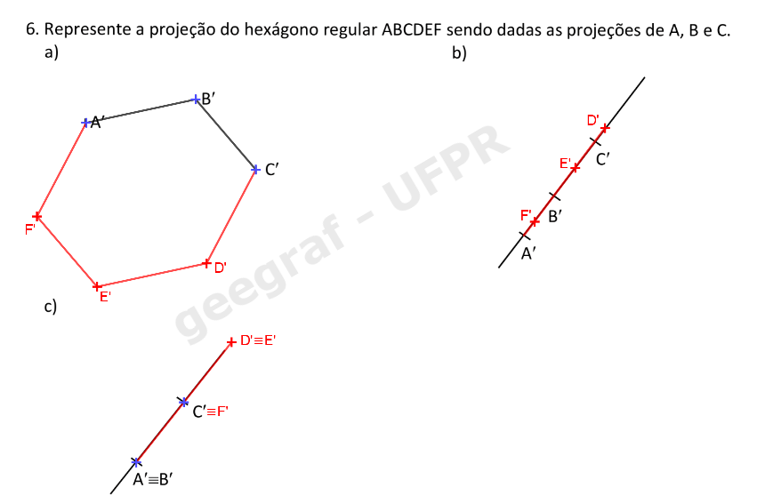
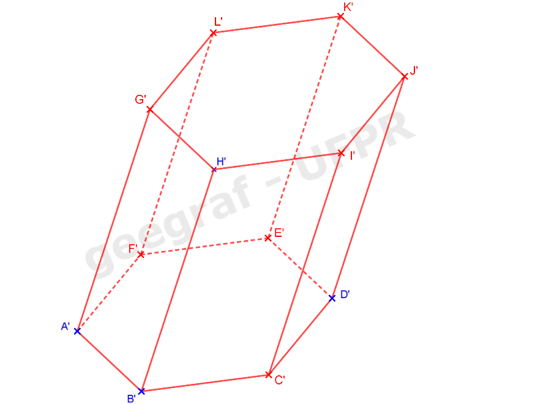

<head>
<link rel="stylesheet" href="scripts/style.css">
</head>

<h2 id="inicio">Visualização de propriedades de projeções, sólidos e aplicações</h2> 

Esta página contém as construções geométricas e visualizações 3D dos exemplos e exercícios utilizados na disciplina de Geometria Descritiva I

A apostila está disponível no link: <a href="http://www.exatas.ufpr.br/portal/degraf_paulo/wp-content/uploads/sites/4/2020/02/ApostilaGD2019.pdf" target="_blank">apostila de Geometria Descritiva</a>

Os objetos programados em 3D podem ser visualizados os objetos em Realidade Virtual (RV) e Realidade Aumentada (RA). As propriedades de projeções e os sólidos podem ser vistos em RA com os marcadores indicados, e através dos links criados nos marcadores, os objetos podem ser vistos em RV.

  
Propriedades das projeções cilíndricas, pág. 1-13

	
Leia o conteúdo das páginas 1, 2 e 3 da apostila. Vamos trabalhar com as projeções de objetos e figuras em um plano chamado de <b>&pi;'</b>.
 	
	
	
<a href="#propriedades" class="topo">voltar ao topo</a>

	
	
<a href="#propriedades" class="topo">voltar ao topo</a>

	
    
<figcaption>Para projetar um ponto <b>A</b> qualquer do espaço usando a projeção cônica, basta definir a reta projetante <b>a</b>, que passa pelo centro de projeção <b>O</b> e pelo ponto <b>A</b>. A interseção desta reta com o plano <b>&pi;'</b> é a projeção <b>A'</b> do ponto <b>A</b>.</figcaption>
    <a href="vr/proj_conica.html" target="_blank" class="visu">Visualização em 3D</a>

	
    
<figcaption>Para projetar um ponto <b>A</b> qualquer do espaço usando a projeção cilíndrica, basta definir a reta projetante <b>a</b>, paralela à direção <b>d</b> e que passa pelo ponto <b>A</b>. A interseção desta reta com o plano <b>&pi;'</b> é a projeção <b>A'</b> do ponto <b>A</b>. Se a reta <b>d</b> formar ângulo <b>0 < &theta; < 90o</b>, a projeção é chamada <b>oblíqua</b>.</figcaption>
    <a href="vr/proj_cilindrica.html" target="_blank" class="visu">Projeção cilíndrica <b>oblíqua</b> em 3D</a>
    <figcaption>Quando <b>&theta; = 90o</b>, temos a projeção <b>ortogonal</b>.</figcaption>
	<a href="vr/proj_cilindrica_orto.html" target="_blank" class="visu">Projeção cilíndrica <b>ortogonal</b> em 3D</a>

	
<a href="#propriedades" class="topo">voltar ao topo</a>

	
    
<figcaption>Quando a reta <b>r</b> não é paralela à direção <b>d</b>, a sua projeção <b>r'</b> é uma reta.</figcaption>
    <a href="vr/p1.html" target="_blank" class="visu">Visualização em 3D: projeção <b>oblíqua</b></a>
	 <a href="vr/p1_orto.html" target="_blank" class="visu">Visualização em 3D: projeção <b>ortogonal</b></a>

	
    
<figcaption>No caso em que as retas <b>r</b> e <b>d</b> são paralelas, a projeção <b>r'</b> é um ponto.</figcaption>
	<a href="vr/p1a.html" target="_blank" class="visu">Visualização em 3D: projeção <b>oblíqua</b></a>
	 <a href="vr/p1a_orto.html" target="_blank" class="visu">Visualização em 3D: projeção <b>ortogonal</b></a>
	  

&#x1f453; Realidade Aumentada e Realidade Virtual

		
Esta apostila tem recursos programados em Realidade Aumentada e Realidade Virtal. Você pode acessar estes recursos usando o seguinte endereço:

		
<a href="https://paulohscwb.github.io/geometria-descritiva/ra.html" target="_blank">https://paulohscwb.github.io/geometria-descritiva/ra.html</a>

		
Veja o passo a passo para acessar estes recursos

		  <ul class="slider">
		   <li>
			   <input type="radio" id="a20" name="sl">
			   <label for="a20"></label>
			   
			   <figcaption>Os ambientes podem ser acessados em qualquer navegador com um dispositivo de webcam (smartphone, tablet ou notebook). Dê preferência aos navegadores GOOGLE CHROME e MOZILLA FIREFOX.</figcaption>
		   </li>
		   <li>
			   <input type="radio" id="a21" name="sl">
			   <label for="a21"></label>
			   
			   <figcaption>Acesse a página <a href="https://paulohscwb.github.io/geometria-descritiva/ra.html" target="_blank"> https://paulohscwb.github.io/geometria-descritiva/ra.html</a>. Na primeira vez que acessar, o dispositivo pedirá a permissão para acesso à câmera para leitura dos QR Codes. Libere o acesso e aponte a câmera para um dos QR Codes impressos da apostila.</figcaption>
		   </li>
		   <li>
			   <input type="radio" id="a22" name="sl">
			   <label for="a22"></label>
			   
			   <figcaption>Os sólidos representados em 3D aparecerão por cima dos desenhos da apostila. Você pode usá-los para conferir as construções ou apenas visualizá-los em 3D. Ao clicar sobre os círculos azuis que aparecem sobre os QR codes, você tem acesso aos sólidos programados em Realidade Virtual.</figcaption>
		   </li>
		   <li>
			   <input type="radio" id="a23" name="sl">
			   <label for="a23"></label>
			   
			   <figcaption>Os objetos em Realidade Virtual podem ser manipulados, ajudando a compreensão dos nossos estudos de projeções.</figcaption>
		   </li>
		   <li>
			   <input type="radio" id="a24" name="sl">
			   <label for="a24"></label>
			   

				 <iframe src="https://drive.google.com/file/d/1Tg2c6pOoDNESEAvl9kvXgRGv81D-U0Kw/preview" width="100%"></iframe>
			   

			   <figcaption>Veja o vídeo de demonstração do uso destes recursos.</figcaption>
		   </li>
		</ul>
			
	  

	
<a href="#propriedades" class="topo">voltar ao topo</a>

	  
    
<figcaption>Considerando <b>r</b> e <b>s</b> estão em planos projetantes distintos, as projeções <b>r'</b> e <b>s'</b> são paralelas.</figcaption>
    <a href="vr/p2.html" target="_blank" class="visu">Propriedade em 3D: projeção <b>oblíqua</b></a>
	 <a href="vr/p2_orto.html" target="_blank" class="visu">Propriedade em 3D: projeção <b>ortogonal</b></a>

      
	
<figcaption>Se <b>r</b> e <b>s</b> estão em um mesmo plano projetante, as projeções <b>r'</b> e <b>s'</b> são coincidentes.</figcaption>
    <a href="vr/p2a.html" target="_blank" class="visu">Propriedade em 3D: projeção <b>oblíqua</b></a>
	 <a href="vr/p2a_orto.html" target="_blank" class="visu">Propriedade em 3D: projeção <b>ortogonal</b></a>

      
    
<figcaption>Quando as retas <b>r</b> e <b>s</b> são paralelas à direção <b>d</b>, suas projeções <b>r'</b> e <b>s'</b> são pontos.</figcaption>
    <a href="vr/p2c.html" target="_blank" class="visu">Propriedade em 3D: projeção <b>oblíqua</b></a>
	 <a href="vr/p2c_orto.html" target="_blank" class="visu">Propriedade em 3D: projeção <b>ortogonal</b></a>

	
<a href="#propriedades" class="topo">voltar ao topo</a>

    
 
    <figcaption>A proporção entre as medidas dos segmentos paralelos <b>AB</b> e <b>CD</b> é a mesma de suas projeções, ou seja: <b>AB/CD = A'B'/C'D'</b>.</figcaption>
    <a href="vr/p3a.html" target="_blank" class="visu">Propriedade em 3D: projeção <b>oblíqua</b></a>
	 <a href="vr/p3a_orto.html" target="_blank" class="visu">Propriedade em 3D: projeção <b>ortogonal</b></a>

     
    
<figcaption>Se os segmentos <b>AB</b> e <b>CD</b> são colineares, a mesma proporção entre as medidas é válida: <b>AB/CD = A'B'/C'D'</b>.</figcaption>
    <a href="vr/p3b.html" target="_blank" class="visu">Propriedade em 3D: projeção <b>oblíqua</b></a>
	 <a href="vr/p3b_orto.html" target="_blank" class="visu">Propriedade em 3D: projeção <b>ortogonal</b></a>

	 
	
<a href="#propriedades" class="topo">voltar ao topo</a>

	 
    

&#x1f4cf; &#x1f4d0; Resolução

  
 Vamos utilizar a régua e o compasso para resolver este exercício. De acordo com a propriedade 3, podemos encontrar a projeção do ponto médio de <b>AB</b> construindo a mediatriz da projeção deste segmento. Clique nos botões do passo a passo para fazer a construção na sua apostila.

  <ul class="slider">
       <li>
           <input type="radio" id="100" name="sl">
           <label for="100"></label>
		   
		   <figcaption>Com a ponta seca em <b>A'</b>, desenhe um arco com raio maior do que a metade de <b>A'B'</b>.</figcaption>
       </li>
       <li>
           <input type="radio" id="101" name="sl">
           <label for="101"></label>
           
           <figcaption>Com a ponta seca em <b>B'</b>, desenhe um arco com o mesmo raio usado no passo anterior.</figcaption>
       </li>
       <li>
           <input type="radio" id="102" name="sl">
           <label for="102"></label>
           
           <figcaption>Desenhe a reta que passa pelos pontos de interseção dos arcos usando a régua.</figcaption>
       </li>
       <li>
           <input type="radio" id="103" name="sl">
           <label for="103"></label>
           
           <figcaption>A projeção do ponto médio <b>M'</b> está na interseção da mediatriz de <b>A'B'</b> com o segmento <b>A'B'</b>.</figcaption>
       </li>
       <li>
           <input type="radio" id="104" name="sl">
           <label for="104"></label>
           
           <figcaption>Como os pontos <b>A'</b> e <b>B'</b> estão coincidentes, quer dizer que o segmento <b>AB</b> é paralelo à direção das projetantes. Logo, <b>M'</b> coincide com <b>A'</b> e <b>B'</b>.</figcaption>
       </li>
    </ul>
    
  

  
  

&#x1f4cf; &#x1f4d0; Resolução

  
 Vamos utilizar a régua e os esquadros para resolver este exercício. De acordo com a propriedade 2, podemos encontrar a projeção dos lados de um paralelogramo utilizando a construção de retas paralelas.

  <ul class="slider">
      <li>
           <input type="radio" id="105" name="sl">
           <label for="105"></label>
           
           <figcaption>A projeção do lado <b>C'D'</b> será paralela ao segmento <b>A'B'</b>. Logo, podemos desenhar a reta <b>C'D' // A'B'</b> com o uso de esquadros.</figcaption>
       </li>
       <li>
           <input type="radio" id="106" name="sl">
           <label for="106"></label>
           
           <figcaption>Alinhando o esquadro de 45o com <b>A'B'</b>, coloque como apoio o outro esquadro ou a régua. Deslize o esquadro de 45o deixando o outro esquadro ou a régua fixo.</figcaption>
       </li>
       <li>
           <input type="radio" id="107" name="sl">
           <label for="107"></label>
           
           <figcaption>Usando a mesma construção, você pode desenhar a reta paralela a <b>B'C'</b> passando por <b>A'</b>. Alinhando-se a hipotenusa do esquadro de 45 com <b>B'C'</b>, apoie o outro esquadro ou a régua com um cateto do esquadro de 45.</figcaption>
       </li>
       <li>
           <input type="radio" id="108" name="sl">
           <label for="108"></label>
           
           <figcaption>Deslizando o esquadro de 45 e mantendo o outro esquadro fixo, você consegue desenhar a paralela a <b>B'C'</b> passando por <b>A'</b>.</figcaption>
       </li>
       <li>
           <input type="radio" id="109" name="sl">
           <label for="109"></label>
           
           <figcaption>A interseção das duas paralelas é o vértice <b>D'</b>. Pronto, o paralelogramo está construído.</figcaption>
       </li>
    </ul>
    
  

  
  

&#x1f4cf; &#x1f4d0; Resolução

  
Vamos utilizar a régua e o compasso para resolver este exercício.

  <ul class="slider">
      <li>
           <input type="radio" id="110" name="sl">
           <label for="110"></label>
           
           <figcaption>Relembrando uma propriedade do paralelogramo: as diagonais interceptam-se em seus respectivos pontos médios. Logo, pela propriedade 3, <b>A'M' = M'C'</b>.</figcaption>
       </li>
       <li>
           <input type="radio" id="111" name="sl">
           <label for="111"></label>
           
           <figcaption>Logo, podemos "pegar" a medida <b>A'B'</b> com o compasso e prolongar o segmento <b>A'M'</b>.</figcaption>
       </li>
       <li>
           <input type="radio" id="112" name="sl">
           <label for="112"></label>
           
           <figcaption>Para encontrar <b>C'</b>, basta desenhar o arco com medida <b>A'M'</b> no prolongamento de <b>A'M'</b>.</figcaption>
       </li>
       <li>
           <input type="radio" id="113" name="sl">
           <label for="113"></label>
           
           <figcaption>O mesmo acontece com os segmentos <b>B'M'</b> e <b>M'D'</b>. Logo, podemos "pegar" a medida <b>B'M'</b> com o compasso...</figcaption>
       </li>
	   <li>
           <input type="radio" id="113a" name="sl">
           <label for="113a"></label>
           
           <figcaption>... e podemos desenhar o arco com centro em <b>M'</b> e raio <b>B'M'</b>.</figcaption>
       </li>
	   <li>
           <input type="radio" id="113b" name="sl">
           <label for="113b"></label>
           
           <figcaption>Pronto! O paralelogramo está construído. Não esqueça de desenhar os lados desta figura.</figcaption>
       </li>
    </ul>
    
  

  
  

&#x1f4cf; &#x1f4d0; Resolução: item b

  
Vamos utilizar a régua e o compasso para resolver este exercício.

  <ul class="slider">
      <li>
           <input type="radio" id="120" name="sl">
           <label for="120"></label>
           
        <figcaption>Como as projeções dos vértices <b>A'</b> e <b>B'</b> são coincidentes, pela propriedade 1, podemos concluir que <b>AB // d</b>. Portanto, temos que <b>C'D' // d</b>.</figcaption>
       </li>
       <li>
           <input type="radio" id="121" name="sl">
           <label for="121"></label>
           
         <figcaption>Podemos "pegar" a medida entre os pontos <b>A'=B'</b> e <b>M'</b> com o compasso e prolongar o segmento que une estes pontos.</figcaption>
       </li>
       <li>
           <input type="radio" id="122" name="sl">
           <label for="122"></label>
           
           <figcaption>Os pontos <b>C'</b> e <b>D'</b> também coincidem, pois <b>AB // CD</b>.  Para encontrar <b>C'=D'</b>, basta desenhar o arco com medida <b>A'M'</b> no prolongamento de <b>A'M'</b>.</figcaption>
       </li>
       <li>
           <input type="radio" id="123" name="sl">
           <label for="123"></label>
           
           <figcaption>O paralelogramo está construído. Use o link abaixo para visualizar em 3D a propriedade que usamos. Agora você pode construir o item c deste exercício.</figcaption>
       </li>
    </ul>
    
	<a href="vr/20_03b.html" target="_blank" class="visu">Visualização em 3D</a>
   

   

&#x1f4cf; &#x1f4d0; Solução: item c

	
	<figcaption>Usando as propriedades dos itens a e b, você consegue fazer a construção deste paralelogramo.</figcaption>
  

  
<a href="#propriedades" class="topo">voltar ao topo</a>

  
  

&#x1f4cf; &#x1f4d0; Resolução

  
 Vamos utilizar a régua e o compasso para resolver este exercício.

  <ul class="slider">
      <li>
           <input type="radio" id="124" name="sl">
           <label for="124"></label>
           
        <figcaption>Relembrando a propriedade do baricentro: A distância do baricentro a um vértice mede 2/3 da mediana, ou seja, <b>CG = 2CM/3</b> ou <b>GM = CM/3.</b></figcaption>
       </li>
       <li>
           <input type="radio" id="125" name="sl">
           <label for="125"></label>
           
         <figcaption>Pela propriedade 3, a medida <b>G'M'</b> mede <b>CM/3</b>. Então vamos construir a mediatriz do segmento <b>A'B'</b>.</figcaption>
       </li>
       <li>
           <input type="radio" id="126" name="sl">
           <label for="126"></label>
           
         <figcaption>Usando os arcos de mesma medida, com centros em <b>A'</b> e <b>B'</b>, obtemos os pontos que definem a mediatriz de <b>A'B'</b>.</figcaption>
       </li>
       <li>
           <input type="radio" id="127" name="sl">
           <label for="127"></label>
           
         <figcaption>Unindo os pontos <b>M'</b> e <b>G'</b>, podemos usar o compasso para "pegar" a medida <b>G'M'</b>.</figcaption>
       </li>
       <li>
           <input type="radio" id="128" name="sl">
           <label for="128"></label>
           
           <figcaption>Com o centro em <b>G'</b>, marcamos uma vez o segmento com medida igual a <b>G'M'</b>.</figcaption>
       </li>
       <li>
           <input type="radio" id="129" name="sl">
           <label for="129"></label>
           
           <figcaption>Na sequência, marcamos novamente um segmento com a mesma medida. Assim, encontramos <b>G'C' = 2G'M'</b>.</figcaption>
       </li>
       <li>
           <input type="radio" id="130" name="sl">
           <label for="130"></label>
           
           <figcaption>Agora você pode desenhar os lados do triângulo <b>A'B'C'</b>.</figcaption>
       </li> 
    </ul>
    
  

    
  

&#x1f4cf; &#x1f4d0; Resolução: item b

  
 Vamos utilizar a régua e o compasso para resolver este exercício.

  <ul class="slider">
      <li>
           <input type="radio" id="131" name="sl">
           <label for="131"></label>
           
        <figcaption>Vamos usar a mesma propriedade do item anterior: A distância do baricentro a um vértice mede 2/3 da mediana, ou seja, <b>CG = 2CM/3</b> ou <b>GM = CM/3.</b></figcaption>
       </li>
       <li>
           <input type="radio" id="132" name="sl">
           <label for="132"></label>
           
         <figcaption>Pela propriedade 2, se os pontos <b>A'</b> e <b>B'</b> coincidem, o lado <b>AB</b> é paralelo à direção <b>d</b>. Logo, o ponto <b>M'</b> também coincide com <b>A'</b> e <b>B'</b>.</figcaption>
       </li>
       <li>
           <input type="radio" id="133" name="sl">
           <label for="133"></label>
           
         <figcaption>Logo, podemos prolongar a reta <b>A'G'</b> para encontrar a projeção do vértice <b>C</b>. Usando o compasso, "pegamos" a medida <b>A'G'</b> e podemos marcá-la a partir de <b>G'</b></figcaption>
       </li>
       <li>
           <input type="radio" id="134" name="sl">
           <label for="134"></label>
           
         <figcaption>Marcando-se duas vezes esta medida <b>A'G'</b> encontramos a projeção <b>C'</b>. Neste caso, o triângulo <b>ABC</b> fica projetado como um segmento.</figcaption>
       </li>
	   <li>
           <input type="radio" id="135" name="sl">
           <label for="135"></label>
           
         <figcaption>Use o link abaixo para visualizar o exercício em 3D. Agora é sua vez de construir o item c.</figcaption>
       </li>
    </ul>
	
    <a href="vr/20_04b.html" target="_blank" class="visu">Visualização em 3D</a>

	

&#x1f4cf; &#x1f4d0; Solução: item c

	
  	<figcaption>Utilizando as mesmas propriedades dos itens anteriores, você consegue construir este triângulo. Use o link abaixo para te ajudar na visualização em 3D.</figcaption>
    <a href="vr/p_ex4c_triangulo.html" target="_blank" class="visu">Visualização em 3D</a>
  

  
  

&#x1f4cf; &#x1f4d0; Resolução

  
 Vamos utilizar a régua, o compasso e os esquadros para resolver este exercício.

  <ul class="slider">
      <li>
           <input type="radio" id="136" name="sl">
           <label for="136"></label>
           
        <figcaption>Relembrando as propriedades do hexágono regular: os lados são iguais ao raio da circunferência circunscrita, e os raios são paralelos aos lados.</figcaption>
       </li>
       <li>
           <input type="radio" id="137" name="sl">
           <label for="137"></label>
           
         <figcaption>Pela propriedade 3, os segmentos <b>A'O'</b> e <b>B'C'</b> terão projeções com mesma medida e serão paralelos. Logo, podemos construir a paralela a <b>A'O'</b> que passa por <b>B'</b>.</figcaption>
       </li>
       <li>
           <input type="radio" id="138" name="sl">
           <label for="138"></label>
           
         <figcaption>Alinhando a hipotenusa de um esquadro e apoiando este esquadro com a régua ou outro esquadro, basta deslizar o esquadro que você alinhou até chegar em <b>B'</b>.</figcaption>
       </li>
       <li>
           <input type="radio" id="139" name="sl">
           <label for="139"></label>
           
         <figcaption>Como <b>AO = BC</b> e <b>AO // BC</b>, pelas propriedades 2 e 3 temos que <b>A'O' = B'C'</b> e <b>A'O' // B'C'</b>. Podemos "pegar" a medida <b>A'O'</b> com o compasso...</figcaption>
       </li>
	   <li>
           <input type="radio" id="140" name="sl">
           <label for="140"></label>
           
         <figcaption>... e marcá-la na paralela construída, a partir do ponto <b>B'</b>. Assim, encontramos a projeção do ponto <b>C'</b>.</figcaption>
       </li>
	   <li>
           <input type="radio" id="141" name="sl">
           <label for="141"></label>
           
         <figcaption>Usando a propriedade 3, como <b>A</b>, <b>O</b> e <b>D</b> são colineares, temos que <b>A'O' = O'D'</b>. Podemos "pegar" essa medida com o compasso...</figcaption>
       </li>
	   <li>
           <input type="radio" id="142" name="sl">
           <label for="142"></label>
           
         <figcaption>... e desenhar o arco com centro em <b>O'</b>. Assim, encontramos o vértice <b>D'</b>.</figcaption>
       </li>
	   <li>
           <input type="radio" id="143" name="sl">
           <label for="143"></label>
           
         <figcaption>Podemos fazer a mesma construção com os segmentos <b>O'F' = O'C'</b> para encontrar <b>F'</b>.</figcaption>
       </li>
	   <li>
           <input type="radio" id="144" name="sl">
           <label for="144"></label>
           
         <figcaption>E para fechar o hexágono, fazemos a mesma construção com os segmentos <b>B'O' = O'E'</b>. Use o link abaixo para visualizar o exercício em 3D.</figcaption>
       </li>
    </ul>
	
    <a href="vr/p_ex5a_hexagono.html" target="_blank" class="visu">Visualização em 3D</a>
  

  
  

&#x1f4cf; &#x1f4d0; Solução: item b

    
	<figcaption>Com as propriedades que usamos no item a, você consegue fazer a construção deste hexágono do item b.</figcaption>
  

  

&#x1f4cf; &#x1f4d0; Resolução: item c

  
 Vamos utilizar a régua e o compasso para resolver este exercício.

  <ul class="slider">
      <li>
           <input type="radio" id="145" name="sl">
           <label for="145"></label>
           
        <figcaption>Usando as propriedades do hexágono regular, podemos notar que <b>AB = OC</b> e <b>AB // OC</b>. Logo, as projeções desses serão iguais e paralelas.</figcaption>
       </li>
       <li>
           <input type="radio" id="146" name="sl">
           <label for="146"></label>
           
         <figcaption>Pela propriedade 5, como os pontos <b>A'</b>, <b>B'</b> e <b>O'</b> são colineares, o hexágono está em um plano paralelo à direção de projeções <b>d</b>. Logo, <b>C'</b> estará na mesma reta.</figcaption>
       </li>
       <li>
           <input type="radio" id="147" name="sl">
           <label for="147"></label>
           
         <figcaption>Podemos "pegar" a medida <b>A'B'</b> com o compasso e transferir esta medida a partir de <b>O'</b>, encontrando o ponto <b>C'</b>.</figcaption>
       </li>
       <li>
           <input type="radio" id="148" name="sl">
           <label for="148"></label>
           
         <figcaption>Como <b>BO = OE</b>, pela propriedade 3 temos que <b>B'O' = O'E'</b>. Podemos "pegar" a medida <b>B'O'</b> com o compasso...</figcaption>
       </li>
	   <li>
           <input type="radio" id="149" name="sl">
           <label for="149"></label>
           
         <figcaption>... e marcá-la a partir do ponto <b>O'</b>, encontrando o vértice <b>E'</b>. Podemos usar a mesma propriedade para encontrar os outros vértices.</figcaption>
       </li>
	   <li>
           <input type="radio" id="150" name="sl">
           <label for="150"></label>
           
         <figcaption>Podemos marcar <b>A'O' = O'D'</b> para encontrar o vértice <b>D'</b>.</figcaption>
       </li>
	   <li>
           <input type="radio" id="151" name="sl">
           <label for="151"></label>
           
         <figcaption>E para finalizar o hexágono, marcamos <b>O'C' = O'F'</b>. Visualize este hexágono em 3D com o link abaixo.</figcaption>
       </li>
    </ul>
	
  

  <a href="vr/p_ex5c_hexagono.html" target="_blank" class="visu">Visualização em 3D: item c</a>

  
<a href="#propriedades" class="topo">voltar ao topo</a>

  
  

&#x1f4cf; &#x1f4d0; Solução

  
 Você pode usar as mesmas propriedades que usamos no exercício 5.

    
	<figcaption>Encontre a projeção do centro da circunferência em cada item. Lembre-se das propriedades do hexágono regular.</figcaption>
  

  
  
<figcaption>Uma figura pertencente a um plano paralelo ao plano de projeções <b>&pi;'</b> fica projetada com o mesmo tamanho, sem redução ou ampliação de tamanho.</figcaption>
    <a href="vr/p4.html" target="_blank" class="visu">Propriedade em 3D: projeção <b>oblíqua</b></a>
	 <a href="vr/p4_orto.html" target="_blank" class="visu">Propriedade em 3D: projeção <b>ortogonal</b></a>

    
<a href="#propriedades" class="topo">voltar ao topo</a>

	 
    
<figcaption>Uma figura que pertence a um plano <b>&alpha;</b> paralelo à direção <b>d</b> de projeções tem projeção reduzida a um segmento.</figcaption>
    <a href="vr/p5.html" target="_blank" class="visu">Propriedade em 3D: projeção <b>oblíqua</b></a>
	 <a href="vr/p5_orto.html" target="_blank" class="visu">Propriedade em 3D: projeção <b>ortogonal</b></a>

	
  
<figcaption>Os segmentos oblíquos ao plano de projeções <b>&pi;'</b> são projetados com tamanho reduzido, ou seja, <b>AB > A'B'</b></figcaption>
  <a href="vr/p6.html" target="_blank" class="visu">Visualização da propriedade em 3D</a>

  
  
<a href="#propriedades" class="topo">voltar ao topo</a>

  
  
<figcaption>Quando a reta <b>r // &pi;'</b> e as retas <b>r</b> e <b>s</b> são perpendiculares ou ortogonais, as retas <b>r'</b> e <b>s'</b> são perpendiculares.</figcaption>
  <a href="vr/p7.html" target="_blank" class="visu">Visualização da propriedade em 3D</a>

    
  

&#x1f4cf; &#x1f4d0; Resolução

  
 Vamos utilizar a régua e o compasso para resolver este exercício.

  <ul class="slider">
      <li>
           <input type="radio" id="152" name="sl">
           <label for="152"></label>
           
        <figcaption>Usando as propriedades do losango, temos que as medidas dos lados são iguais <b>AB = BC = CD = AD</b> e as diagonais <b>AC</b> e <b>BD</b> são perpendiculares. Podemos usar a propriedade 7 de projeções ortogonais.</figcaption>
       </li>
       <li>
           <input type="radio" id="153" name="sl">
           <label for="153"></label>
           
         <figcaption>Como a reta <b>AC</b> é paralela a <b>&pi;'</b>, o ângulo de 90o está projetado em verdadeira grandeza (vg). Podemos construir a mediatriz da projeção da diagonal <b>A'C'</b>.</figcaption>
       </li>
       <li>
           <input type="radio" id="154" name="sl">
           <label for="154"></label>
           
         <figcaption>A interseção da mediatriz de <b>A'C'</b> com a reta <b>r'</b> é o vértice <b>B'</b>.</figcaption>
       </li>
       <li>
           <input type="radio" id="155" name="sl">
           <label for="155"></label>
           
         <figcaption>Como <b>BM = MD</b>, pela propriedade 3 temos que <b>B'M' = M'D'</b>. Podemos marcar com o compasso a medida <b>B'M'</b> a partir do ponto <b>M'</b>, encontrando o vértice <b>D'</b>.</figcaption>
       </li>
	   <li>
           <input type="radio" id="156" name="sl">
           <label for="156"></label>
           
         <figcaption>Pronto, a projeção do losango está construída. Veja no link abaixo a representação em 3D deste exercício.</figcaption>
       </li>
    </ul>
	
  

  <a href="vr/p_ex1_losango.html" target="_blank" class="visu">Visualização em 3D</a>

  
  

&#x1f4cf; &#x1f4d0; Resolução

  
 Vamos utilizar a régua e o compasso para resolver este exercício.

  <ul class="slider">
      <li>
           <input type="radio" id="157" name="sl">
           <label for="157"></label>
           
        <figcaption>Usando as propriedades do retângulo, temos que os vértices pertencem a uma circunferência com centro no encontro das diagonais <b>M</b>. Esta circunferência é chamada de arco capaz de 90o.</figcaption>
       </li>
       <li>
           <input type="radio" id="158" name="sl">
           <label for="158"></label>
           
         <figcaption>Como o segmento <b>AB</b> é paralelo a <b>&pi;'</b>, sua projeção <b>A'B'</b> está em verdadeira grandeza (vg). Podemos construir a circunferência com centro em <b>A'</b> e raio 3cm.</figcaption>
       </li>
       <li>
           <input type="radio" id="159" name="sl">
           <label for="159"></label>
           
         <figcaption>Vamos começar construindo a mediatriz de <b>A'C'</b> para desenhar o arco capaz de 90o.</figcaption>
       </li>
       <li>
           <input type="radio" id="160" name="sl">
           <label for="160"></label>
           
         <figcaption>Com o centro em <b>M'</b>, podemos construir a circunferência de raio <b>M'A' = M'C'</b>.</figcaption>
       </li>
	   <li>
           <input type="radio" id="161" name="sl">
           <label for="161"></label>
           
         <figcaption>Agora podemos desenhar a circunferência com centro em <b>A'</b> e raio 3cm. A interseção desta circunferência com o arco capaz de 90o é o vértice <b>B'</b>. Escolha uma das interseções para este vértice <b>B'</b></figcaption>
       </li>
	   <li>
           <input type="radio" id="162" name="sl">
           <label for="162"></label>
           
         <figcaption>Como os lados <b>AB</b> e <b>CD</b> são paralelos, podemos desenhar a circunferência com centro em <b>C'</b> e raio 3cm para encontrar o vértice <b>D'</b>.</figcaption>
       </li>
	   <li>
           <input type="radio" id="163" name="sl">
           <label for="163"></label>
           
         <figcaption>Pronto, a projeção do retângulo está construída. Veja no link abaixo a representação em 3D deste exercício.</figcaption>
       </li>
    </ul>
	
  

  <a href="vr/p_ex2_retangulo.html" target="_blank" class="visu">Visualização em 3D</a>

  
<a href="#propriedades" class="topo">voltar ao topo</a>

  
  

&#x1f4cf; &#x1f4d0; Resolução

  
 Vamos utilizar o compasso e os esquadros para resolver este exercício.

  <ul class="slider">
      <li>
           <input type="radio" id="164" name="sl">
           <label for="164"></label>
           
        <figcaption>Um paralelepípedo tem todas as faces com paralelogramos. Supondo-se que o vértice <b>F</b> está mais próximo do observador, temos as arestas determinadas por <b>F</b> visíveis.</figcaption>
       </li>
       <li>
           <input type="radio" id="165" name="sl">
           <label for="165"></label>
           
         <figcaption>Outra maneira de construir o paralelepípedo é considerando que o vértice <b>F</b> está mais distante do observador. Neste caso, suas arestas tornam-se invisíveis. Neste exercício você pode escolher uma das visibilidades apresentadas.</figcaption>
       </li>
       <li>
           <input type="radio" id="166" name="sl">
           <label for="166"></label>
           
         <figcaption>Vamos começar construindo a reta paralela a <b>B'C'</b> que passa por <b>A'</b> para encontrar o vértice <b>D'</b> da base do paralelepípedo. Podemos usar o esquadro de 45o para alinhar com o segmento.</figcaption>
       </li>
       <li>
           <input type="radio" id="167" name="sl">
           <label for="167"></label>
           
         <figcaption>Deslizando o esquadro com o outro esquadro apoiado, podemos desenhar a reta paralela a <b>B'C'</b> pelo vértice <b>A'</b>.</figcaption>
       </li>
	   <li>
           <input type="radio" id="168" name="sl">
           <label for="168"></label>
           
         <figcaption>Fazendo a mesma construção, podemos desenhar a reta paralela ao segmento <b>A'B'</b> que passa por <b>C'</b>. O encontro destas paralelas é o vértice <b>D'</b>.</figcaption>
       </li>
	   <li>
           <input type="radio" id="169" name="sl">
           <label for="169"></label>
           
         <figcaption>Agora podemos desenhar as arestas laterais. Basta desenhar as retas paralelas à aresta lateral <b>A'E'</b> que passam pelos vértices <b>B'</b>, <b>C'</b> e <b>D'</b>.</figcaption>
       </li>
	   <li>
           <input type="radio" id="170" name="sl">
           <label for="170"></label>
           
         <figcaption>Com o compasso, você pode "pegar" a medida <b>A'E'</b>...</figcaption>
       </li>
	   <li>
           <input type="radio" id="171" name="sl">
           <label for="171"></label>
           
         <figcaption>... e marcar com a ponta seca em <b>B'</b> para encontrar o vértice <b>F'</b>.</figcaption>
       </li>
	   <li>
           <input type="radio" id="172" name="sl">
           <label for="172"></label>
           
         <figcaption>Fazendo a mesma construção com os vértices <b>C'</b> e <b>D'</b>, você encontra os vértices <b>G'</b> e <b>H'</b>. Esta construção é possível por causa das propriedades 2 e 3 de projeções cilíndricas.</figcaption>
       </li>
	   <li>
           <input type="radio" id="173" name="sl">
           <label for="173"></label>
           
         <figcaption>Agora você pode "passar a limpo" o desenho do paralelepípedo. Como ainda não estamos trabalhando com as coordenadas dos vértices, você pode escolher uma das visualizações mostradas nos passos 1 e 2.</figcaption>
       </li>
    </ul>
	
  

  
  

&#x1f4cf; &#x1f4d0; Solução

  
 Você pode utilizar o compasso e os esquadros para resolver este exercício. Lembre-se das propriedades de projeções cilíndricas 2 e 3.

	
	<figcaption>Tente encontrar o centro da circunferência da base dos vertices <b>A'</b> e <b>B'</b>. Use as propriedades do hexágono regular.</figcaption>
  

  
<a href="#propriedades" class="topo">voltar ao topo</a>

  
  

&#x1f4cf; &#x1f4d0; Solução

  
 Você pode utilizar o compasso e os esquadros para resolver este exercício. Lembre-se de aplicar as propriedades de projeções cilíndricas e cilíndricas ortogonais.

	
	<figcaption>Usando as propriedades de projeções cilíndricas ortogonais, verifique quais dos segmentos são projetados em verdadeira grandeza (vg) em <b>&pi;'</b>: <b>AB</b>, <b>AE</b>, <b>HJ</b> e <b>JG</b>.</figcaption>
  

  
<a href="#propriedades" class="topo">voltar ao topo</a>

Pontos e Retas, pág. 14-37

	
	

&#x1f4cf; &#x1f4d0; Resolução

  
Com as posições dos pontos relativas aos dois planos de projeções, vamos estudar os sinais das coordenadas destes pontos em cada diedro.

  <ul class="slider">
      <li>
           <input type="radio" id="174" name="sl">
           <label for="174"></label>
           
        <figcaption>O plano <b>&pi;'</b> é chamado de primeiro plano de projeções, definido pelos eixos <b>x</b> e <b>y</b>. O plano <b>&pi;''</b> é chamado de segundo plano de projeções, definido pelos eixos <b>x</b> e <b>z</b>.</figcaption>
       </li>
       <li>
           <input type="radio" id="175" name="sl">
           <label for="175"></label>
           
         <figcaption>Um ponto <b>P</b> pertence ao <b>1&ordm; diedro</b> quando tem as coordenadas <b>y</b> e <b>z</b> positivas. A coordenada <b>x</b> pode ser negativa ou positiva.</figcaption>
       </li>
       <li>
           <input type="radio" id="176" name="sl">
           <label for="176"></label>
           
         <figcaption>Um ponto <b>P</b> pertence ao <b>2&ordm; diedro</b> quando tem a coordenada <b>y</b> negativa e a coordenada <b>z</b> positiva. O sinal da coordenada <b>x</b> pode ser tanto negativo quando positivo.</figcaption>
       </li>
       <li>
           <input type="radio" id="177" name="sl">
           <label for="177"></label>
           
         <figcaption>Um ponto <b>P</b> pertence ao <b>3&ordm; diedro</b> quando tem as coordenadas <b>y</b> e <b>z</b> negativas. A coordenada <b>x</b> pode ser tanto negativa quanto positiva.</figcaption>
       </li>
	   <li>
           <input type="radio" id="178" name="sl">
           <label for="178"></label>
           
         <figcaption>Um ponto <b>P</b> pertence ao <b>4&ordm; diedro</b> quando tem a coordenada <b>y</b> positiva e a coordenada <b>z</b> negativa. O sinal da coordenada <b>x</b> pode ser tanto negativo quando positivo.</figcaption>
       </li>
	   <li>
           <input type="radio" id="179" name="sl">
           <label for="179"></label>
           
         <figcaption>Resumindo, estas são as combinações dos sinais das coordenadas de um ponto e sua respectiva localização em um dos diedros.</figcaption>
       </li>
    </ul>
	
  

	
<a href="#pontos" class="topo">voltar ao topo</a>

	
	

&#x1f4cf; &#x1f4d0; Resolução

  
Vamos representar as projeções de um ponto <b>A</b> em perspectiva.

  <ul class="slider">
      <li>
           <input type="radio" id="180" name="sl">
           <label for="180"></label>
           
        <figcaption>Vamos representar os eixos <b>x</b>, <b>y</b> e <b>z</b>. O plano <b>&pi;'</b> é definido pelos eixos <b>x</b> e <b>y</b>. Já o plano <b>&pi;''</b> é  definido pelos eixos <b>x</b> e <b>z</b>. O plano <b>&pi;'''</b> é definido pelos eixos <b>y</b> e <b>z</b>.</figcaption>
       </li>
       <li>
           <input type="radio" id="181" name="sl">
           <label for="181"></label>
           
         <figcaption>Vamos escolher a projeção de um ponto <b>A</b> sobre um dos planos de projeção. Neste caso, escolha um ponto <b>A'</b> sobre o plano <b>&pi;'</b>. Logo, vamos começar a representação pela 1&ordf; projeção de um ponto <b>A</b>. </figcaption>
       </li>
       <li>
           <input type="radio" id="182" name="sl">
           <label for="182"></label>
           
         <figcaption>Vamos traçar paralelas ao eixo <b>y</b> passando pelo ponto <b>A'</b> para encontrar a coordenada <b>y</b> deste ponto. Alinhe a hipotenusa do esquadro de 45 com o eixo <b>y</b> e apoie um cateto deste esquadro com a régua ou com o outro esquadro.</figcaption>
       </li>
       <li>
           <input type="radio" id="183" name="sl">
           <label for="183"></label>
           
         <figcaption>Deixando fixo o esquadro de 60 ou a régua, deslize o esquadro de 45 até chegar no ponto <b>A'</b>. Trace o segmento de reta que passa por <b>A'</b>, paralelo ao eixo <b>y</b>, interceptando o eixo <b>x</b>. A distância de <b>A'</b> até o eixo <b>x</b> é a coordenada <b>y</b> do ponto <b>A</b>, que denominamos <b>afastamento</b> ou <b>ordenada</b>.</figcaption>
       </li>
	   <li>
           <input type="radio" id="184" name="sl">
           <label for="184"></label>
           
         <figcaption>Agora vamos determinar a medida da coordenada <b>x</b> do ponto <b>A</b>. Alinhe a hipotenusa do esquadro de 45 com o eixo <b>x</b> e apoie um cateto com o esquadro de 60 ou com a régua.</figcaption>
       </li>
	   <li>
           <input type="radio" id="185" name="sl">
           <label for="185"></label>
           
         <figcaption>Deixando fixo o esquadro de 60, deslize o esquadro de 45 até chegar no ponto <b>A'</b>. Trace o segmento que passa por <b>A'</b>, é paralelo ao eixo <b>x</b> e intercepta o eixo <b>y</b>. A distância de <b>A'</b> até o eixo <b>y</b> é a coordenada <b>x</b> do ponto A, que denominamos de <b>abscissa</b>.</figcaption>
       </li>
	   <li>
           <input type="radio" id="186" name="sl">
           <label for="186"></label>
           
         <figcaption>Agora use os esquadros para desenhar a reta paralela ao eixo <b>z</b> que passa por <b>A'</b>. Determine nesta paralela um ponto <b>A</b>. Para encontrar o ponto <b>A''</b>, podemos traçar a reta paralela ao eixo <b>y</b>, que passa pelo ponto <b>A</b> e a reta paralela ao eixo <b>z</b> que passa no ponto auxiliar do eixo <b>x</b>. Logo, encontramos a 2&ordf; projeção <b>A''</b> do ponto <b>A</b>.</figcaption>
       </li>
	   <li>
           <input type="radio" id="187" name="sl">
           <label for="187"></label>
           
         <figcaption>Conseguimos determinar dois retângulos: um em <b>&pi;'</b> com os lados de medidas iguais às coordenadas <b>x</b> e <b>y</b> do ponto <b>A</b>; e outro em um plano paralelo a <b>&pi;'''</b>, com medidas iguais às coordenadas <b>y</b> e <b>z</b> do ponto <b>A</b>.</figcaption>
       </li>
	   <li>
           <input type="radio" id="188" name="sl">
           <label for="188"></label>
           
         <figcaption>Usando os esquadros, determine a reta paralela ao eixo <b>x</b> que passa por <b>A</b> e a reta paralela ao eixo <b>z</b> que passa no ponto auxiliar do eixo <b>y</b>. Assim, temos mais um retângulo, com lados de medidas iguais às coordenadas <b>x</b> e <b>z</b> do ponto <b>A</b> e encontramos a 3&ordf; projeção <b>A'''</b> do ponto <b>A</b>.</figcaption>
       </li>
	   <li>
           <input type="radio" id="189" name="sl">
           <label for="189"></label>
           
         <figcaption>Use os esquadros e trace a paralela ao eixo <b>x</b> que passa por <b>A''</b> e a paralela ao eixo <b>y</b> que passa por <b>A'''</b>. Desta forma, encontramos os 6 retângulos que formam um prisma com as medidas de <b>abscissa (x)</b>, <b>afastamento ou ordenada (y)</b> e <b>cota (z)</b> do ponto <b>A</b>.</figcaption>
       </li>
    </ul>
	
  

  
  

&#x1f4cf; &#x1f4d0; Resolução

  
Agora vamos representar um ponto <b>A</b> em épura, ou seja, as projeções deste ponto nos planos <b>&pi;'</b> e <b>&pi;''</b> ficarão em um só plano.

  <ul class="slider">
      <li>
           <input type="radio" id="190" name="sl">
           <label for="190"></label>
           
        <figcaption>Vamos fixar o plano <b>&pi;''</b> e rebater o plano <b>&pi;'</b> sobre <b>&pi;''</b> usando o eixo <b>x</b> como eixo deste rebatimento. O eixo <b>x</b> é chamado de <b>linha de terra</b> e podemos escolher a origem <b>O</b> e desenhar dois segmentos paralelos ao eixo nas extremidades para identificar a linha de terra.</figcaption>
       </li>
       <li>
           <input type="radio" id="191" name="sl">
           <label for="191"></label>
           
         <figcaption>Usando o eixo <b>x</b> para rebater o plano <b>&pi;'</b> sobre <b>&pi;''</b>, temos que a projeção <b>A'</b> será rotacionada no sentido anti-horário segundo ângulo de 90&deg;. O mesmo acontecerá com o eixo <b>y</b>. Logo, as projeções <b>A'</b> e <b>A''</b> ficarão em uma reta perpendicular ao eixo <b>x</b>.</figcaption>
       </li>
       <li>
           <input type="radio" id="192" name="sl">
           <label for="192"></label>
           
         <figcaption>Na épura, podemos representar os eixos <b>y</b> e <b>z</b> usando a construção de reta perpendicular com esquadros. Alinhe o cateto de um dos esquadros (neste exemplo é o de 45) com o eixo <b>x</b> e apoie a hipotenusa deste esquadro no outro esquadro (neste exemplo é o esquadro de 60) ou na régua.</figcaption>
       </li>
       <li>
           <input type="radio" id="193" name="sl">
           <label for="193"></label>
           
         <figcaption>Deixando fixo o esquadro de 60, deslize o esquadro de 45 até chegar no ponto <b>O</b>. Trace o segmento de reta que passa por <b>O</b> e está perpendicular ao eixo <b>x</b>.</figcaption>
       </li>
	   <li>
           <input type="radio" id="194" name="sl">
           <label for="194"></label>
           
         <figcaption>Neste segmento teremos o eixo <b>z</b> com as coordenadas para cima do eixo <b>x</b> e o eixo <b>y</b> com as coordenadas positivas para baixo do eixo <b>x</b>. Agora com a ponta seca em <b>A'</b>, "pegue" a abscissa de <b>A</b> para marcarmos na representação em épura.</figcaption>
       </li>
	   <li>
           <input type="radio" id="195" name="sl">
           <label for="195"></label>
           
         <figcaption>Com a ponta seca na origem <b>O</b> da épura, marque a abscissa do ponto <b>A</b> sobre o eixo <b>x</b> (linha de terra). As abscissas positivas são marcadas à direita da origem e as abscissas negativas são marcadas à esquerda de <b>O</b> Neste ponto podemos desenhar uma reta paralela aos eixos <b>y</b> e <b>z</b> ou a perpendicular ao eixo <b>x</b> usando os esquadros.</figcaption>
       </li>
	   <li>
           <input type="radio" id="196" name="sl">
           <label for="196"></label>
           
         <figcaption>Alinhando o cateto do esquadro de 45 com o eixo <b>x</b>, deixe o outro esquadro apoiado na hipotenusa do esquadro de 45.</figcaption>
       </li>
	   <li>
           <input type="radio" id="197" name="sl">
           <label for="197"></label>
           
         <figcaption>Deixando fixo o esquadro de 60, deslize o esquadro de 45 até chegar no ponto que marcamos com a abscissa de <b>A</b>. Represente a reta perpendicular ao eixo <b>x</b> qe passa por este ponto. Esta reta é chamada <b>linha de chamada</b> de <b>A</b>.</figcaption>
       </li>
	   <li>
           <input type="radio" id="198" name="sl">
           <label for="198"></label>
           
         <figcaption>Pegando a distância da cota de <b>A</b> com o compasso, podemos marcar esta distância a partir do eixo <b>x</b> na linha de chamada de <b>A</b>. Como a cota é positiva, marcamos esta distância para cima do eixo <b>x</b>. Esta é a representação da 2&ordf; projeção do ponto <b>A</b>.</figcaption>
       </li>
	   <li>
           <input type="radio" id="199" name="sl">
           <label for="199"></label>
           
         <figcaption>Com a mesma construção, podemos marcar a ordenada do ponto <b>A</b> a partir do mesmo ponto na linha de chamada. Como a ordenada é positiva, marcamos esta distância para baixo do eixo <b>x</b>.</figcaption>
       </li>
	   <li>
           <input type="radio" id="200" name="sl">
           <label for="200"></label>
           
         <figcaption>Esta é a representação em épura do ponto A: representamos a 1&ordf; projeção <b>A'</b> no mesmo plano da 2&ordf; projeção <b>A''</b>. Veja esta representação em 3D no link abaixo.</figcaption>
       </li>
    </ul>
	
  

  <a href="vr/a_epura0.html" target="_blank" class="visu">Visualização em 3D</a>

	
<a href="#pontos" class="topo">voltar ao topo</a>

	
	

&#x1f4cf; &#x1f4d0; Resolução

  
Vamos representar um ponto <b>A</b> pertencente ao 1&ordm; diedro por meio de suas projeções em perspectiva, e depois em épura. Marque a origem no desenho em épura e construa os segmentos paralelos à linha de terra que determinam o eixo <b>x</b>.

  <ul class="slider">
      <li>
           <input type="radio" id="201" name="sl">
           <label for="201"></label>
           
        <figcaption>Já temos a cota do ponto <b>A</b>, que é a distância <b>AA'</b>. Vamos construir a reta paralela ao eixo <b>x</b> que passa por <b>A'</b> para determinar as outras coordenadas deste ponto. Alinhando a hipotenusa do esquadro de 45 com o eixo <b>x</b>, colocamos o outro esquadro ou a régua como apoio em um dos catetos do esquadro de 45.</figcaption>
       </li>
       <li>
           <input type="radio" id="202" name="sl">
           <label for="202"></label>
           
         <figcaption>Deixando fixo o esquadro de 60, deslizamos o esquadro de 45 até chegar no ponto <b>A'</b>. Construa a reta paralela ao eixo <b>x</b>, encontrando o ponto auxiliar no eixo <b>y</b> que determina a abscissa de <b>A</b>.</figcaption>
       </li>
       <li>
           <input type="radio" id="203" name="sl">
           <label for="203"></label>
           
         <figcaption>Agora vamos construir a reta paralela ao eixo <b>y</b> que passa pelo ponto <b>A'</b>. Alinhe a hipotenusa do esquadro de 45 com o eixo <b>y</b> e deixe o esquadro de 60 como apoio em um dos catetos do esquadro de 45.</figcaption>
       </li>
       <li>
           <input type="radio" id="204" name="sl">
           <label for="204"></label>
           
         <figcaption>Vamos construir a reta projetante de <b>A</b>, paralela ao eixo <b>y</b>, deslizando o esquadro de 45 até chegar em <b>A</b> com o outro esquadro fixo.</figcaption>
       </li>
	   <li>
           <input type="radio" id="205" name="sl">
           <label for="205"></label>
           
         <figcaption>Agora deslizamos o esquadro de 45 até chegar em <b>A'</b>, determinando o ponto auxiliar no eixo <b>x</b> e a ordenada de <b>A</b>.</figcaption>
       </li>
	   <li>
           <input type="radio" id="206" name="sl">
           <label for="206"></label>
           
         <figcaption>Podemos "pegar" com o compasso a ordenada de <b>A</b> para marcar esta medida na projetante de <b>A</b> que construímos. Com a ponta seca em <b>A'</b> e abertura até o ponto auxiliar do eixo <b>x</b>...</figcaption>
       </li>
	   <li>
           <input type="radio" id="207" name="sl">
           <label for="207"></label>
           
         <figcaption>... "pegamos" esta medida e marcamos a partir do ponto <b>A</b>. Desta maneira, encontramos a 2&ordf; projeção <b>A''</b>.</figcaption>
       </li>
	   <li>
           <input type="radio" id="208" name="sl">
           <label for="208"></label>
           
         <figcaption>Agora que temos as projeções de <b>A</b> em <b>&pi;'</b> e <b>&pi;''</b> no desenho em perspectiva, vamos passar estas medidas para a épura. Com a ponta seca no ponto auxiliar do eixo <b>y</b> e abertura até <b>A'</b>, "pegamos" a abscissa de <b>A</b>...</figcaption>
       </li>
	   <li>
           <input type="radio" id="209" name="sl">
           <label for="209"></label>
           
         <figcaption>... e marcamos com a ponta seca na origem da épura. Como a abscissa é positiva, marcamos esta distância à direita da origem <b>O</b>. Agora vamos construir a linha de chamada do ponto <b>A</b>.</figcaption>
       </li>
	   <li>
           <input type="radio" id="210" name="sl">
           <label for="210"></label>
           
         <figcaption>Podemos alinhar um dos catetos do esquadro de 60 com a linha de terra, apoiando a hipotenusa com o outro esquadro. Vamos deixar fixo o esquadro de 45.</figcaption>
       </li>
	   <li>
           <input type="radio" id="211" name="sl">
           <label for="211"></label>
           
         <figcaption>Deslizando o esquadro de 60 até chegar no ponto que marcamos com a abscissa de <b>A</b>, construa a perpendicular à linha de terra por este ponto.</figcaption>
       </li>
	   <li>
           <input type="radio" id="212" name="sl">
           <label for="212"></label>
           
         <figcaption>"Pegando" a medida da cota de <b>A</b> (distância <b>AA'</b>) com o compasso, marcamos esta distância na linha de chamada a partir do ponto auxiliar do eixo <b>x</b>. Esta é a projeção <b>A''</b>: como a cota é positiva, esta distância é marcada para cima da linha de terra.</figcaption>
       </li>
	   <li>
           <input type="radio" id="213" name="sl">
           <label for="213"></label>
           
         <figcaption>Fazendo a mesma construção com a ordenada de <b>A</b> (distância <b>xAA''</b>), encontramos a projeção <b>A'</b>: como a ordenada é positiva, marcamos esta distância para baixo da linha de terra.</figcaption>
       </li>
    </ul>
	
  

	
	

&#x1f4cf; &#x1f4d0; Solução

    
Usando as mesmas construções do ponto <b>A</b> do 1&ordm; diedro, conseguimos encontrar as coordenadas de <b>B</b> em perspectiva e colocá-las em épura.

    
	<figcaption>As coordenadas <b>y</b> e <b>z</b> são marcadas para cima da linha da terra para o ponto <b>B</b> do 2&ordm; diedro. Note que a 2&ordf; projeção de <b>B</b> vem de trás para a frente.</figcaption>
  

	
	

&#x1f4cf; &#x1f4d0; Solução

    
Usando as mesmas construções do ponto <b>A</b> do 1&ordm; diedro, conseguimos encontrar as coordenadas de <b>C</b> em perspectiva e colocá-las em épura.

    
	<figcaption>A coordenada <b>y</b> é marcada para cima da linha de terra, pois é negativa, e a coordenada  <b>z</b> é marcada para baixo da linha da terra, pois também é negativa.</figcaption>
  

	
	

&#x1f4cf; &#x1f4d0; Solução

    
Usando as mesmas construções do ponto <b>A</b> do 1&ordm; diedro, conseguimos encontrar as coordenadas de <b>D</b> em perspectiva e colocá-las em épura.

    
	<figcaption>As coordenadas <b>y</b> e <b>z</b> são marcadas para baixo da linha da terra para o ponto <b>D</b> do 4&ordm; diedro. Use o link abaixo para visualizar os 4 pontos em 3D.</figcaption>
  

	
<a href="vr/a_epura1.html" target="_blank" class="visu">Visualização em 3D</a>

	
<a href="#pontos" class="topo">voltar ao topo</a>

	
	

&#x1f4cf; &#x1f4d0; Resolução

  
Vamos representar os pontos <b>A</b>, <b>B</b> e <b>C</b> pertencentes aos planos de projeção por meio de suas projeções em perspectiva, e depois em épura. Marque a origem no desenho em épura e construa os segmentos paralelos à linha de terra que determinam a linha de terra (eixo <b>x</b>).

  <ul class="slider">
      <li>
           <input type="radio" id="226" name="sl">
           <label for="226"></label>
           
        <figcaption>Determine os eixos <b>x</b>, <b>y</b> e <b>z</b> e os planos de projeção em perspectiva. Na épura, escolha a origem <b>O</b> e construa as linhas paralelas ao eixo <b>x</b> nos cantos da linha de terra.</figcaption>
       </li>
       <li>
           <input type="radio" id="227" name="sl">
           <label for="227"></label>
           
         <figcaption>Escolhendo um ponto <b>A</b> sobre o plano <b>&pi;'</b>, a projeção <b>A'</b> ficará coincidente com o ponto <b>A</b>. Vamos encontrar as outras projeções usando retas paralelas aos eixos que passam por <b>A</b>. Alinhe a hipotenusa do esquadro de 45 com o eixo <b>y</b>, apoiando o cateto deste esquadro com o outro esquadro.</figcaption>
       </li>
       <li>
           <input type="radio" id="228" name="sl">
           <label for="228"></label>
           
         <figcaption>Deixando fixo o esquadro de 60, deslize o esquadro de 45 até chegar no ponto <b>A</b>. Trace a reta paralela a <b>y</b> até chegar no eixo <b>x</b>: esta é a projeção <b>A''</b>.</figcaption>
       </li>
       <li>
           <input type="radio" id="229" name="sl">
           <label for="229"></label>
           
         <figcaption>Agora podemos construir a paralela ao eixo <b>x</b> que passa por <b>A</b>. Alinhe a hipotenusa do esquadro de 45 com o eixo <b>x</b> e deixe um cateto com o outro esquadro apoiado.</figcaption>
       </li>
	   <li>
           <input type="radio" id="230" name="sl">
           <label for="230"></label>
           
         <figcaption>Deixando fixo o esquadro de 60, deslize o esquadro de 45 até chegar em <b>A</b>. Construa a reta paralela a <b>x</b> que passa por <b>A</b> até chegar no eixo <b>y</b>: esta é a projeção <b>A'''</b>.</figcaption>
       </li>
	   <li>
           <input type="radio" id="231" name="sl">
           <label for="231"></label>
           
         <figcaption>Agora podemos inserir as coordenadas de <b>A</b> em épura. Com a ponta seca em <b>A'''</b>, "pegue" a distância <b>A'A'''</b>...</figcaption>
       </li>
	   <li>
           <input type="radio" id="232" name="sl">
           <label for="232"></label>
           
         <figcaption>... e com a ponta seca na origem da épura <b>O</b>, construa o arco com raio <b>A'A'''</b>: assim, encontramos a projeção <b>A''</b> em épura.</figcaption>
       </li>
	   <li>
           <input type="radio" id="233" name="sl">
           <label for="233"></label>
           
         <figcaption>Agora vamos construir a linha de chamada de <b>A</b>. Alinhe um cateto do esquadro de 60 com a linha de terra, deixando a hipotenusa apoiada no outro esquadro.</figcaption>
       </li>
	   <li>
           <input type="radio" id="234" name="sl">
           <label for="234"></label>
           
         <figcaption>Deixando fixo o esquadro de 45, deslize o esquadro de 60 até chegar em <b>A''</b>. Agora você pode construir a linha de chama da de <b>A</b>.</figcaption>
       </li>
	   <li>
           <input type="radio" id="235" name="sl">
           <label for="235"></label>
           
         <figcaption>Com a ponta seca em <b>A''</b>, "pegue" a distância <b>A'A''</b>...</figcaption>
       </li>
	   <li>
           <input type="radio" id="236" name="sl">
           <label for="236"></label>
           
         <figcaption>... e construa o arco com a medida <b>A'A''</b> na linha de chamada de <b>A</b>: assim encontramos a projeção <b>A'</b>. Todos os pontos pertencentes ao plano <b>&pi;'</b> têm cotas nulas, e as segundas projeções pertencem à linha de terra. Agora você pode usar as mesmas construções para encontrar os pontos <b>B</b> e <b>C</b> pertencentes aos outros planos de projeção e encontrar suas projeções em épura.</figcaption>
       </li>
	   <li>
           <input type="radio" id="237" name="sl">
           <label for="237"></label>
           
         <figcaption>Escolha um ponto <b>B</b> pertencente a <b>&pi;''</b> e determine suas projeções em perspectiva e em épura. Estes pontos têm ordenadas nulas e as primeiras projeções pertencem à linha de terra.</figcaption>
       </li>
	   <li>
           <input type="radio" id="238" name="sl">
           <label for="238"></label>
           
         <figcaption>Escolha um ponto <b>C</b> pertencente a <b>&pi;'''</b> e determine suas projeções em perspectiva e em épura. Estes pontos têm abscissas nulas e as primeiras projeções pertencem ao eixo <b>y</b> e as segundas projeções pertencem ao eixo <b>z</b>.</figcaption>
       </li>
    </ul>
	
  

	
	

&#x1f4cf; &#x1f4d0; Resolução

  
Vamos representar os pontos <b>A</b>, <b>B</b> e <b>C</b> pertencentes aos eixos por meio de suas projeções em perspectiva, e depois em épura. Marque a origem no desenho em épura e construa os segmentos paralelos à linha de terra que determinam a linha de terra (eixo <b>x</b>).

  <ul class="slider">
      <li>
           <input type="radio" id="214" name="sl">
           <label for="214"></label>
           
        <figcaption>Determine os eixos <b>x</b>, <b>y</b> e <b>z</b> e os planos de projeção em perspectiva. Na épura, escolha a origem <b>O</b> e construa as linhas paralelas ao eixo <b>x</b> nos cantos da linha de terra.</figcaption>
       </li>
       <li>
           <input type="radio" id="215" name="sl">
           <label for="215"></label>
           
         <figcaption>Escolhendo um ponto <b>A</b>sobre o eixo <b>x</b>, as projeções <b>A'</b> e <b>A''</b> ficam coincidentes no próprio eixo <b>x</b> e <b>A'''</b> coincide com a origem. Com a ponta seca na origem, "pegue" a medida da abscissa de <b>A</b> para marcarmos na épura.</figcaption>
       </li>
       <li>
           <input type="radio" id="216" name="sl">
           <label for="216"></label>
           
         <figcaption>Com a ponta seca na origem da épura, determine o arco com abscissa de <b>A</b>. Logo, temos as projeções <b>A'</b> e <b>A''</b> em épura.</figcaption>
       </li>
       <li>
           <input type="radio" id="217" name="sl">
           <label for="217"></label>
           
         <figcaption>Todos os pontos do eixo <b>x</b> têm <b>y=0</b> e <b>z=0</b>. Quando <b>A &isin; x</b>, temos que <b>A' &isin; x </b> e <b>A'' &isin; x</b>. Além disso, <b>A''' &equiv; O</b>.</figcaption>
       </li>
	   <li>
           <input type="radio" id="218" name="sl">
           <label for="218"></label>
           
         <figcaption>Escolha um ponto <b>B</b> pertencente ao eixo <b>y</b>. Neste caso, temos <b>B' &equiv; B'''</b> e <b>B'' &equiv; O</b>. Vamos construir a linha de chamada de <b>B</b> construindo uma perpendicular à linha de terra que passa por <b>O</b>. Alinhe um cateto do esquadro de 60, e deixe o outro esquadro apoiado na hipotenusa.</figcaption>
       </li>
	   <li>
           <input type="radio" id="219" name="sl">
           <label for="219"></label>
           
         <figcaption>Deslizando o esquadro de 60 até passar em <b>O</b>, desenhe a reta perpendicular à linha de terra.</figcaption>
       </li>
	   <li>
           <input type="radio" id="220" name="sl">
           <label for="220"></label>
           
         <figcaption>Com a ponta seca em <b>B</b>, "pegue" a coordenada <b>y</b> do ponto <b>B</b>.</figcaption>
       </li>
	   <li>
           <input type="radio" id="221" name="sl">
           <label for="221"></label>
           
         <figcaption>Com centro na origem da épura, marque a ordenada do ponto <b>B</b>. Como é uma medida positiva, marcamos para baixo da linha de terra. Assim, determinamos a projeção <b>B'</b> e a projeção <b>B''</b> coincide com a origem.</figcaption>
       </li>
	   <li>
           <input type="radio" id="222" name="sl">
           <label for="222"></label>
           
         <figcaption>Todos os pontos do eixo <b>y</b> têm abscissas e cotas nulas. Se o ponto <b>B &isin; y</b>, então a 1&ordf; projeção de <b>B</b> pertence a <b>y</b>. Além disso, <b>B' &equiv; O</b>.</figcaption>
       </li>
	   <li>
           <input type="radio" id="223" name="sl">
           <label for="223"></label>
           
         <figcaption>Escolhendo-se um ponto <b>C &isin; z</b>, temos que as projeções <b>C''</b> e <b>C'''</b> coincidem e a projeção <b>C'</b> coincide com a origem. Usando o compasso, "pegue" a coordenada <b>z</b> do ponto <b>C</b>...</figcaption>
       </li>
	   <li>
           <input type="radio" id="224" name="sl">
           <label for="224"></label>
           
         <figcaption>...e transfira para a épura. Como a medida de <b>z</b> é positiva, marcamos a distância para cima da linha de terra. Logo, temos a projeção <b>C''</b> e a projeção <b>C'</b> coincide com a origem.</figcaption>
       </li>
	   <li>
           <input type="radio" id="225" name="sl">
           <label for="225"></label>
           
         <figcaption>O eixo <b>z</b> contém os pontos com abscissas e ordenadas nulas. Se o ponto <b>C &isin; z</b>, então temos que <b>C'' &isin; z</b> e <b>C' &equiv; O</b>.</figcaption>
       </li>
    </ul>
	
  

	
<a href="#pontos" class="topo">voltar ao topo</a>

	
	
<a href="#pontos" class="topo">voltar ao topo</a>

	
	
	
<a href="vr/a_epura2.html" target="_blank" class="visu">Visualização em 3D</a>

	
	
<a href="#pontos" class="topo">voltar ao topo</a>

	
	
<a href="#pontos" class="topo">voltar ao topo</a>

	
	
	
	
	
	
	
	
<a href="#pontos" class="topo">voltar ao topo</a>

	
	
<a href="#pontos" class="topo">voltar ao topo</a>

	
	
<a href="#pontos" class="topo">voltar ao topo</a>

	
	
<a href="#pontos" class="topo">voltar ao topo</a>

	
	
<a href="#pontos" class="topo">voltar ao topo</a>

	
	
<a href="#pontos" class="topo">voltar ao topo</a>

	
	
<a href="#pontos" class="topo">voltar ao topo</a>

	
	
<a href="#pontos" class="topo">voltar ao topo</a>

	
	
<a href="#pontos" class="topo">voltar ao topo</a>

	
	
	
<a href="vr/a_mpp1.html" target="_blank" class="visu">Visualização em 3D</a>

	
<a href="#pontos" class="topo">voltar ao topo</a>

	
	
	
<a href="#pontos" class="topo">voltar ao topo</a>

	
	
	
	
<a href="#pontos" class="topo">voltar ao topo</a>

	
	
	
	
<a href="#pontos" class="topo">voltar ao topo</a>

	
	
	
	
	
<a href="#pontos" class="topo">voltar ao topo</a>

	
	
	
	
	
	
	
<a href="#pontos" class="topo">voltar ao topo</a>

	
	
	
<a href="#pontos" class="topo">voltar ao topo</a>

	
	
	
<a href="#pontos" class="topo">voltar ao topo</a>

Planos: horizontal, frontal e de perfil, pág. 38-58

	
	
	
<a href="#planos1" class="topo">voltar ao topo</a>

	
	
<a href="#planos1" class="topo">voltar ao topo</a>

	
	
<a href="#planos1" class="topo">voltar ao topo</a>

	
	
	
	
<a href="#planos1" class="topo">voltar ao topo</a>

	
	
<a href="#planos1" class="topo">voltar ao topo</a>

	
	

&#x1f453; Realidade Aumentada

		
Você pode acessar os recursos de Realidade Aumentada usando o seguinte endereço:

		
<a href="https://paulohscwb.github.io/geometria-descritiva/ra.html" target="_blank">https://paulohscwb.github.io/geometria-descritiva/ra.html</a>

		
Veja o passo a passo para acessar estes recursos

		  <ul class="slider">
		   <li>
			   <input type="radio" id="a30" name="sl">
			   <label for="a30"></label>
			   
			   <figcaption>Os ambientes podem ser acessados em qualquer navegador com um dispositivo de webcam (smartphone, tablet ou notebook). Dê preferência aos navegadores GOOGLE CHROME e MOZILLA FIREFOX.</figcaption>
		   </li>
		   <li>
			   <input type="radio" id="a31" name="sl">
			   <label for="a31"></label>
			   
			   <figcaption>Acesse a página <a href="https://paulohscwb.github.io/geometria-descritiva/ra.html" target="_blank"> https://paulohscwb.github.io/geometria-descritiva/ra.html</a>. Na primeira vez que acessar, o dispositivo pedirá a permissão para acesso à câmera para leitura dos QR Codes. Libere o acesso e aponte a câmera para um dos QR Codes impressos da apostila.</figcaption>
		   </li>
		   <li>
			   <input type="radio" id="a32" name="sl">
			   <label for="a32"></label>
			   
			   <figcaption>Os sólidos representados em 3D aparecerão por cima dos desenhos da apostila. Você pode usá-los para conferir as construções ou apenas visualizá-los em 3D. Ao clicar sobre os círculos azuis que aparecem sobre os QR codes, você tem acesso aos sólidos programados em Realidade Virtual.</figcaption>
		   </li>
		   <li>
			   <input type="radio" id="a33" name="sl">
			   <label for="a33"></label>
			   
			   <figcaption>Os objetos em Realidade Virtual podem ser manipulados, ajudando a compreensão dos nossos estudos de projeções.</figcaption>
		   </li>
		   <li>
			   <input type="radio" id="a34" name="sl">
			   <label for="a34"></label>
			   

				 <iframe src="https://drive.google.com/file/d/1Tg2c6pOoDNESEAvl9kvXgRGv81D-U0Kw/preview" width="100%"></iframe>
			   

			   <figcaption>Veja o vídeo de demonstração do uso destes recursos.</figcaption>
		   </li>
		</ul>
			
	  

	 <a href="vr/a44.html" target="_blank" class="visu">Visualização em 3D</a>

	
<a href="#planos1" class="topo">voltar ao topo</a>

	
	
<a href="vr/a45.html" target="_blank" class="visu">Visualização em 3D</a>

	
	
<a href="vr/a46.html" target="_blank" class="visu">Visualização em 3D</a>

	
<a href="#planos1" class="topo">voltar ao topo</a>

	
	
<a href="vr/a47.html" target="_blank" class="visu">Visualização em 3D</a>

	
	
<a href="vr/a48.html" target="_blank" class="visu">Visualização em 3D</a>

	
<a href="#planos1" class="topo">voltar ao topo</a>

	
	
<a href="vr/a49.html" target="_blank" class="visu">Visualização em 3D</a>

	
	
<a href="vr/a50.html" target="_blank" class="visu">Visualização em 3D</a>

	
<a href="#planos1" class="topo">voltar ao topo</a>

	
	
<a href="vr/a52.html" target="_blank" class="visu">Visualização em 3D</a>

	
	
<a href="vr/a51.html" target="_blank" class="visu">Visualização em 3D</a>

	
<a href="#planos1" class="topo">voltar ao topo</a>

	
	
	
	
	
<a href="vr/a53.html" target="_blank" class="visu">Visualização em 3D</a>

	
<a href="#planos1" class="topo">voltar ao topo</a>

	
	
<a href="#planos1" class="topo">voltar ao topo</a>

	
	
	
<a href="vr/a2.html" target="_blank" class="visu">Visualização em 3D</a>

	
<a href="#planos1" class="topo">voltar ao topo</a>

	
	
<a href="vr/a3.html" target="_blank" class="visu">Visualização em 3D</a>

	
	
<a href="vr/a5.html" target="_blank" class="visu">Visualização em 3D</a>

	
<a href="#planos1" class="topo">voltar ao topo</a>

	
	
<a href="vr/a4.html" target="_blank" class="visu">Visualização em 3D</a>

	
	
<a href="vr/a1.html" target="_blank" class="visu">Visualização em 3D</a>

	
<a href="#planos1" class="topo">voltar ao topo</a>

	
	
<a href="vr/a0.html" target="_blank" class="visu">Visualização em 3D</a>

	
	
<a href="#planos1" class="topo">voltar ao topo</a>

	
	
<a href="#planos1" class="topo">voltar ao topo</a>

	
	
	
<figcaption>A partir deste ponto, o endereço para visualizar os sólidos em Realidade Aumentada mudou para:  <a href="ra1.html">https://paulohscwb.github.io/geometria-descritiva/ra1.html</a></figcaption>
	

&#x1f453; Realidade Aumentada

		
A partir deste ponto da apostila, você pode acessar os recursos de Realidade Aumentada usando o seguinte endereço:

		
<a href="https://paulohscwb.github.io/geometria-descritiva/ra1.html" target="_blank">https://paulohscwb.github.io/geometria-descritiva/ra1.html</a>

		
Veja o passo a passo para acessar estes recursos

		  <ul class="slider">
		   <li>
			   <input type="radio" id="a40" name="sl">
			   <label for="a40"></label>
			   
			   <figcaption>Os ambientes podem ser acessados em qualquer navegador com um dispositivo de webcam (smartphone, tablet ou notebook). Dê preferência aos navegadores GOOGLE CHROME e MOZILLA FIREFOX.</figcaption>
		   </li>
		   <li>
			   <input type="radio" id="a41" name="sl">
			   <label for="a41"></label>
			   
			   <figcaption>Acesse a página <a href="https://paulohscwb.github.io/geometria-descritiva/ra1.html" target="_blank"> https://paulohscwb.github.io/geometria-descritiva/ra1.html</a>. Na primeira vez que acessar, o dispositivo pedirá a permissão para acesso à câmera para leitura dos QR Codes. Libere o acesso e aponte a câmera para um dos QR Codes impressos da apostila.</figcaption>
		   </li>
		   <li>
			   <input type="radio" id="a42" name="sl">
			   <label for="a42"></label>
			   
			   <figcaption>Os sólidos representados em 3D aparecerão por cima dos desenhos da apostila. Você pode usá-los para conferir as construções ou apenas visualizá-los em 3D. Ao clicar sobre os círculos azuis que aparecem sobre os QR codes, você tem acesso aos sólidos programados em Realidade Virtual.</figcaption>
		   </li>
		   <li>
			   <input type="radio" id="a43" name="sl">
			   <label for="a43"></label>
			   
			   <figcaption>Os objetos em Realidade Virtual podem ser manipulados, ajudando a compreensão dos nossos estudos de projeções.</figcaption>
		   </li>
		   <li>
			   <input type="radio" id="a44" name="sl">
			   <label for="a44"></label>
			   

				 <iframe src="https://drive.google.com/file/d/1Tg2c6pOoDNESEAvl9kvXgRGv81D-U0Kw/preview" width="100%"></iframe>
			   

			   <figcaption>Veja o vídeo de demonstração do uso destes recursos.</figcaption>
		   </li>
		</ul>
			
	  

	 <a href="vr/a6.html" target="_blank" class="visu">Visualização em 3D</a>

	
<a href="#planos1" class="topo">voltar ao topo</a>

	
	
<a href="vr/a8.html" target="_blank" class="visu">Visualização em 3D</a>

	
	
<a href="vr/a7.html" target="_blank" class="visu">Visualização em 3D</a>

	
<a href="#planos1" class="topo">voltar ao topo</a>

	
	
<a href="vr/a9.html" target="_blank" class="visu">Visualização em 3D</a>

	
	
<a href="vr/a10.html" target="_blank" class="visu">Visualização em 3D</a>

	
<a href="#planos1" class="topo">voltar ao topo</a>

	
	
	
<a href="vr/a22.html" target="_blank" class="visu">Visualização em 3D</a>

	
<a href="#planos1" class="topo">voltar ao topo</a>

Planos: de topo e vertical, pág. 59-77

	
	
<a href="#planos2" class="topo">voltar ao topo</a>

	
	
	
<a href="#planos2" class="topo">voltar ao topo</a>

	
	
	
<a href="#planos2" class="topo">voltar ao topo</a>

	
	
<a href="vr/a11.html" target="_blank" class="visu">Visualização em 3D</a>

	
	
<a href="vr/a12.html" target="_blank" class="visu">Visualização em 3D</a>

	
<a href="#planos2" class="topo">voltar ao topo</a>

	
	
	
	
	
<a href="#planos2" class="topo">voltar ao topo</a>

	
	
	
	
<a href="#planos2" class="topo">voltar ao topo</a>

	
	
<a href="vr/a13.html" target="_blank" class="visu">Visualização em 3D</a>

	
	
<a href="#planos2" class="topo">voltar ao topo</a>

	
	
<a href="vr/a14.html" target="_blank" class="visu">Visualização em 3D</a>

	
<a href="#planos2" class="topo">voltar ao topo</a>

	
	
<a href="vr/a15.html" target="_blank" class="visu">Visualização em 3D</a>

	
<a href="#planos2" class="topo">voltar ao topo</a>

	
	
<a href="#planos2" class="topo">voltar ao topo</a>

	
	
	
<a href="#planos2" class="topo">voltar ao topo</a>

	
	
	
<a href="#planos2" class="topo">voltar ao topo</a>

	
	
<a href="vr/a16.html" target="_blank" class="visu">Visualização em 3D</a>

	
	
	
<a href="#planos2" class="topo">voltar ao topo</a>

	
	
<a href="vr/a17.html" target="_blank" class="visu">Visualização em 3D</a>

	
	
	
<a href="#planos2" class="topo">voltar ao topo</a>

	
	
<a href="#planos2" class="topo">voltar ao topo</a>

	
	
<a href="#planos2" class="topo">voltar ao topo</a>

	
	
<a href="vr/a18.html" target="_blank" class="visu">Visualização em 3D</a>

	
<a href="#planos2" class="topo">voltar ao topo</a>

	
	
<a href="vr/a19.html" target="_blank" class="visu">Visualização em 3D</a>

	
<a href="#planos2" class="topo">voltar ao topo</a>

	
	
<a href="vr/a20.html" target="_blank" class="visu">Visualização em 3D</a>

	
<a href="#planos2" class="topo">voltar ao topo</a>

Planos: paralelo à linha de terra e qualquer, pág. 78-96

	
	
	
<a href="#planos3" class="topo">voltar ao topo</a>

	
	
	
<a href="#planos3" class="topo">voltar ao topo</a>

	
	
<a href="#planos3" class="topo">voltar ao topo</a>

	
	
<a href="vr/a23.html" target="_blank" class="visu">Visualização em 3D</a>

	
<a href="#planos3" class="topo">voltar ao topo</a>

	
	
<a href="vr/a24.html" target="_blank" class="visu">Visualização em 3D</a>

	
<a href="#planos3" class="topo">voltar ao topo</a>

	
	
<a href="vr/a25.html" target="_blank" class="visu">Visualização em 3D</a>

	
<a href="#planos3" class="topo">voltar ao topo</a>

	
	
<a href="vr/a26.html" target="_blank" class="visu">Visualização em 3D</a>

	
<a href="#planos3" class="topo">voltar ao topo</a>

	
	
<a href="vr/a27.html" target="_blank" class="visu">Visualização em 3D</a>

	
<a href="#planos3" class="topo">voltar ao topo</a>

	
	
	
<a href="#planos3" class="topo">voltar ao topo</a>

	
	
<a href="#planos3" class="topo">voltar ao topo</a>

	
	
	
<a href="#planos3" class="topo">voltar ao topo</a>

	
	
<a href="#planos3" class="topo">voltar ao topo</a>

	
	
<a href="vr/a28.html" target="_blank" class="visu">Visualização em 3D</a>

	
<a href="#planos3" class="topo">voltar ao topo</a>

	
	
<a href="vr/a29.html" target="_blank" class="visu">Visualização em 3D</a>

	
<a href="#planos3" class="topo">voltar ao topo</a>

	
	
<a href="vr/a30.html" target="_blank" class="visu">Visualização em 3D</a>

	
	
<a href="#planos3" class="topo">voltar ao topo</a>

	
	
<a href="vr/a31.html" target="_blank" class="visu">Visualização em 3D</a>

	
<a href="#planos3" class="topo">voltar ao topo</a>

	
	
<a href="#planos3" class="topo">voltar ao topo</a>

	
	
<a href="#planos3" class="topo">voltar ao topo</a>

	
	
<a href="vr/a21.html" target="_blank" class="visu">Visualização em 3D</a>

	
<a href="#planos3" class="topo">voltar ao topo</a>

 
<h4>página desenvolvida por:</h4> 

Paulo Henrique Siqueira
  
<h4>construções geométricas feitas pelos professores do Grupo de Estudos em Expressão Gráfica (GEEGRAF) da Universidade Federal do Paraná (UFPR):</h4> 

Deise Maria Bertholdi Costa
 

Emerson Rolkouski
 

Luzia Vidal de Souza
 

Paulo Henrique Siqueira
 

Simone da Silva Soria Medina
 
<h4>Objetos 3D programados em RA e RV:</h4> 

Paulo Henrique Siqueira
 

<b>contato:</b> paulohscwb@gmail.com 
 

Para ver os objetos em Realidade Aumentada, visite a página:
 

<a href="https://paulohscwb.github.io/cotadas/ra.html" target="_blank"> https://paulohscwb.github.io/cotadas/ra.html</a>
 

em qualquer navegador com um dispositivo de webcam (smartphone, tablet ou notebook).

O acesso às páginas de Realidade Virtual é feito clicando no círculo azul que aparece em cima dos marcadores.

<h4>Referências:</h4>
<ol>
	<li>Etienne, J. <i>AR.js - Augmented Reality for the Web - Scripts do ambiente de Realidade Aumentada:</i> <a href="https://github.com/jeromeetienne/AR.js" target="blank">https://github.com/jeromeetienne/AR.js</a>.</li>
	<li>Ngo, K. <i>Orbit controls for A-Frame - Scripts de controle de órbita nas páginas programadas com Realidade Virtual:</i> <a href="https://github.com/supermedium/superframe/tree/master/components/orbit-controls/" target="_blank"> https://github.com/supermedium/superframe/tree/master/components/orbit-controls/</a>.</li>
	<li>Plesch, A. <i>Geometry from vertices and faces - Scripts para construções das faces de poliedros nos ambientes de Realidade Aumentada e Realidade Virtual:</i> <a href="https://github.com/andreasplesch/aframe-faceset-component" target="_blank">https://github.com/andreasplesch/aframe-faceset-component</a>.</li>
</ol>