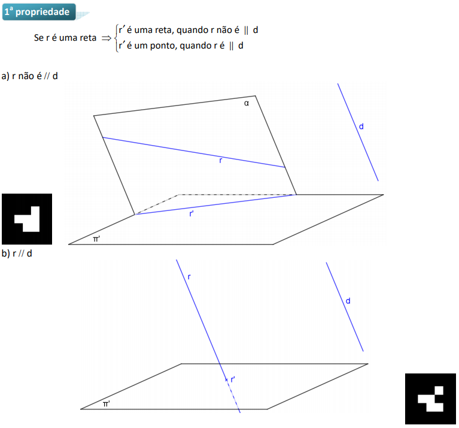

# geometria-descritiva
Visualização de propriedades de projeções e sólidos 
 Referências
 Imagem de visualização
 <h3>Propriedades das projeções cilíndricas</h3>
<table><tr><td><h4>Propriedade 1, pág. 4</h4>

 </td></tr></table>
