<head>
<link rel="stylesheet" href="scripts/style.css">
</head>

<h2 id="inicio">Visualização de propriedades de projeções, sólidos e aplicações</h2> 

Este site contém as construções geométricas e visualizações 3D dos exemplos e exercícios utilizados na disciplina de Geometria Descritiva I

A apostila está disponível no link: <a href="http://www.exatas.ufpr.br/portal/degraf_paulo/wp-content/uploads/sites/4/2020/02/ApostilaGD2019.pdf" target="_blank">apostila de Geometria Descritiva</a>

Os objetos programados em 3D podem ser visualizados os objetos em Realidade Virtual (RV) e Realidade Aumentada (RA). As propriedades de projeções e os sólidos podem ser vistos em RA com os marcadores indicados, e através dos links criados nos marcadores, os objetos podem ser vistos em RV.

  
Propriedades das projeções cilíndricas: pág. 1-13

	
Leia o conteúdo das páginas 1, 2 e 3 da apostila. Vamos trabalhar com as projeções de objetos e figuras em um plano chamado de <b>&pi;'</b>.
 	
	
	
<a href="#propriedades" class="topo">voltar ao topo</a>

	
	
<a href="#propriedades" class="topo">voltar ao topo</a>

	
    
<figcaption>Para projetar um ponto <b>A</b> qualquer do espaço usando a projeção cônica, basta definir a reta projetante <b>a</b>, que passa pelo centro de projeção <b>O</b> e pelo ponto <b>A</b>. A interseção desta reta com o plano <b>&pi;'</b> é a projeção <b>A'</b> do ponto <b>A</b>.</figcaption>
    <a href="vr/proj_conica.html" target="_blank" class="visu">Visualização em 3D</a>

	
    
<figcaption>Para projetar um ponto <b>A</b> qualquer do espaço usando a projeção cilíndrica, basta definir a reta projetante <b>a</b>, paralela à direção <b>d</b> e que passa pelo ponto <b>A</b>. A interseção desta reta com o plano <b>&pi;'</b> é a projeção <b>A'</b> do ponto <b>A</b>. Se a reta <b>d</b> formar ângulo <b>0 < &theta; < 90o</b>, a projeção é chamada <b>oblíqua</b>.</figcaption>
    <a href="vr/proj_cilindrica.html" target="_blank" class="visu">Projeção cilíndrica <b>oblíqua</b> em 3D</a>
    <figcaption>Quando <b>&theta; = 90o</b>, temos a projeção <b>ortogonal</b>.</figcaption>
	<a href="vr/proj_cilindrica_orto.html" target="_blank" class="visu">Projeção cilíndrica <b>ortogonal</b> em 3D</a>

	
<a href="#propriedades" class="topo">voltar ao topo</a>

	
    
<figcaption>Quando a reta <b>r</b> não é paralela à direção <b>d</b>, a sua projeção <b>r'</b> é uma reta.</figcaption>
    <a href="vr/p1.html" target="_blank" class="visu">Visualização em 3D: projeção <b>oblíqua</b></a>
	 <a href="vr/p1_orto.html" target="_blank" class="visu">Visualização em 3D: projeção <b>ortogonal</b></a>

	
    
<figcaption>No caso em que as retas <b>r</b> e <b>d</b> são paralelas, a projeção <b>r'</b> é um ponto.</figcaption>
	<a href="vr/p1a.html" target="_blank" class="visu">Visualização em 3D: projeção <b>oblíqua</b></a>
	 <a href="vr/p1a_orto.html" target="_blank" class="visu">Visualização em 3D: projeção <b>ortogonal</b></a>
	  

&#x1f453; Realidade Aumentada e Realidade Virtual

		
Esta apostila tem recursos programados em Realidade Aumentada e Realidade Virtal. Você pode acessar estes recursos usando o seguinte endereço:

		
<a href="https://paulohscwb.github.io/geometria-descritiva/ra.html"> https://paulohscwb.github.io/geometria-descritiva/ra.html</a>

		
Os ambientes podem ser acessados em qualquer navegador com um dispositivo de webcam (smartphone, tablet ou notebook).

		
O acesso aos sites de Realidade Virtual é feito clicando no círculo azul que aparece em cima dos marcadores.

		
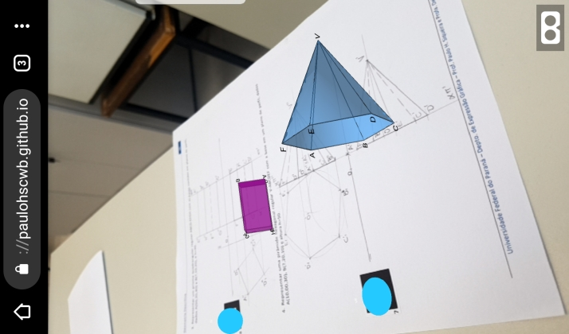
  
		
Veja o vídeo de demonstração do uso destes recursos:

		

		  <iframe src="https://drive.google.com/file/d/1Tg2c6pOoDNESEAvl9kvXgRGv81D-U0Kw/preview" width="100%"></iframe>
		

	  

	
<a href="#propriedades" class="topo">voltar ao topo</a>

	  
    
<figcaption>Considerando <b>r</b> e <b>s</b> estão em planos projetantes distintos, as projeções <b>r'</b> e <b>s'</b> são paralelas.</figcaption>
    <a href="vr/p2.html" target="_blank" class="visu">Propriedade em 3D: projeção <b>oblíqua</b></a>
	 <a href="vr/p2_orto.html" target="_blank" class="visu">Propriedade em 3D: projeção <b>ortogonal</b></a>

      
	
<figcaption>Se <b>r</b> e <b>s</b> estão em um mesmo plano projetante, as projeções <b>r'</b> e <b>s'</b> são coincidentes.</figcaption>
    <a href="vr/p2a.html" target="_blank" class="visu">Propriedade em 3D: projeção <b>oblíqua</b></a>
	 <a href="vr/p2a_orto.html" target="_blank" class="visu">Propriedade em 3D: projeção <b>ortogonal</b></a>

      
    
<figcaption>Quando as retas <b>r</b> e <b>s</b> são paralelas à direção <b>d</b>, suas projeções <b>r'</b> e <b>s'</b> são pontos.</figcaption>
    <a href="vr/p2c.html" target="_blank" class="visu">Propriedade em 3D: projeção <b>oblíqua</b></a>
	 <a href="vr/p2c_orto.html" target="_blank" class="visu">Propriedade em 3D: projeção <b>ortogonal</b></a>

	
<a href="#propriedades" class="topo">voltar ao topo</a>

    
 
    <figcaption>A proporção entre as medidas dos segmentos paralelos <b>AB</b> e <b>CD</b> é a mesma de suas projeções, ou seja: <b>AB/CD = A'B'/C'D'</b>.</figcaption>
    <a href="vr/p3a.html" target="_blank" class="visu">Propriedade em 3D: projeção <b>oblíqua</b></a>
	 <a href="vr/p3a_orto.html" target="_blank" class="visu">Propriedade em 3D: projeção <b>ortogonal</b></a>

     
    
<figcaption>Se os segmentos <b>AB</b> e <b>CD</b> são colineares, a mesma proporção entre as medidas é válida: <b>AB/CD = A'B'/C'D'</b>.</figcaption>
    <a href="vr/p3b.html" target="_blank" class="visu">Propriedade em 3D: projeção <b>oblíqua</b></a>
	 <a href="vr/p3b_orto.html" target="_blank" class="visu">Propriedade em 3D: projeção <b>ortogonal</b></a>

	 
	
<a href="#propriedades" class="topo">voltar ao topo</a>

	 
    

&#x1f4cf; &#x1f4d0; Resolução

  
 Vamos utilizar a régua e o compasso para resolver este exercício. De acordo com a propriedade 3, podemos encontrar a projeção do ponto médio de <b>AB</b> construindo a mediatriz da projeção deste segmento. Clique nos botões do passo a passo para fazer a construção na sua apostila.

  <ul class="slider">
       <li>
           <input type="radio" id="slide100" name="slide">
           <label for="slide100"></label>
		   
		   <figcaption>Com a ponta seca em <b>A'</b>, desenhe um arco com raio maior do que a metade de <b>A'B'</b>.</figcaption>
       </li>
       <li>
           <input type="radio" id="slide101" name="slide">
           <label for="slide101"></label>
           
           <figcaption>Com a ponta seca em <b>B'</b>, desenhe um arco com o mesmo raio usado no passo anterior.</figcaption>
       </li>
       <li>
           <input type="radio" id="slide102" name="slide">
           <label for="slide102"></label>
           
           <figcaption>Desenhe a reta que passa pelos pontos de interseção dos arcos usando a régua.</figcaption>
       </li>
       <li>
           <input type="radio" id="slide103" name="slide">
           <label for="slide103"></label>
           
           <figcaption>A projeção do ponto médio <b>M'</b> está na interseção da mediatriz de <b>A'B'</b> com o segmento <b>A'B'</b>.</figcaption>
       </li>
       <li>
           <input type="radio" id="slide104" name="slide">
           <label for="slide104"></label>
           
           <figcaption>Como os pontos <b>A'</b> e <b>B'</b> estão coincidentes, quer dizer que o segmento <b>AB</b> é paralelo à direção das projetantes. Logo, <b>M'</b> coincide com <b>A'</b> e <b>B'</b>.</figcaption>
       </li>
    </ul>
    
  

  
  

&#x1f4cf; &#x1f4d0; Resolução

  
 Vamos utilizar a régua e os esquadros para resolver este exercício. De acordo com a propriedade 2, podemos encontrar a projeção dos lados de um paralelogramo utilizando a construção de retas paralelas.

  <ul class="slider">
      <li>
           <input type="radio" id="slide105" name="slide">
           <label for="slide105"></label>
           
           <figcaption>A projeção do lado <b>C'D'</b> será paralela ao segmento <b>A'B'</b>. Logo, podemos desenhar a reta <b>C'D' // A'B'</b> com o uso de esquadros.</figcaption>
       </li>
       <li>
           <input type="radio" id="slide106" name="slide">
           <label for="slide106"></label>
           
           <figcaption>Alinhando o esquadro de 45o com <b>A'B'</b>, coloque como apoio o outro esquadro ou a régua. Deslize o esquadro de 45o deixando o outro esquadro ou a régua fixo.</figcaption>
       </li>
       <li>
           <input type="radio" id="slide107" name="slide">
           <label for="slide107"></label>
           
           <figcaption>Usando a mesma construção, você pode desenhar a reta paralela a <b>B'C'</b> passando por <b>A'</b>. Alinhando-se a hipotenusa do esquadro de 45 com <b>B'C'</b>, apoie o outro esquadro ou a régua com um cateto do esquadro de 45.</figcaption>
       </li>
       <li>
           <input type="radio" id="slide108" name="slide">
           <label for="slide108"></label>
           
           <figcaption>Deslizando o esquadro de 45 e mantendo o outro esquadro fixo, você consegue desenhar a paralela a <b>B'C'</b> passando por <b>A'</b>.</figcaption>
       </li>
       <li>
           <input type="radio" id="slide109" name="slide">
           <label for="slide109"></label>
           
           <figcaption>A interseção das duas paralelas é o vértice <b>D'</b>. Pronto, o paralelogramo está construído.</figcaption>
       </li>
    </ul>
    
  

  
  

&#x1f4cf; &#x1f4d0; Resolução

  
Vamos utilizar a régua e o compasso para resolver este exercício.

  <ul class="slider">
      <li>
           <input type="radio" id="slide110" name="slide">
           <label for="slide110"></label>
           
           <figcaption>Relembrando uma propriedade do paralelogramo: as diagonais interceptam-se em seus respectivos pontos médios. Logo, pela propriedade 3, <b>A'M' = M'C'</b>.</figcaption>
       </li>
       <li>
           <input type="radio" id="slide111" name="slide">
           <label for="slide111"></label>
           
           <figcaption>Logo, podemos "pegar" a medida <b>A'B'</b> com o compasso e prolongar o segmento <b>A'M'</b>.</figcaption>
       </li>
       <li>
           <input type="radio" id="slide112" name="slide">
           <label for="slide112"></label>
           
           <figcaption>Para encontrar <b>C'</b>, basta desenhar o arco com medida <b>A'M'</b> no prolongamento de <b>A'M'</b>.</figcaption>
       </li>
       <li>
           <input type="radio" id="slide113" name="slide">
           <label for="slide113"></label>
           
           <figcaption>O mesmo acontece com os segmentos <b>B'M'</b> e <b>M'D'</b>. Logo, podemos "pegar" a medida <b>B'M'</b> com o compasso...</figcaption>
       </li>
	   <li>
           <input type="radio" id="slide113a" name="slide">
           <label for="slide113a"></label>
           
           <figcaption>... e podemos desenhar o arco com centro em <b>M'</b> e raio <b>B'M'</b>.</figcaption>
       </li>
	   <li>
           <input type="radio" id="slide113b" name="slide">
           <label for="slide113b"></label>
           
           <figcaption>Pronto! O paralelogramo está construído. Não esqueça de desenhar os lados desta figura.</figcaption>
       </li>
    </ul>
    
  

  
  

&#x1f4cf; &#x1f4d0; Resolução: item b

  
Vamos utilizar a régua e o compasso para resolver este exercício.

  <ul class="slider">
      <li>
           <input type="radio" id="slide120" name="slide">
           <label for="slide120"></label>
           
        <figcaption>Como as projeções dos vértices <b>A'</b> e <b>B'</b> são coincidentes, pela propriedade 1, podemos concluir que <b>AB // d</b>. Portanto, temos que <b>C'D' // d</b>.</figcaption>
       </li>
       <li>
           <input type="radio" id="slide121" name="slide">
           <label for="slide121"></label>
           
         <figcaption>Podemos "pegar" a medida entre os pontos <b>A'=B'</b> e <b>M'</b> com o compasso e prolongar o segmento que une estes pontos.</figcaption>
       </li>
       <li>
           <input type="radio" id="slide122" name="slide">
           <label for="slide122"></label>
           
           <figcaption>Os pontos <b>C'</b> e <b>D'</b> também coincidem, pois <b>AB // CD</b>.  Para encontrar <b>C'=D'</b>, basta desenhar o arco com medida <b>A'M'</b> no prolongamento de <b>A'M'</b>.</figcaption>
       </li>
       <li>
           <input type="radio" id="slide123" name="slide">
           <label for="slide123"></label>
           
           <figcaption>O paralelogramo está construído. Use o link abaixo para visualizar em 3D a propriedade que usamos. Agora você pode construir o item c deste exercício.</figcaption>
       </li>
    </ul>
    
	<a href="vr/20_03b.html" target="_blank" class="visu">Visualização em 3D</a>
   

   

&#x1f4cf; &#x1f4d0; Solução: item c

	
	<figcaption>Usando as propriedades dos itens a e b, você consegue fazer a construção deste paralelogramo.</figcaption>
  

  
<a href="#propriedades" class="topo">voltar ao topo</a>

  
  

&#x1f4cf; &#x1f4d0; Resolução

  
 Vamos utilizar a régua e o compasso para resolver este exercício.

  <ul class="slider">
      <li>
           <input type="radio" id="slide124" name="slide">
           <label for="slide124"></label>
           
        <figcaption>Relembrando a propriedade do baricentro: A distância do baricentro a um vértice mede 2/3 da mediana, ou seja, <b>CG = 2CM/3</b> ou <b>GM = CM/3.</b></figcaption>
       </li>
       <li>
           <input type="radio" id="slide125" name="slide">
           <label for="slide125"></label>
           
         <figcaption>Pela propriedade 3, a medida <b>G'M'</b> mede <b>CM/3</b>. Então vamos construir a mediatriz do segmento <b>A'B'</b>.</figcaption>
       </li>
       <li>
           <input type="radio" id="slide126" name="slide">
           <label for="slide126"></label>
           
         <figcaption>Usando os arcos de mesma medida, com centros em <b>A'</b> e <b>B'</b>, obtemos os pontos que definem a mediatriz de <b>A'B'</b>.</figcaption>
       </li>
       <li>
           <input type="radio" id="slide127" name="slide">
           <label for="slide127"></label>
           
         <figcaption>Unindo os pontos <b>M'</b> e <b>G'</b>, podemos usar o compasso para "pegar" a medida <b>G'M'</b>.</figcaption>
       </li>
       <li>
           <input type="radio" id="slide128" name="slide">
           <label for="slide128"></label>
           
           <figcaption>Com o centro em <b>G'</b>, marcamos uma vez o segmento com medida igual a <b>G'M'</b>.</figcaption>
       </li>
       <li>
           <input type="radio" id="slide129" name="slide">
           <label for="slide129"></label>
           
           <figcaption>Na sequência, marcamos novamente um segmento com a mesma medida. Assim, encontramos <b>G'C' = 2G'M'</b>.</figcaption>
       </li>
       <li>
           <input type="radio" id="slide130" name="slide">
           <label for="slide130"></label>
           
           <figcaption>Agora você pode desenhar os lados do triângulo <b>A'B'C'</b>.</figcaption>
       </li> 
    </ul>
    
  

    
  

&#x1f4cf; &#x1f4d0; Resolução: item b

  
 Vamos utilizar a régua e o compasso para resolver este exercício.

  <ul class="slider">
      <li>
           <input type="radio" id="slide131" name="slide">
           <label for="slide131"></label>
           
        <figcaption>Vamos usar a mesma propriedade do item anterior: A distância do baricentro a um vértice mede 2/3 da mediana, ou seja, <b>CG = 2CM/3</b> ou <b>GM = CM/3.</b></figcaption>
       </li>
       <li>
           <input type="radio" id="slide132" name="slide">
           <label for="slide132"></label>
           
         <figcaption>Pela propriedade 2, se os pontos <b>A'</b> e <b>B'</b> coincidem, o lado <b>AB</b> é paralelo à direção <b>d</b>. Logo, o ponto <b>M'</b> também coincide com <b>A'</b> e <b>B'</b>.</figcaption>
       </li>
       <li>
           <input type="radio" id="slide133" name="slide">
           <label for="slide133"></label>
           
         <figcaption>Logo, podemos prolongar a reta <b>A'G'</b> para encontrar a projeção do vértice <b>C</b>. Usando o compasso, "pegamos" a medida <b>A'G'</b> e podemos marcá-la a partir de <b>G'</b></figcaption>
       </li>
       <li>
           <input type="radio" id="slide134" name="slide">
           <label for="slide134"></label>
           
         <figcaption>Marcando-se duas vezes esta medida <b>A'G'</b> encontramos a projeção <b>C'</b>. Neste caso, o triângulo <b>ABC</b> fica projetado como um segmento.</figcaption>
       </li>
	   <li>
           <input type="radio" id="slide135" name="slide">
           <label for="slide135"></label>
           
         <figcaption>Use o link abaixo para visualizar o exercício em 3D. Agora é sua vez de construir o item c.</figcaption>
       </li>
    </ul>
	
    <a href="vr/20_04b.html" target="_blank" class="visu">Visualização em 3D</a>

	

&#x1f4cf; &#x1f4d0; Solução: item c

	
  	<figcaption>Utilizando as mesmas propriedades dos itens anteriores, você consegue construir este triângulo. Use o link abaixo para te ajudar na visualização em 3D.</figcaption>
    <a href="vr/p_ex4c_triangulo.html" target="_blank" class="visu">Visualização em 3D</a>
  

  
  

&#x1f4cf; &#x1f4d0; Resolução

  
 Vamos utilizar a régua, o compasso e os esquadros para resolver este exercício.

  <ul class="slider">
      <li>
           <input type="radio" id="slide136" name="slide">
           <label for="slide136"></label>
           
        <figcaption>Relembrando as propriedades do hexágono regular: os lados são iguais ao raio da circunferência circunscrita, e os raios são paralelos aos lados.</figcaption>
       </li>
       <li>
           <input type="radio" id="slide137" name="slide">
           <label for="slide137"></label>
           
         <figcaption>Pela propriedade 3, os segmentos <b>A'O'</b> e <b>B'C'</b> terão projeções com mesma medida e serão paralelos. Logo, podemos construir a paralela a <b>A'O'</b> que passa por <b>B'</b>.</figcaption>
       </li>
       <li>
           <input type="radio" id="slide138" name="slide">
           <label for="slide138"></label>
           
         <figcaption>Alinhando a hipotenusa de um esquadro e apoiando este esquadro com a régua ou outro esquadro, basta deslizar o esquadro que você alinhou até chegar em <b>B'</b>.</figcaption>
       </li>
       <li>
           <input type="radio" id="slide139" name="slide">
           <label for="slide139"></label>
           
         <figcaption>Como <b>AO = BC</b> e <b>AO // BC</b>, pelas propriedades 2 e 3 temos que <b>A'O' = B'C'</b> e <b>A'O' // B'C'</b>. Podemos "pegar" a medida <b>A'O'</b> com o compasso...</figcaption>
       </li>
	   <li>
           <input type="radio" id="slide140" name="slide">
           <label for="slide140"></label>
           
         <figcaption>... e marcá-la na paralela construída, a partir do ponto <b>B'</b>. Assim, encontramos a projeção do ponto <b>C'</b>.</figcaption>
       </li>
	   <li>
           <input type="radio" id="slide141" name="slide">
           <label for="slide141"></label>
           
         <figcaption>Usando a propriedade 3, como <b>A</b>, <b>O</b> e <b>D</b> são colineares, temos que <b>A'O' = O'D'</b>. Podemos "pegar" essa medida com o compasso...</figcaption>
       </li>
	   <li>
           <input type="radio" id="slide142" name="slide">
           <label for="slide142"></label>
           
         <figcaption>... e desenhar o arco com centro em <b>O'</b>. Assim, encontramos o vértice <b>D'</b>.</figcaption>
       </li>
	   <li>
           <input type="radio" id="slide143" name="slide">
           <label for="slide143"></label>
           
         <figcaption>Podemos fazer a mesma construção com os segmentos <b>O'F' = O'C'</b> para encontrar <b>F'</b>.</figcaption>
       </li>
	   <li>
           <input type="radio" id="slide144" name="slide">
           <label for="slide144"></label>
           
         <figcaption>E para fechar o hexágono, fazemos a mesma construção com os segmentos <b>B'O' = O'E'</b>. Use o link abaixo para visualizar o exercício em 3D.</figcaption>
       </li>
    </ul>
	
    <a href="vr/p_ex5a_hexagono.html" target="_blank" class="visu">Visualização em 3D</a>
  

  
  

&#x1f4cf; &#x1f4d0; Solução: item b

    
	<figcaption>Com as propriedades que usamos no item a, você consegue fazer a construção deste hexágono do item b.</figcaption>
  

  

&#x1f4cf; &#x1f4d0; Resolução: item c

  
 Vamos utilizar a régua e o compasso para resolver este exercício.

  <ul class="slider">
      <li>
           <input type="radio" id="slide145" name="slide">
           <label for="slide145"></label>
           
        <figcaption>Usando as propriedades do hexágono regular, podemos notar que <b>AB = OC</b> e <b>AB // OC</b>. Logo, as projeções desses serão iguais e paralelas.</figcaption>
       </li>
       <li>
           <input type="radio" id="slide146" name="slide">
           <label for="slide146"></label>
           
         <figcaption>Pela propriedade 5, como os pontos <b>A'</b>, <b>B'</b> e <b>O'</b> são colineares, o hexágono está em um plano paralelo à direção de projeções <b>d</b>. Logo, <b>C'</b> estará na mesma reta.</figcaption>
       </li>
       <li>
           <input type="radio" id="slide147" name="slide">
           <label for="slide147"></label>
           
         <figcaption>Podemos "pegar" a medida <b>A'B'</b> com o compasso e transferir esta medida a partir de <b>O'</b>, encontrando o ponto <b>C'</b>.</figcaption>
       </li>
       <li>
           <input type="radio" id="slide148" name="slide">
           <label for="slide148"></label>
           
         <figcaption>Como <b>BO = OE</b>, pela propriedade 3 temos que <b>B'O' = O'E'</b>. Podemos "pegar" a medida <b>B'O'</b> com o compasso...</figcaption>
       </li>
	   <li>
           <input type="radio" id="slide149" name="slide">
           <label for="slide149"></label>
           
         <figcaption>... e marcá-la a partir do ponto <b>O'</b>, encontrando o vértice <b>E'</b>. Podemos usar a mesma propriedade para encontrar os outros vértices.</figcaption>
       </li>
	   <li>
           <input type="radio" id="slide150" name="slide">
           <label for="slide150"></label>
           
         <figcaption>Podemos marcar <b>A'O' = O'D'</b> para encontrar o vértice <b>D'</b>.</figcaption>
       </li>
	   <li>
           <input type="radio" id="slide151" name="slide">
           <label for="slide151"></label>
           
         <figcaption>E para finalizar o hexágono, marcamos <b>O'C' = O'F'</b>. Visualize este hexágono em 3D com o link abaixo.</figcaption>
       </li>
    </ul>
	
  

  <a href="vr/p_ex5c_hexagono.html" target="_blank" class="visu">Visualização em 3D: item c</a>

  
<a href="#propriedades" class="topo">voltar ao topo</a>

  
  

&#x1f4cf; &#x1f4d0; Solução

  
 Você pode usar as mesmas propriedades que usamos no exercício 5.

    
	<figcaption>Encontre a projeção do centro da circunferência em cada item. Lembre-se das propriedades do hexágono regular.</figcaption>
  

  
  
<figcaption>Uma figura pertencente a um plano paralelo ao plano de projeções <b>&pi;'</b> fica projetada com o mesmo tamanho, sem redução ou ampliação de tamanho.</figcaption>
    <a href="vr/p4.html" target="_blank" class="visu">Propriedade em 3D: projeção <b>oblíqua</b></a>
	 <a href="vr/p4_orto.html" target="_blank" class="visu">Propriedade em 3D: projeção <b>ortogonal</b></a>

    
<a href="#propriedades" class="topo">voltar ao topo</a>

	 
    
<figcaption>Uma figura que pertence a um plano <b>&alpha;</b> paralelo à direção <b>d</b> de projeções tem projeção reduzida a um segmento.</figcaption>
    <a href="vr/p5.html" target="_blank" class="visu">Propriedade em 3D: projeção <b>oblíqua</b></a>
	 <a href="vr/p5_orto.html" target="_blank" class="visu">Propriedade em 3D: projeção <b>ortogonal</b></a>

	
  
<figcaption>Os segmentos oblíquos ao plano de projeções <b>&pi;'</b> são projetados com tamanho reduzido, ou seja, <b>AB > A'B'</b></figcaption>
  <a href="vr/p6.html" target="_blank" class="visu">Visualização da propriedade em 3D</a>

  
  
<a href="#propriedades" class="topo">voltar ao topo</a>

  
  
<figcaption>Quando a reta <b>r // &pi;'</b> e as retas <b>r</b> e <b>s</b> são perpendiculares ou ortogonais, as retas <b>r'</b> e <b>s'</b> são perpendiculares.</figcaption>
  <a href="vr/p7.html" target="_blank" class="visu">Visualização da propriedade em 3D</a>

    
  

&#x1f4cf; &#x1f4d0; Resolução

  
 Vamos utilizar a régua e o compasso para resolver este exercício.

  <ul class="slider">
      <li>
           <input type="radio" id="slide152" name="slide">
           <label for="slide152"></label>
           
        <figcaption>Usando as propriedades do losango, temos que as medidas dos lados são iguais <b>AB = BC = CD = AD</b> e as diagonais <b>AC</b> e <b>BD</b> são perpendiculares. Podemos usar a propriedade 7 de projeções ortogonais.</figcaption>
       </li>
       <li>
           <input type="radio" id="slide153" name="slide">
           <label for="slide153"></label>
           
         <figcaption>Como a reta <b>AC</b> é paralela a <b>&pi;'</b>, o ângulo de 90o está projetado em verdadeira grandeza (vg). Podemos construir a mediatriz da projeção da diagonal <b>A'C'</b>.</figcaption>
       </li>
       <li>
           <input type="radio" id="slide154" name="slide">
           <label for="slide154"></label>
           
         <figcaption>A interseção da mediatriz de <b>A'C'</b> com a reta <b>r'</b> é o vértice <b>B'</b>.</figcaption>
       </li>
       <li>
           <input type="radio" id="slide155" name="slide">
           <label for="slide155"></label>
           
         <figcaption>Como <b>BM = MD</b>, pela propriedade 3 temos que <b>B'M' = M'D'</b>. Podemos marcar com o compasso a medida <b>B'M'</b> a partir do ponto <b>M'</b>, encontrando o vértice <b>D'</b>.</figcaption>
       </li>
	   <li>
           <input type="radio" id="slide156" name="slide">
           <label for="slide156"></label>
           
         <figcaption>Pronto, a projeção do losango está construída. Veja no link abaixo a representação em 3D deste exercício.</figcaption>
       </li>
    </ul>
	
  

  <a href="vr/p_ex1_losango.html" target="_blank" class="visu">Visualização em 3D</a>

  
  

&#x1f4cf; &#x1f4d0; Resolução

  
 Vamos utilizar a régua e o compasso para resolver este exercício.

  <ul class="slider">
      <li>
           <input type="radio" id="slide157" name="slide">
           <label for="slide157"></label>
           
        <figcaption>Usando as propriedades do retângulo, temos que os vértices pertencem a uma circunferência com centro no encontro das diagonais <b>M</b>. Esta circunferência é chamada de arco capaz de 90o.</figcaption>
       </li>
       <li>
           <input type="radio" id="slide158" name="slide">
           <label for="slide158"></label>
           
         <figcaption>Como o segmento <b>AB</b> é paralelo a <b>&pi;'</b>, sua projeção <b>A'B'</b> está em verdadeira grandeza (vg). Podemos construir a circunferência com centro em <b>A'</b> e raio 3cm.</figcaption>
       </li>
       <li>
           <input type="radio" id="slide159" name="slide">
           <label for="slide159"></label>
           
         <figcaption>Vamos começar construindo a mediatriz de <b>A'C'</b> para desenhar o arco capaz de 90o.</figcaption>
       </li>
       <li>
           <input type="radio" id="slide160" name="slide">
           <label for="slide160"></label>
           
         <figcaption>Com o centro em <b>M'</b>, podemos construir a circunferência de raio <b>M'A' = M'C'</b>.</figcaption>
       </li>
	   <li>
           <input type="radio" id="slide161" name="slide">
           <label for="slide161"></label>
           
         <figcaption>Agora podemos desenhar a circunferência com centro em <b>A'</b> e raio 3cm. A interseção desta circunferência com o arco capaz de 90o é o vértice <b>B'</b>. Escolha uma das interseções para este vértice <b>B'</b></figcaption>
       </li>
	   <li>
           <input type="radio" id="slide162" name="slide">
           <label for="slide162"></label>
           
         <figcaption>Como os lados <b>AB</b> e <b>CD</b> são paralelos, podemos desenhar a circunferência com centro em <b>C'</b> e raio 3cm para encontrar o vértice <b>D'</b>.</figcaption>
       </li>
	   <li>
           <input type="radio" id="slide163" name="slide">
           <label for="slide163"></label>
           
         <figcaption>Pronto, a projeção do retângulo está construída. Veja no link abaixo a representação em 3D deste exercício.</figcaption>
       </li>
    </ul>
	
  

  <a href="vr/p_ex2_retangulo.html" target="_blank" class="visu">Visualização em 3D</a>

  
<a href="#propriedades" class="topo">voltar ao topo</a>

  
  

&#x1f4cf; &#x1f4d0; Resolução

  
 Vamos utilizar o compasso e os esquadros para resolver este exercício.

  <ul class="slider">
      <li>
           <input type="radio" id="slide164" name="slide">
           <label for="slide164"></label>
           
        <figcaption>Um paralelepípedo tem todas as faces com paralelogramos. Supondo-se que o vértice <b>F</b> está mais próximo do observador, temos as arestas determinadas por <b>F</b> visíveis</figcaption>
       </li>
       <li>
           <input type="radio" id="slide165" name="slide">
           <label for="slide165"></label>
           
         <figcaption>Outra maneira de construir o paralelepípedo é considerando que o vértice <b>F</b> está mais distante do observador. Neste caso, suas arestas tornam-se invisíveis. Neste exercício você pode escolher uma das visibilidades apresentadas.</figcaption>
       </li>
       <li>
           <input type="radio" id="slide166" name="slide">
           <label for="slide166"></label>
           
         <figcaption>Vamos começar construindo a reta paralela a <b>B'C'</b> que passa por <b>A'</b> para encontrar o vértice <b>D'</b> da base do paralelepípedo. Podemos usar o esquadro de 45o para alinhar com o segmento.</figcaption>
       </li>
       <li>
           <input type="radio" id="slide167" name="slide">
           <label for="slide167"></label>
           
         <figcaption>Deslizando o esquadro com o outro esquadro apoiado, podemos desenhar a reta paralela a <b>B'C'</b> pelo vértice <b>A'</b>.</figcaption>
       </li>
	   <li>
           <input type="radio" id="slide168" name="slide">
           <label for="slide168"></label>
           
         <figcaption>Fazendo a mesma construção, podemos desenhar a reta paralela ao segmento <b>A'B'</b> que passa por <b>C'</b>. O encontro destas paralelas é o vértice <b>D'</b>.</figcaption>
       </li>
	   <li>
           <input type="radio" id="slide169" name="slide">
           <label for="slide169"></label>
           
         <figcaption>Agora podemos desenhar as arestas laterais. Basta desenhar as retas paralelas à aresta lateral <b>A'E'</b> que passam pelos vértices <b>B'</b>, <b>C'</b> e <b>D'</b>.</figcaption>
       </li>
	   <li>
           <input type="radio" id="slide170" name="slide">
           <label for="slide170"></label>
           
         <figcaption>Com o compasso, você pode "pegar" a medida <b>A'E'</b>...</figcaption>
       </li>
	   <li>
           <input type="radio" id="slide171" name="slide">
           <label for="slide171"></label>
           
         <figcaption>... e marcar com a ponta seca em <b>B'</b> para encontrar o vértice <b>F'</b>.</figcaption>
       </li>
	   <li>
           <input type="radio" id="slide172" name="slide">
           <label for="slide172"></label>
           
         <figcaption>Fazendo a mesma construção com os vértices <b>C'</b> e <b>D'</b>, você encontra os vértices <b>G'</b> e <b>H'</b>. Esta construção é possível por causa das propriedades 2 e 3 de projeções cilíndricas.</figcaption>
       </li>
	   <li>
           <input type="radio" id="slide173" name="slide">
           <label for="slide173"></label>
           
         <figcaption>Agora você pode "passar a limpo" o desenho do paralelepípedo. Como ainda não estamos trabalhando com as coordenadas dos vértices, você pode escolher uma das visualizações mostradas nos passos 1 e 2.</figcaption>
       </li>
    </ul>
	
  

  
  

&#x1f4cf; &#x1f4d0; Solução

  
 Você pode utilizar o compasso e os esquadros para resolver este exercício. Lembre-se das propriedades de projeções cilíndricas 2 e 3.

	
	<figcaption>Tente encontrar o centro da circunferência da base dos vertices <b>A'</b> e <b>B'</b>. Use as propriedades do hexágono regular.</figcaption>
  

  
<a href="#propriedades" class="topo">voltar ao topo</a>

  
  

&#x1f4cf; &#x1f4d0; Solução

  
 Você pode utilizar o compasso e os esquadros para resolver este exercício. Lembre-se de aplicar as propriedades de projeções cilíndricas e cilíndricas ortogonais.

	
	<figcaption>Usando as propriedades de projeções cilíndricas ortogonais, verifique quais dos segmentos são projetados em verdadeira grandeza (vg) em <b>&pi;'</b>: <b>AB</b>, <b>AE</b>, <b>HJ</b> e <b>JG</b>.</figcaption>
  

  
<a href="#propriedades" class="topo">voltar ao topo</a>

Pontos e Retas: pág. 14-37

	
	
<a href="#pontos" class="topo">voltar ao topo</a>

	
	
<a href="#pontos" class="topo">voltar ao topo</a>

	
	<a href="vr/a_epura1.html" target="_blank" class="visu">Visualização em 3D</a>
	
<a href="#pontos" class="topo">voltar ao topo</a>

	
	
	
<a href="#pontos" class="topo">voltar ao topo</a>

	
	
<a href="#pontos" class="topo">voltar ao topo</a>

	
	
	<a href="vr/a_epura2.html" target="_blank" class="visu">Visualização em 3D</a>
	
	
<a href="#pontos" class="topo">voltar ao topo</a>

	
	
<a href="#pontos" class="topo">voltar ao topo</a>

	
	
	
	
	
	
	
	
<a href="#pontos" class="topo">voltar ao topo</a>

	
	
<a href="#pontos" class="topo">voltar ao topo</a>

	
	
<a href="#pontos" class="topo">voltar ao topo</a>

	
	
<a href="#pontos" class="topo">voltar ao topo</a>

	
	
<a href="#pontos" class="topo">voltar ao topo</a>

	
	
<a href="#pontos" class="topo">voltar ao topo</a>

	
	
<a href="#pontos" class="topo">voltar ao topo</a>

	
	
<a href="#pontos" class="topo">voltar ao topo</a>

	
	
<a href="#pontos" class="topo">voltar ao topo</a>

	
	
	<a href="vr/030_mpp.html" target="_blank" class="visu">Visualização em 3D</a>
	
<a href="#pontos" class="topo">voltar ao topo</a>

	
	
	
<a href="#pontos" class="topo">voltar ao topo</a>

	
	
	
	
<a href="#pontos" class="topo">voltar ao topo</a>

	
	
	
	
<a href="#pontos" class="topo">voltar ao topo</a>

	
	
	
	
	
<a href="#pontos" class="topo">voltar ao topo</a>

	
	
	
	
	
	
	
<a href="#pontos" class="topo">voltar ao topo</a>

	
	
	
<a href="#pontos" class="topo">voltar ao topo</a>

	
	
	
<a href="#pontos" class="topo">voltar ao topo</a>

<a href="#inicio"> voltar ao topo</a>
<h3 id="horizontal">Representações de sólidos com uma face horizontal</h3>
<table><tr><td><h3>Exercício 1, pág. 43</h3>

 

<h3>Exercício 2, pág. 44</h3>

 

<h3>Exercício 3, pág. 44</h3>

 

<h3>Exercício 4, pág. 45</h3>

 

<h3>Exercício 5, pág. 45</h3>

 

<h3>Exercício 6, pág. 46</h3>

 

<h3>Exercício 7, pág. 46</h3>

 

<h3>Exercício 8, pág. 47</h3>

 

<h3>Exercício 9, pág. 47</h3>

 

<h3>Exercício 4, pág. 48</h3>

 
</td></tr></table>

<a href="#inicio"> voltar ao topo</a>
<h3 id="frontal">Representações de sólidos com uma face frontal</h3>
<table><tr><td><h3>Exercício 2, pág. 50</h3>

 

<h3>Exercício 3, pág. 51</h3>

 

<h3>Exercício 4, pág. 51</h3>

 

<h3>Exercício 5, pág. 52</h3>

 

<h3>Exercício 6, pág. 52</h3>

 

<h3>Exercício 7, pág. 53</h3>

 
</td></tr></table>

<a href="#inicio"> voltar ao topo</a>
  Para visualizar os sólidos a partir do plano de perfil, o endereço em Realidade Aumentada é o seguinte:
 
<a href="ra1.html"> ra1.html</a>

<h3>Representações de sólidos com uma face de perfil</h3>
<table><tr><td><h3>Exercício 2, pág. 55</h3>

 

<h3>Exercício 3, pág. 56</h3>

 

<h3>Exercício 4, pág. 56</h3>

 

<h3>Exercício 5, pág. 57</h3>

 

<h3>Exercício 6, pág. 57</h3>

 

<h3>Exercício 8, pág. 58</h3>

 
</td></tr></table>

<a href="#inicio"> voltar ao topo</a>
<h3 id="topo">Sólidos com uma face de topo</h3>
<table><tr><td><h3>Exercício 4, pág. 62</h3>

 

<h3>Exercício 5, pág. 62</h3>

 

<h3>Exercício 12, pág. 65</h3>

 

<h3>Exercício 14, pág. 66</h3>

 

<h3>Exercício 15, pág. 67</h3>

 
</td></tr></table>

<a href="#inicio"> voltar ao topo</a>
<h3 id="vertical">Sólidos com uma face vertical</h3>
<table><tr><td><h3>Exercício 4, pág. 71</h3>

 

<h3>Exercício 7, pág. 72</h3>

 

<h3>Exercício 11, pág. 75</h3>

 

<h3>Exercício 12, pág. 76</h3>

 

<h3>Exercício 13, pág. 77</h3>

 
</td></tr></table>

<a href="#inicio"> voltar ao topo</a>
<h3 id="paralelo">Sólidos com uma face em um plano paralelo à linha de terra</h3>
<table><tr><td><h3>Exercício 2, pág. 81</h3>
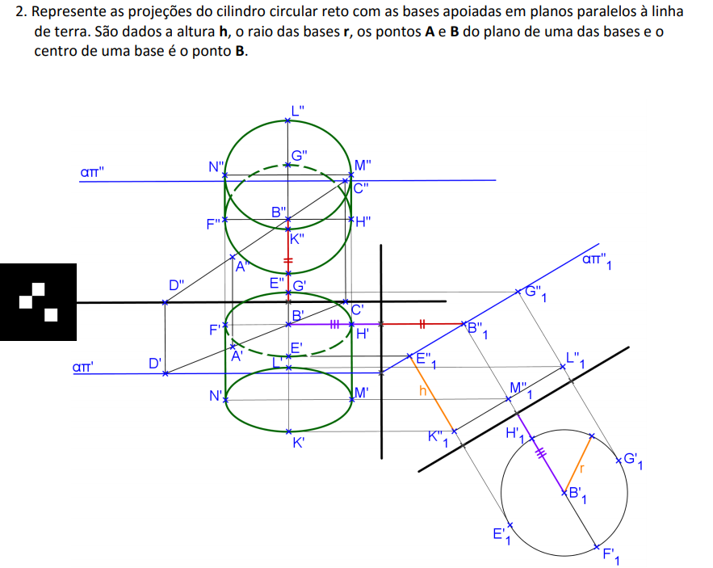
 

<h3>Exercício 3, pág. 82</h3>
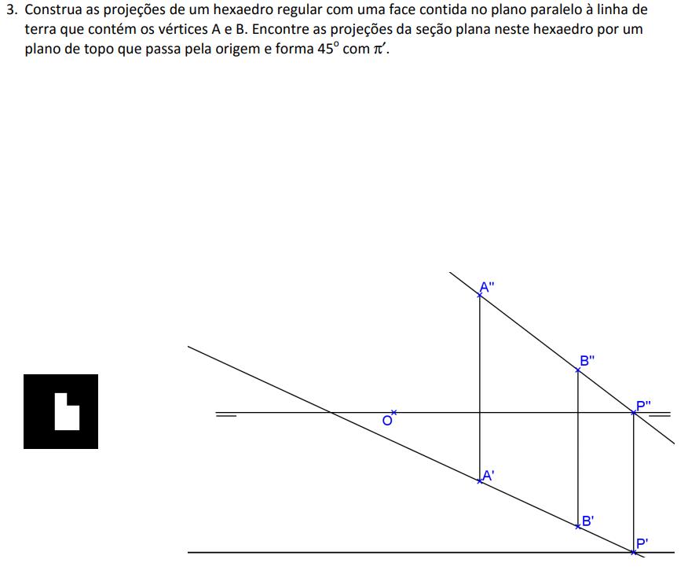
 

<h3>Exercício 4, pág. 83</h3>
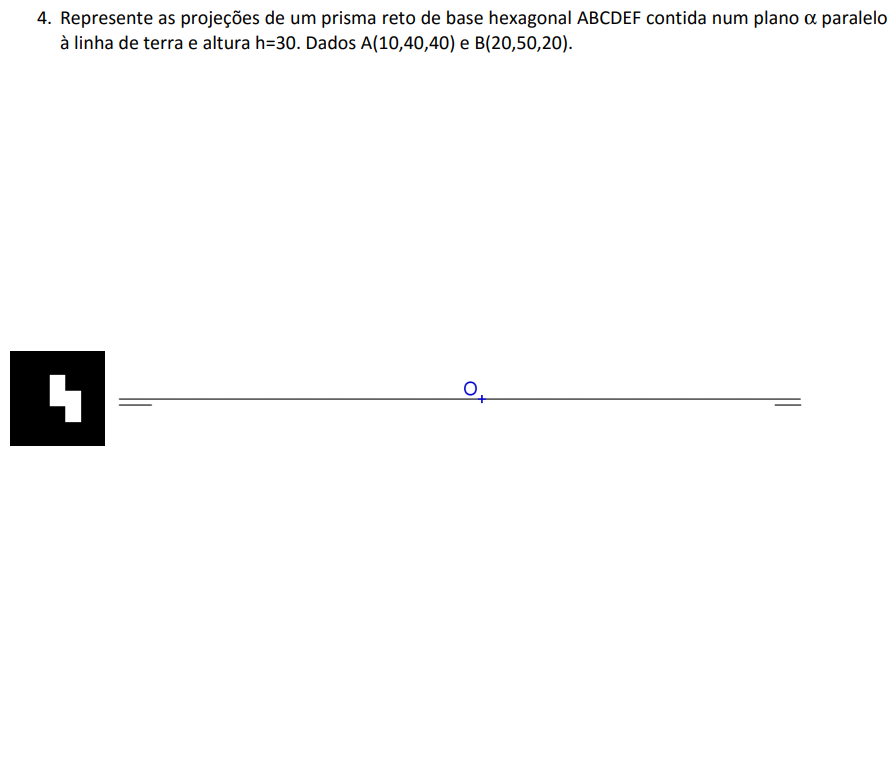
 

<h3>Exercício 5, pág. 84</h3>
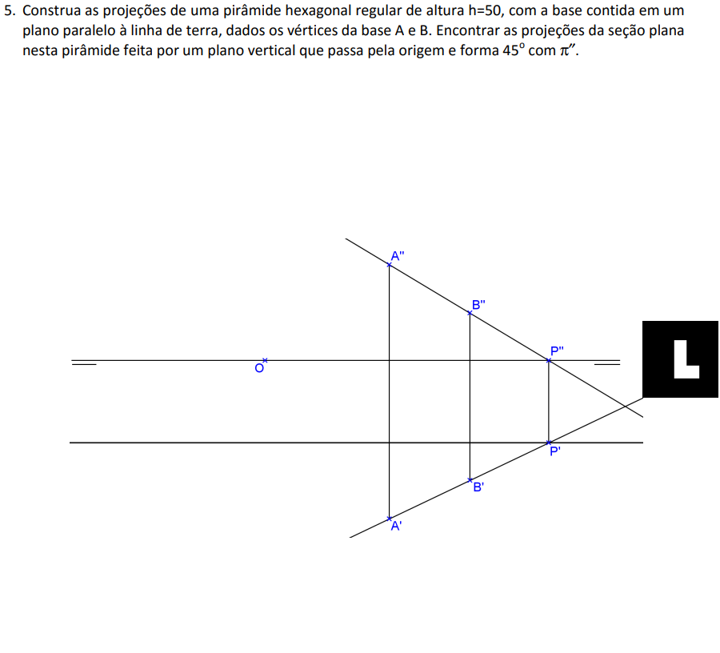
 

<h3>Exercício 6, pág. 85</h3>
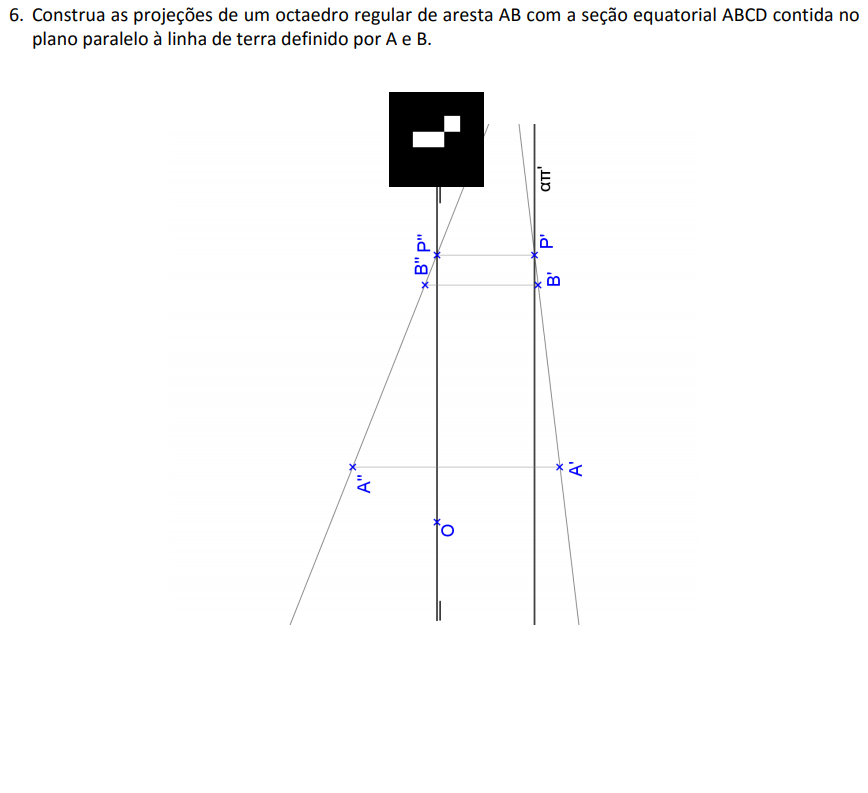
 
</td></tr></table>

<a href="#inicio"> voltar ao topo</a>
<h3 id="qualquer">Sólidos com uma face em um plano qualquer</h3>
<table><tr><td><h3>Exercício 2, pág. 90</h3>
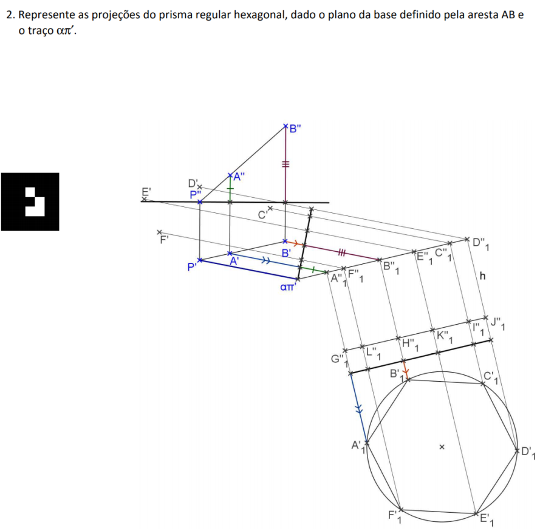
 

<h3>Exercício 3, pág. 91</h3>
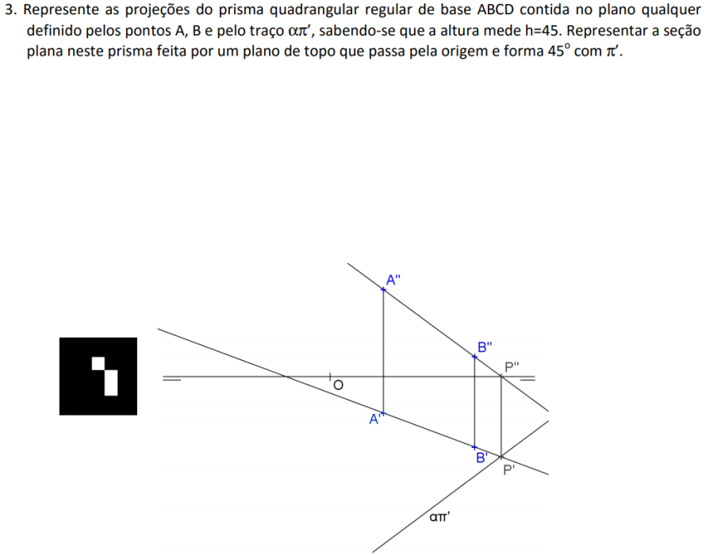
 

<h3>Exercício 4, pág. 92</h3>
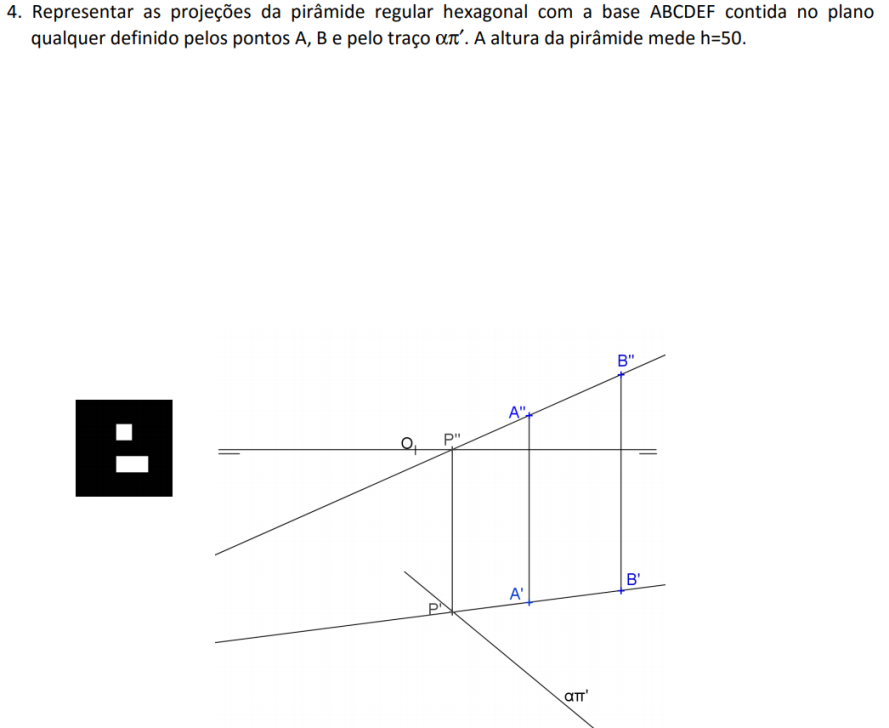
 

<h3>Exercício 6, pág. 93</h3>
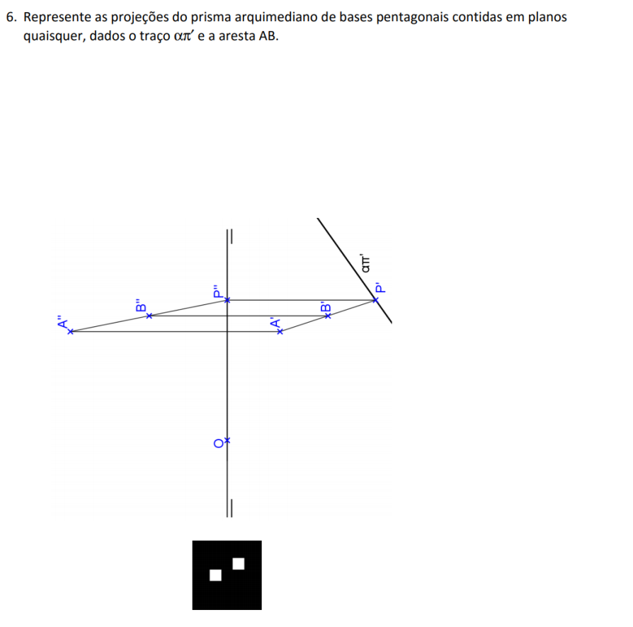
 

<h3>Exercício 1, pág. 96</h3>
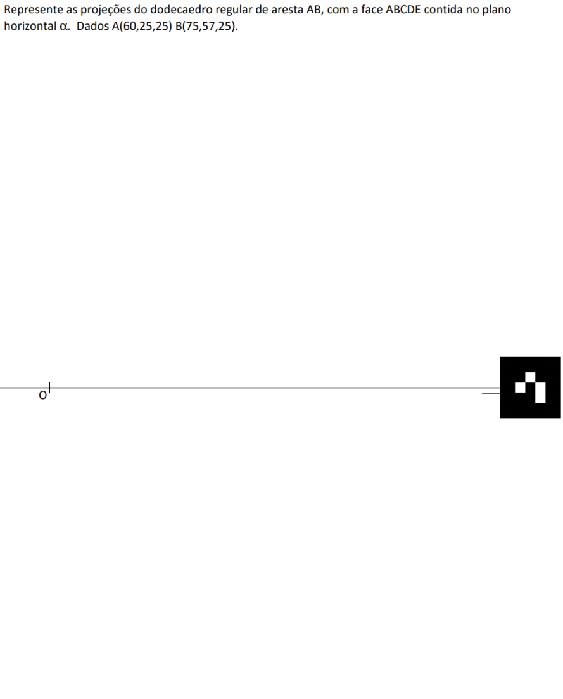
 
</td></tr></table>

 

<b>site desenvolvido por:</b>
 

Paulo Henrique Siqueira
  

<b>construções geométricas feitas pelos professores do Grupo de Estudos em Expressão Gráfica (GEEGRAF) da Universidade Federal do Paraná (UFPR):</b>
 

Deise Maria Bertholdi Costa
 

Emerson Rolkouski
 

Luzia Vidal de Souza
 

Paulo Henrique Siqueira
 

Simone da Silva Soria Medina
 

<b>Objetos 3D programados em RA e RV:</b>
 

Paulo Henrique Siqueira
 

<b>contato:</b> paulohscwb@gmail.com 
 

Para ver os objetos em Realidade Aumentada, visite o site:
 

<a href="https://paulohscwb.github.io/geometria-descritiva/ra.html">https://paulohscwb.github.io/geometria-descritiva/ra.html</a>

 

em qualquer navegador com um dispositivo de webcam (smartphone, tablet ou notebook).

O acesso aos sites de Realidade Virtual é feito clicando no círculo azul que aparece em cima dos marcadores.

 <b>Referências:</b>

O ambiente Realidade Aumentada foi criado com os scripts de <b>Jerome Etienne</b>: <a href="https://github.com/jeromeetienne/AR.js"> AR.js - Augmented Reality for the Web</a>.

Os scripts de órbita desenvolvidos por <b>Kevin Ngo</b> foram usados nas páginas de RV: <a href="https://github.com/supermedium/superframe/tree/master/components/orbit-controls/"> Orbit controls for A-Frame</a>.

As faces de poliedros foram criadas com a função desenvolvida por <b>Andreas Plesch</b>: <a href="https://github.com/andreasplesch/aframe-faceset-component"> Geometry from vertices and faces</a>.

