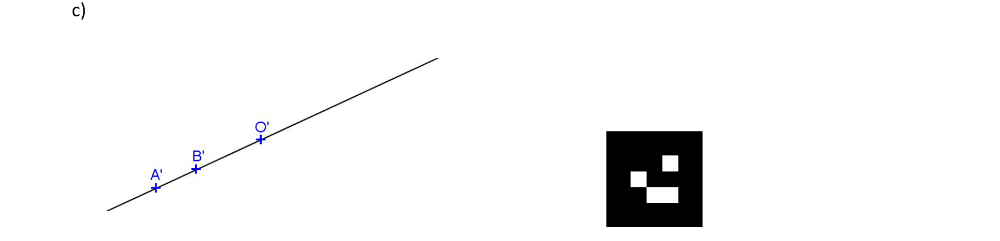
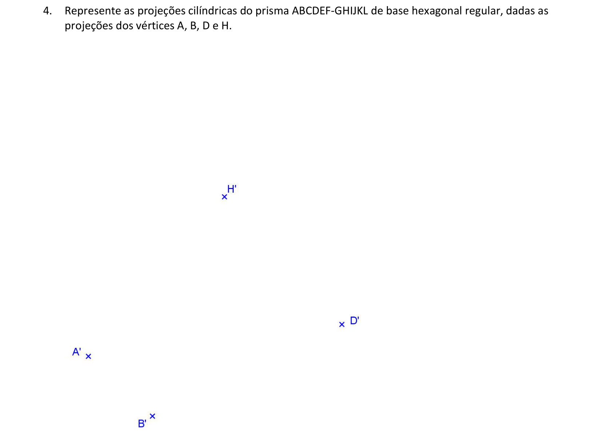

<link rel="stylesheet" href="../../scripts/style.css">

<h2 id="inicio">Respostas do Módulo 1</h2> 
  

Atividade 1.1: exercício 6 da pág. 20

  
  

&#x1f4cf; &#x1f4d0; Solução

  
 Você pode usar as mesmas propriedades que usamos no exercício 5.

    
	<figcaption>Encontre a projeção do centro da circunferência em cada item. Lembre-se das propriedades do hexágono regular.</figcaption>
  

  

Atividade 1.2: exercício 4 da pág. 23

  
  

&#x1f4cf; &#x1f4d0; Solução

  
 Você pode utilizar o compasso e os esquadros para resolver este exercício. Lembre-se das propriedades de projeções cilíndricas 2 e 3.

	
	<figcaption>Tente encontrar o centro da circunferência da base dos vertices <b>A'</b> e <b>B'</b>. Use as propriedades do hexágono regular.</figcaption>
  

  

   

