<link rel="stylesheet" href="../../scripts/style.css">

<h2 id="inicio">Respostas do Módulo 2</h2> 
  

Atividade 2.1: exercício 5 da pág. 21

  
  

&#x1f4cf; &#x1f4d0; Resolução

  

  <ul class="slider">
      <li>
           <input type="radio" id="323" name="sl">
           <label for="323"></label>
           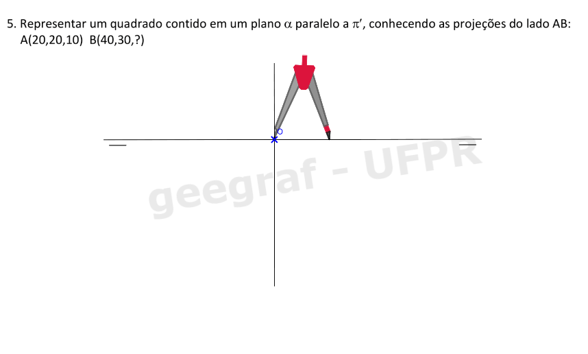
        <figcaption>Marcar a abscissa do ponto A. Traçar a linha de chamada do ponto A perpendicular a LT.</figcaption>
       </li>
	  <li>
           <input type="radio" id="324" name="sl">
           <label for="324"></label>
           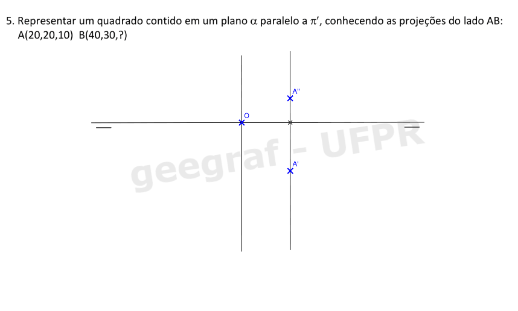
        <figcaption>Marcar o afastamento e a cota do ponto A.</figcaption>
       </li>
       <li>
           <input type="radio" id="325" name="sl">
           <label for="325"></label>
           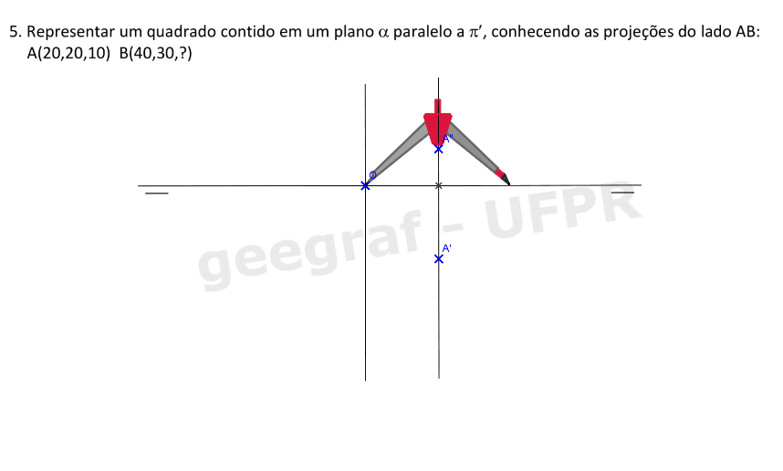
         <figcaption>Marcar a abscissa do ponto B. Traçar a linha de chamada do ponto B perpendicular a LT.</figcaption>
       </li>
	   <li>
           <input type="radio" id="326" name="sl">
           <label for="326"></label>
           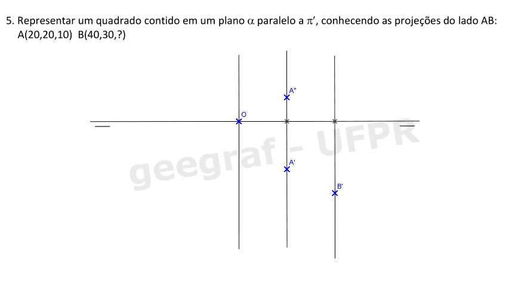
         <figcaption>Marcar o afastamento do ponto B.</figcaption>
       </li>
	   <li>
           <input type="radio" id="327" name="sl">
           <label for="327"></label>
           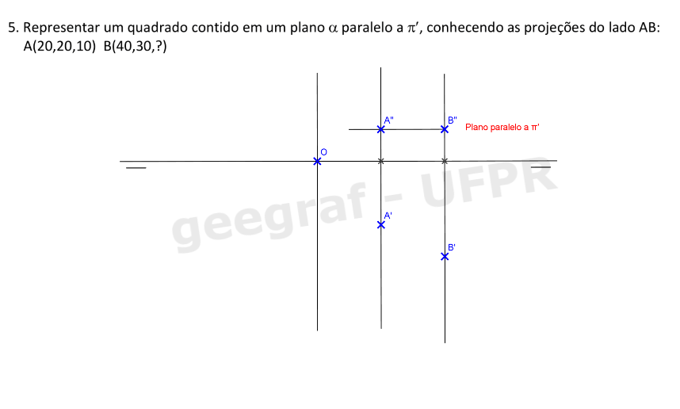
         <figcaption>O ponto B tem a mesma cota do ponto A.</figcaption>
       </li>
	   <li>
           <input type="radio" id="328" name="sl">
           <label for="328"></label>
           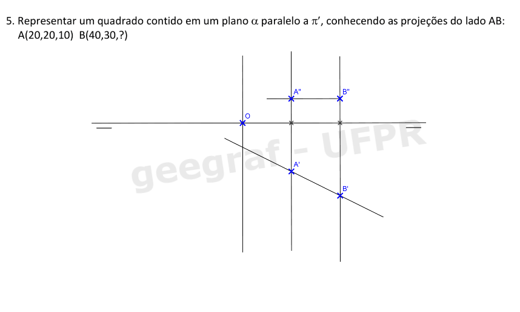
         <figcaption>Traçar uma reta passando por A’ e B’. A’B’ é a VG do lado AB do quadrado.</figcaption>
       </li>
	   <li>
           <input type="radio" id="329" name="sl">
           <label for="329"></label>
           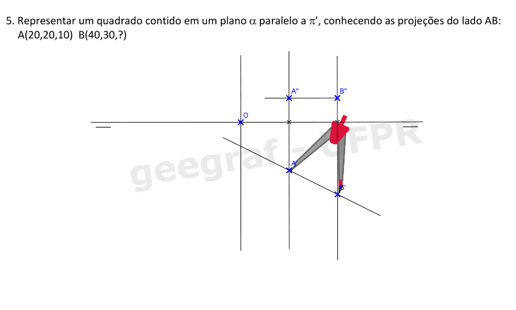
         <figcaption>Com o compasso medir o lado AB.</figcaption>
       </li>
	   <li>
           <input type="radio" id="330" name="sl">
           <label for="330"></label>
           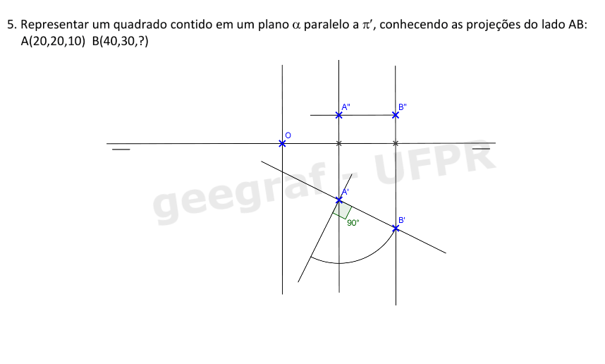
         <figcaption>Traçar por A’ ou por B’ uma perpendicular ao lado AB.</figcaption>
       </li>
	   <li>
           <input type="radio" id="331" name="sl">
           <label for="331"></label>
           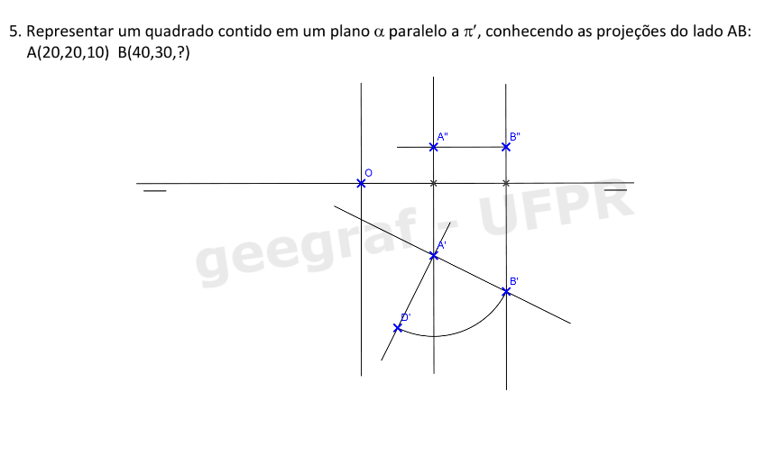
         <figcaption>Transportar a medida do lado AB para a perpendicular do Passo 10.  Marque D’.</figcaption>
       </li>
	   <li>
           <input type="radio" id="332" name="sl">
           <label for="332"></label>
           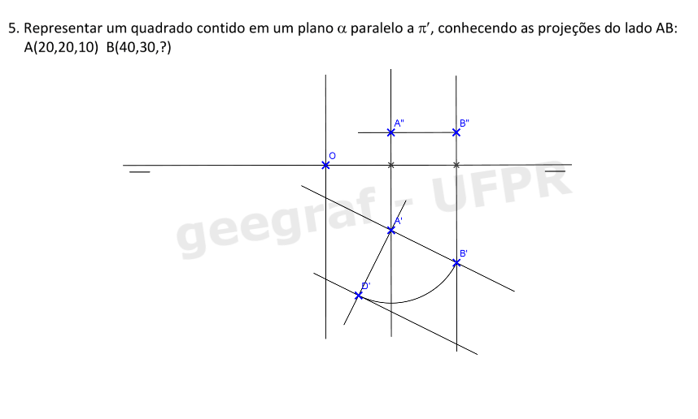
         <figcaption>Trace por D’ uma paralela ao lado AB e encontre o vértice C’ do quadrado.Destaque a projeção A’B’C’D’ do quadrado.</figcaption>
       </li>
	   <li>
           <input type="radio" id="333" name="sl">
           <label for="333"></label>
           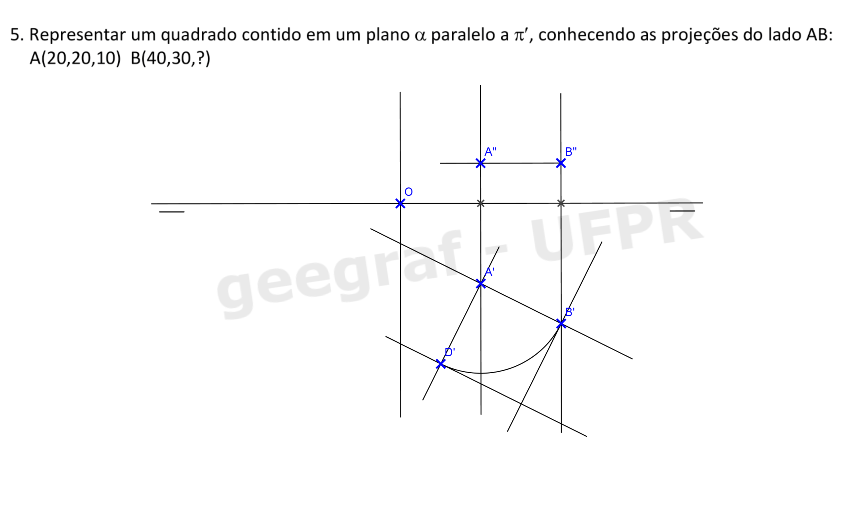
         <figcaption>Faça as linhas de chamada dos pontos C e D.</figcaption>
       </li>
	   <li>
           <input type="radio" id="334" name="sl">
           <label for="334"></label>
           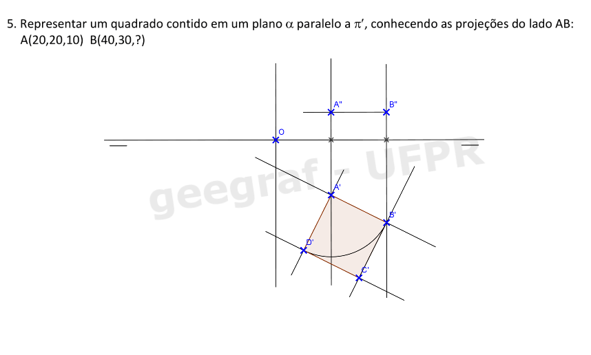
         <figcaption>Como o quadrado está contido em um plano α  paralelo a π' , a segunda projeção do quadrado está na interseção das linhas de chamada dos pontos A, B, C e D com o traço απ'.</figcaption>
       </li>
	   <li>
           <input type="radio" id="335" name="sl">
           <label for="335"></label>
           
         <figcaption>Destaque a projeção A”B”C”D” do quadrado.</figcaption>
       </li>
	   <li>
           <input type="radio" id="336" name="sl">
           <label for="336"></label>
           
         <figcaption></figcaption>
       </li>
    </ul>
	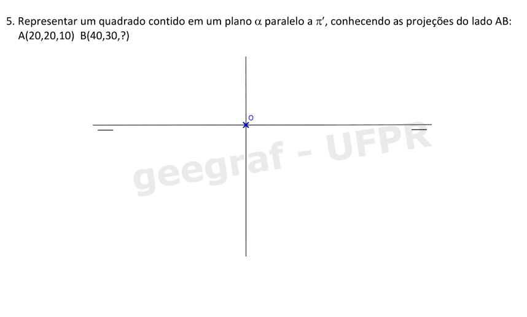
  

  

Atividade 2.2: exercício 10 da pág. 36

  
  

&#x1f4cf; &#x1f4d0; Solução

		

	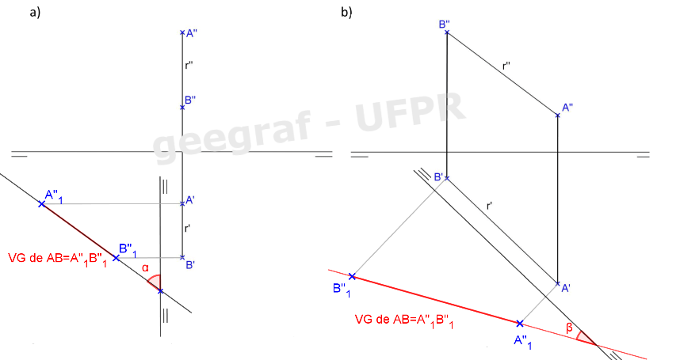
	<figcaption></figcaption>
	

