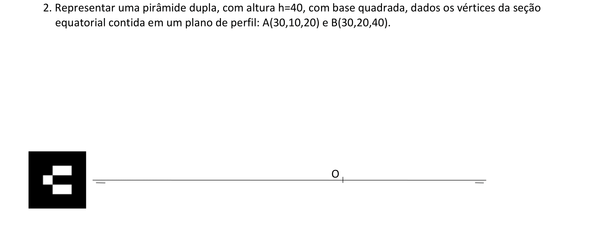
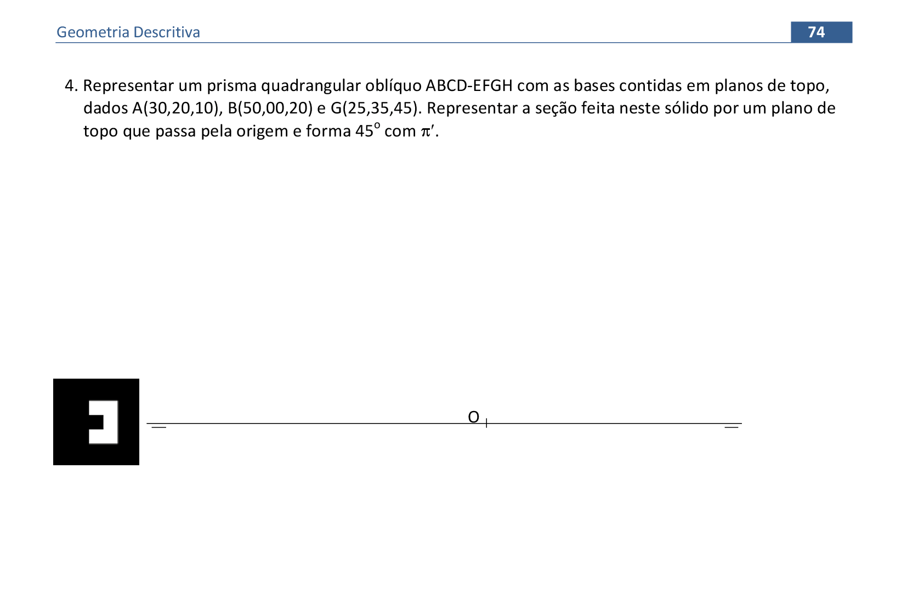

<link rel="stylesheet" href="../../scripts/style.css">

<h2 id="inicio">Respostas do Módulo 4</h2> 
  

Atividade 4.1: exercício 2 da pág. 67

  
  

&#x1f4cf; &#x1f4d0; Solução

	
Podemos resolver esta questão por rebatimento ou por mudança de plano de projeção.

	
	<figcaption>A solução apresentada foi resolvida por mudança de plano de projeção.</figcaption>
  

		
  

Atividade 4.2: exercício 4 da pág. 74

  
  

&#x1f4cf; &#x1f4d0; Resolução

  
Para encontrar as projeções da base usamos o mesmo procedimento do exercício 1 da página 72.

  <ul class="slider">
      <li>
           <input type="radio" id="s052" name="sl">
           <label for="s052"></label>
           
        <figcaption>As arestas de um prisma são paralelas entre si e de mesmo tamanho. Como conhecemos a aresta <b>CG</b>, logo podemos representar as demais arestas. A base <b>EFGH</b> está contida no plano <b>&beta;</b>, paralelo ao plano <b>&alpha;</b>.</figcaption>
       </li>
	  <li>
           <input type="radio" id="s053" name="sl">
           <label for="s053"></label>
           
        <figcaption>Para encontrar a seção produzida pelo plano de topo <b>&delta;</b>, encontramos os pontos de interseção deste com as arestas do prisma (polígono <b>1234</b>). A segunda projeção do polígono fica reduzida a um segmento de reta.</figcaption>
       </li>
	</ul>
	
  

