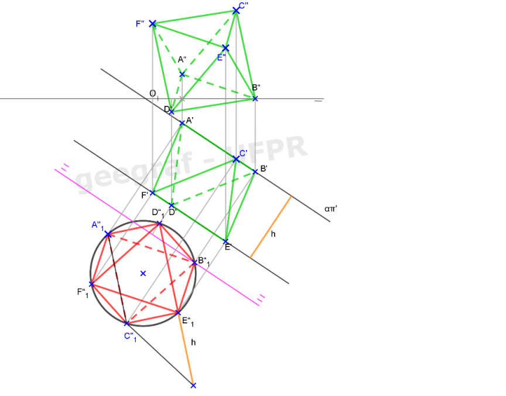
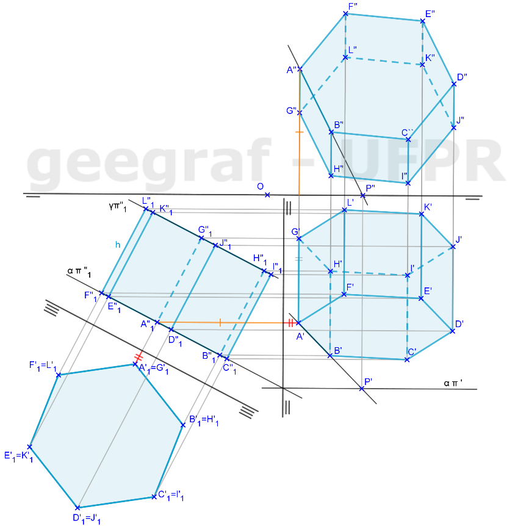

<link rel="stylesheet" href="../../scripts/style.css">

<h2 id="inicio">Respostas do Módulo 5</h2> 
  

Atividade 5.1: Exercício 10 da pág. 86

  
  

&#x1f4cf; &#x1f4d0; Solução

	
Utilizamos a mudança de planos para construir duas faces paralelas em VG do octaedro regular. Neste caso, o octaedro é considerado um anti-prisma de base triangular.

	
	<figcaption>Depois, basta fazer os alçamentos dos vértices <b>C</b>, <b>D</b>, <b>E</b> e <b>F</b> para determinar as projeções do octaedro.</figcaption>
  

  	
  

Atividade 5.2: Exercício 4 da pág. 94

  
  

&#x1f4cf; &#x1f4d0; Solução

	
A resolução desse exercício é semelhante ao anterior, a base agora será um hexágono regular e altura é dada.

	
  

