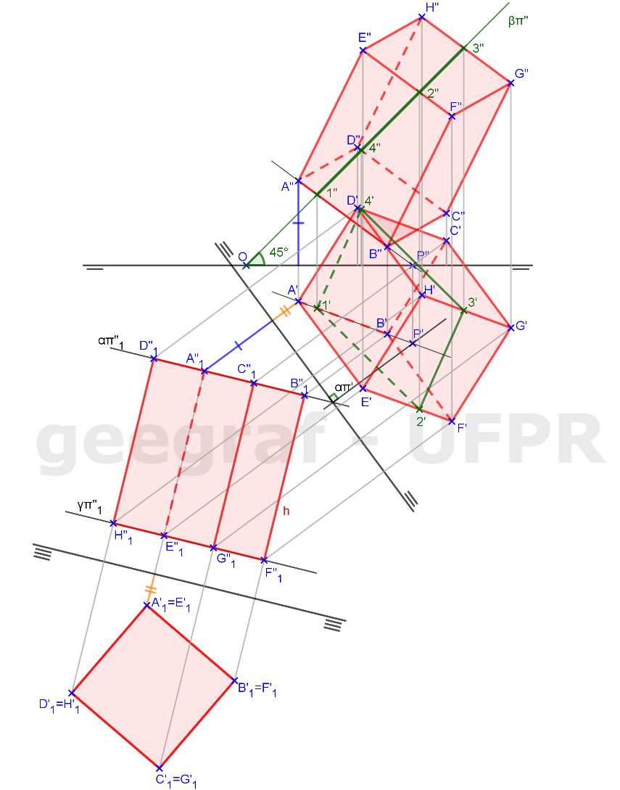

<link rel="stylesheet" href="../../scripts/style.css">

<h2 id="inicio">Respostas do Módulo 6</h2> 
	
  

Atividade 6.1: exercício 3 da pág. 102

  
  

  

&#x1f4cf; &#x1f4d0; Solução

	
Esse exercício também é parecido com os anteriores. Agora será representado um prisma quadrangular regular com a base contida no plano qualquer.

	
	<figcaption>A seção plana nesse poliedro será dada por um plano de topo e como esse plano é projetante em 2ª projeção temos que a 2ª projeção da seção será um segmento de reta.</figcaption>
  

