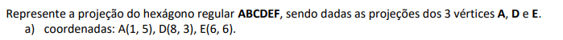
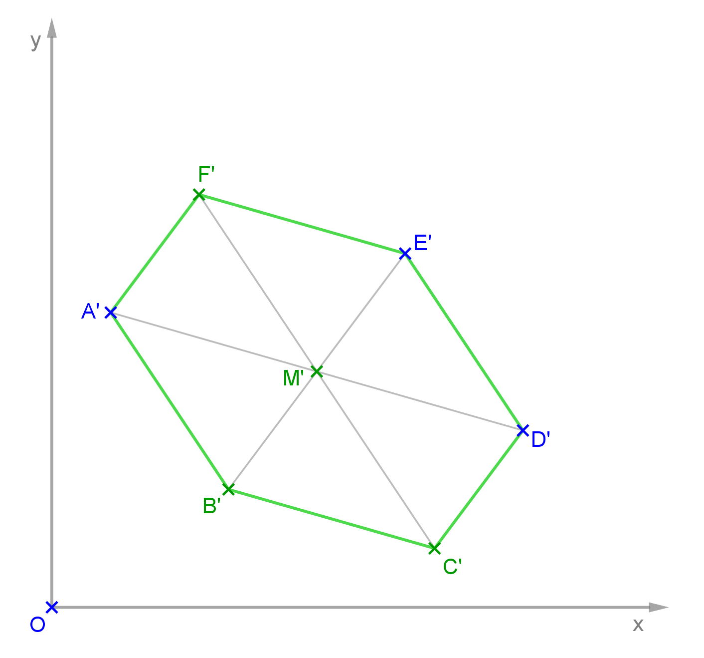
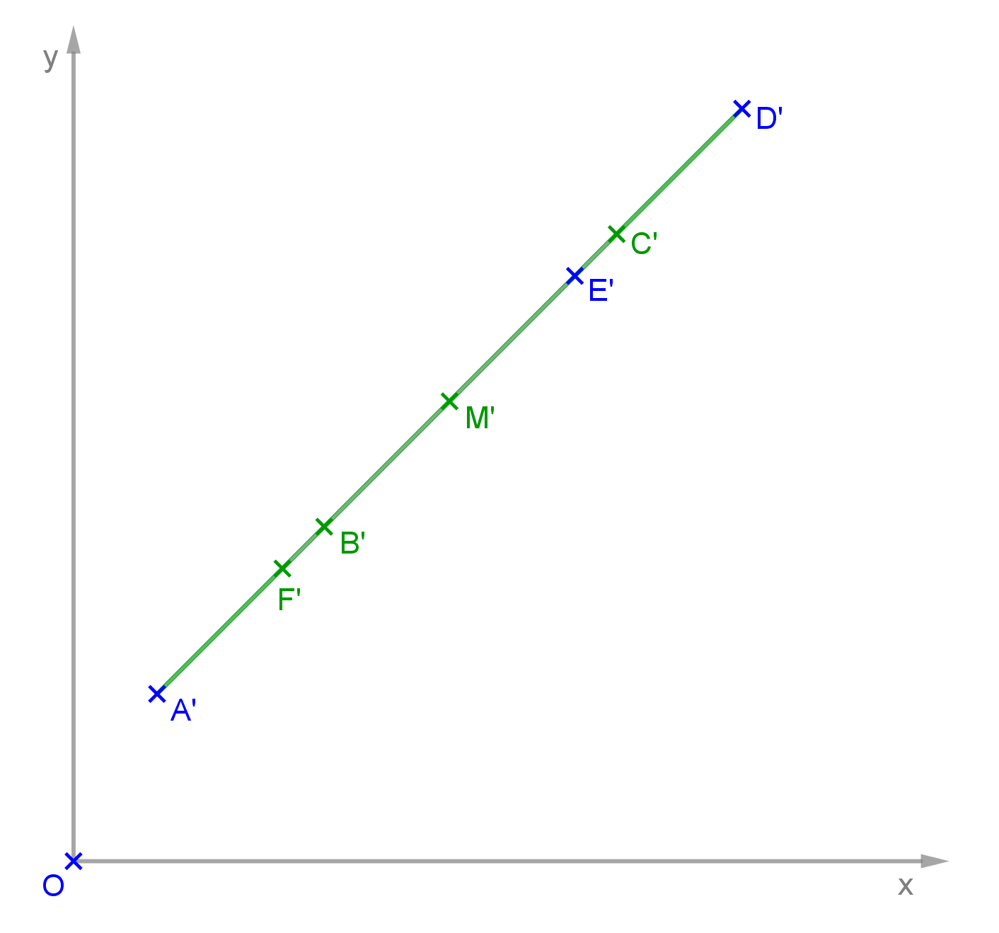
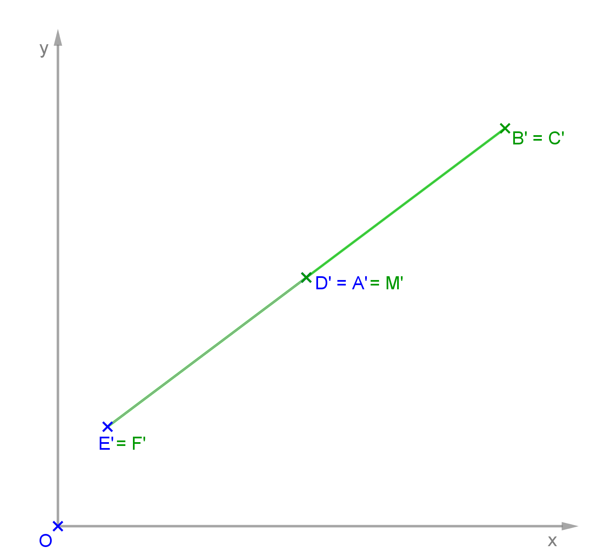
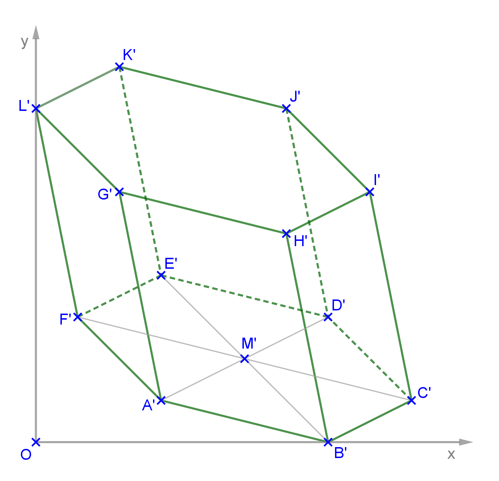

<link rel="stylesheet" href="../../scripts/style.css">

<h2 id="inicio">Respostas do Módulo 1</h2> 
  

Atividade 1.1 item a

  
  

&#x1f4cf; &#x1f4d0; Solução

  
Você pode usar as mesmas propriedades que usamos no exercício 5.

    
	<figcaption>Encontre a projeção do centro da circunferência M em cada item. Lembre-se das propriedades do hexágono regular.</figcaption>
  

  

Atividade 1.1 item b

  
  

&#x1f4cf; &#x1f4d0; Solução

  
Você pode usar as mesmas propriedades que usamos no exercício 5 e do item anterior.

    
	<figcaption>Encontre a projeção do centro da circunferência M em cada item. Lembre-se das propriedades do hexágono regular.</figcaption>
  

  

Atividade 1.1 item c

  
  

&#x1f4cf; &#x1f4d0; Solução

  
Você pode usar as mesmas propriedades que usamos no exercício 5 e dos itens anteriores.

    
	<figcaption>Encontre a projeção do centro da circunferência M. Como os vértices D' e A' coincidem, temos que B' e C' também coincidem e o mesmo acontece com E' e F'.</figcaption>
  

  

Atividade 1.2

  
  

&#x1f4cf; &#x1f4d0; Solução

  
 Você pode utilizar o compasso e os esquadros para resolver este exercício. Lembre-se das propriedades de projeções cilíndricas 2 e 3.

	
	<figcaption>Tente encontrar o centro da circunferência da base dos vertices <b>A'</b> e <b>B'</b>. Use as propriedades do hexágono regular.</figcaption>
  

  

   

