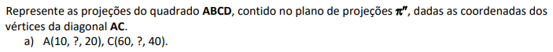
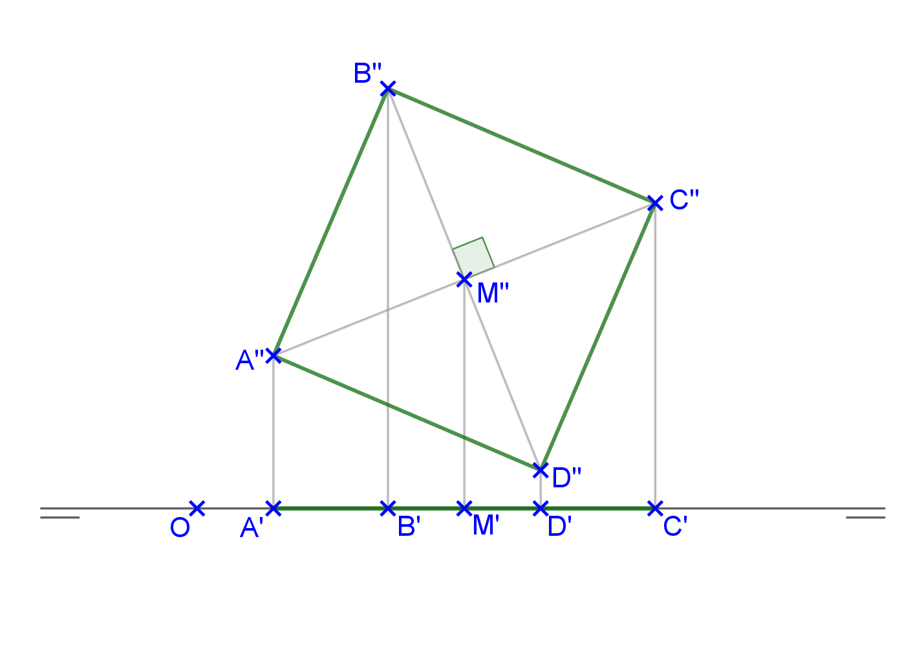
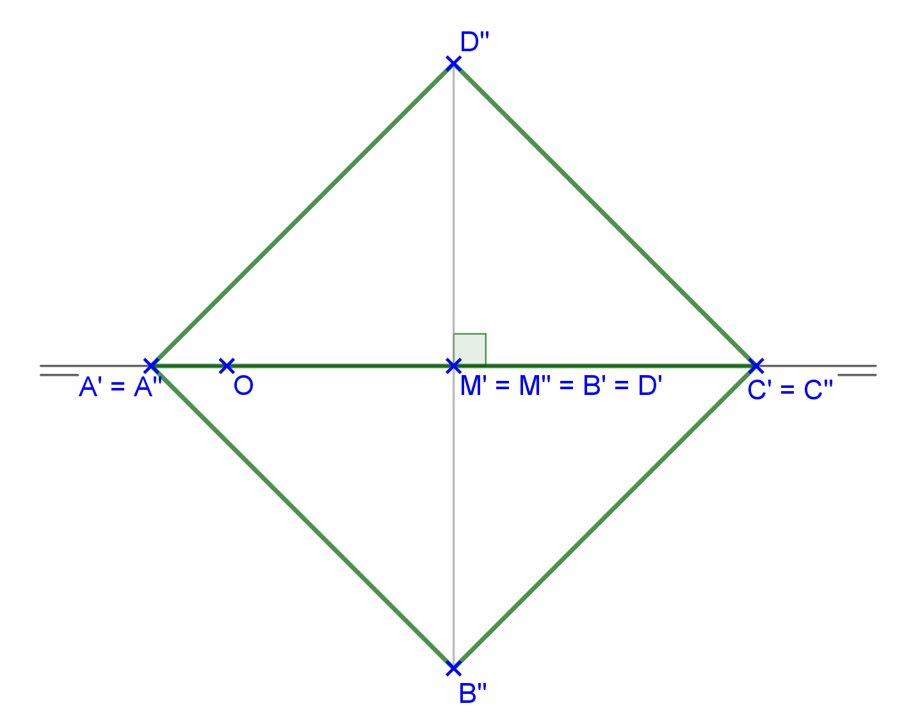
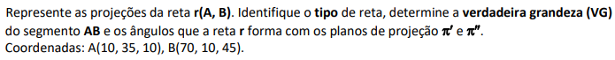
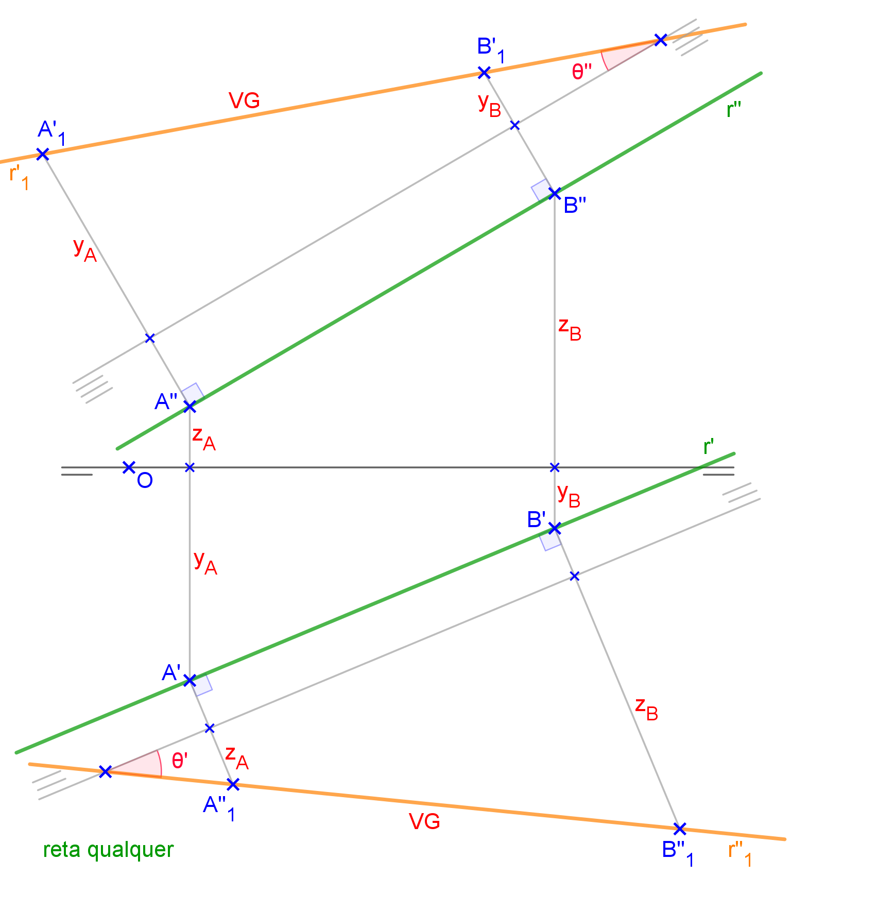

<link rel="stylesheet" href="../../scripts/style.css">

<h2 id="inicio">Respostas das Atividades do Módulo 2</h2> 
  

Atividade 2.1

  
  

&#x1f4cf; &#x1f4d0; Solução

  
Como o quadrado pertence ao plano <b>&pi;''</b>, a segunda projeção está em VG.

    
	<figcaption>Podemos construir o segmento <b>A''C''</b> e o ponto médio <b>M''</b>. O segmento <b>B''D''</b> tem mesma medida de <b>A''C''</b>. A primeira projeção do quadrado pertence à linha de terra.</figcaption>
  

  
  

&#x1f4cf; &#x1f4d0; Solução

  
Como o quadrado pertence ao plano <b>&pi;''</b>, a segunda projeção está em VG.

    
	<figcaption>Os pontos <b>A</b> e <b>C</b> pertencem à linha de terra. Podemos encontrar o segmento <b>B''D''</b> da mesma forma usada no item anterior.</figcaption>
  

  

Atividade 2.2

  
  

&#x1f4cf; &#x1f4d0; Solução

  
A reta <b>r(A, B)</b> é do tipo qualquer. Logo, podemos usar mudança de planos de projeção para encontrar a VG do segmento <b>AB</b>.

	
	<figcaption>Fazendo a mudança das primeiras projeções, encontramos o ângulo <b>&theta;''</b> que a reta forma com <b>&pi;''</b>. Fazendo a mudança das segundas projeções, encontramos o ângulo <b>&theta;'</b> que a reta forma com <b>&pi;'</b>.</figcaption>
  

  

   

