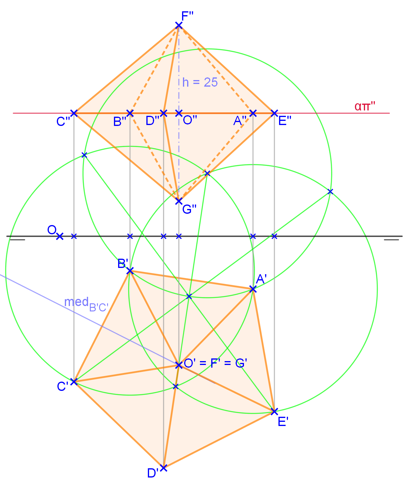
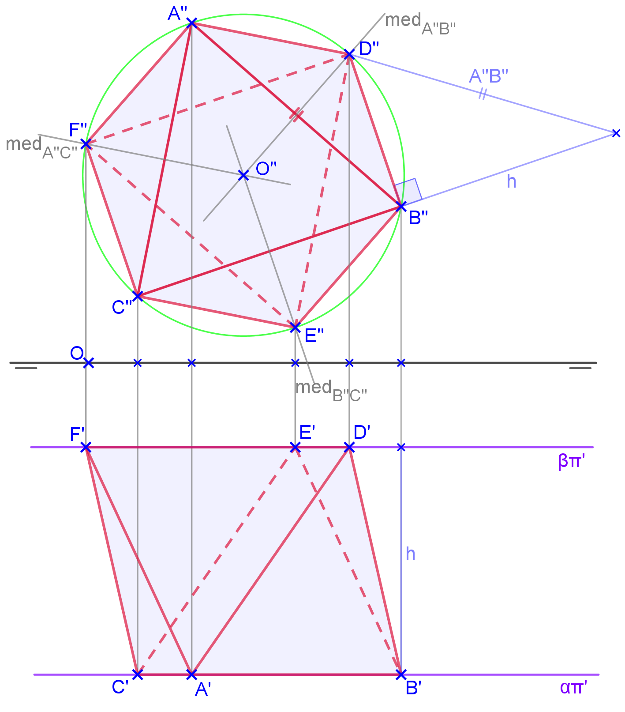

<link rel="stylesheet" href="../../scripts/style.css">

<h2 id="inicio">Respostas das Atividades do Módulo 3</h2> 
  

Atividade 3.1

  
  

&#x1f4cf; &#x1f4d0; Solução

  
O pentágono da seção equatorial da pirâmide dupla está no plano horizontal, ou seja, fica projetado em VG na primeira projeção.

    
	<figcaption>Podemos construir o pentágono a partir do lado <b>A'B'</b>. O centro do pentágono <b>O'</b> pode ser encontrado com as mediatrizes dos lados <b>A'B'</b> e <b>B'C'</b>. A partir da segunda projeção <b>O''</b> podemos construir a altura <b>h</b> para cima e para baixo do plano horizontal.</figcaption>
  

  

Atividade 2.2

  
  

&#x1f4cf; &#x1f4d0; Solução

  
A face <b>ABC</b> fica projetada em VG na segunda projeção, pois está contida em um plano frontal.

	
	<figcaption>A partir da projeção da face <b>A''B''C''</b>, construímos o anti-prisma de base triangular. Este sólido é o octaedro com a face <b>ABC</b> contida no plano frontal.</figcaption>
  

  

   

