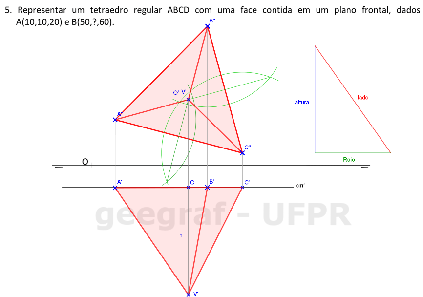

<link rel="stylesheet" href="../../scripts/style.css">

<h2 id="inicio">Respostas do Módulo 3</h2> 
  

Atividade 3.1: exercício 3 da pág. 48

  
  

  
solução

  

Atividade 3.2: exercício 5 da pág. 52

&#x1f4cf; &#x1f4d0; Solução

	
Como uma das faces do tetraedro está contida num plano frontal sua segunda projeção está em VG e a primeira projeção reduzida a um segmento de reta paralelo à LT (contido no traço horizontal do plano).

	
	<figcaption>Para determinar a altura do tetraedro regular construímos um triângulo retângulo auxiliar onde um dos catetos corresponde ao raio da circunferência circunscrita à face, o outro corresponde à altura e a hipotenusa à aresta do tetraedro.</figcaption>
  

