<link rel="stylesheet" href="../../scripts/styleA.css">

<h2 id="inicio">Respostas das Atividades do Módulo 4</h2> 
  

Atividade 4.1

  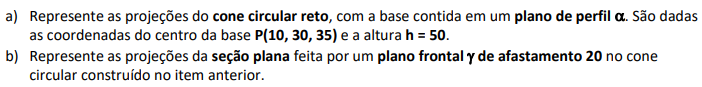
  

&#x1f4cf; &#x1f4d0; Resolução

  
O plano de perfil <b>&alpha;</b> passa pelo ponto <b>P</b>.

  <ul class="slider">
      <li>
           <input type="radio" id="045" name="sl">
           <label for="045"></label>
           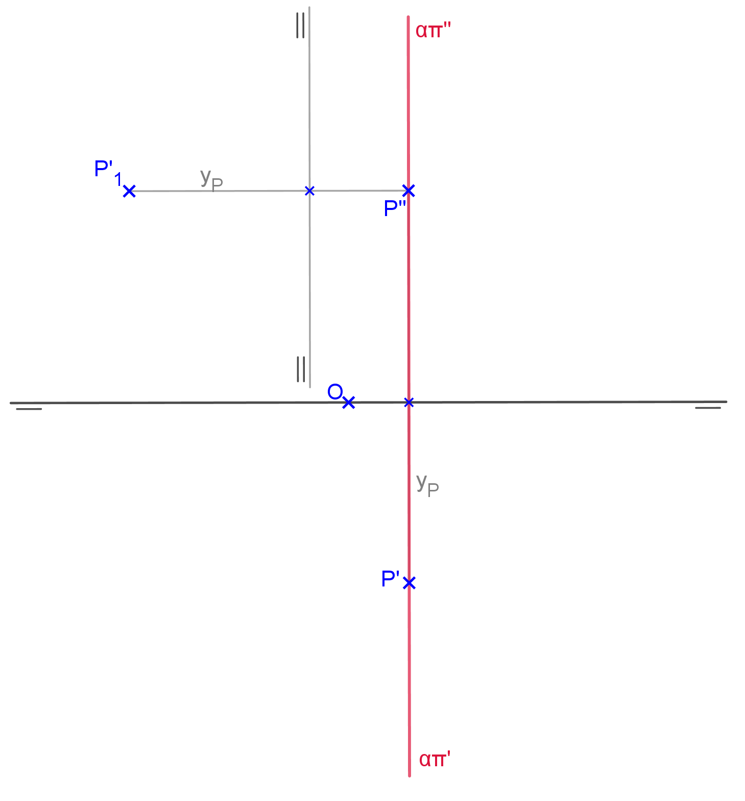
           <figcaption>Os traços <b>&alpha;&pi;'</b> e <b>&alpha;&pi;''</b> são perpendiculares à linha de terra. Vamos utilizar a mudança de plano horizontal, mantendo-se as segundas projeções. Construa a linha de terra 2 paralela a <b>&alpha;&pi;''</b> e determine a projeção <b>P'1</b> marcando a coordenada <b>yP</b>.</figcaption>
       </li>
       <li>
           <input type="radio" id="046" name="sl">
           <label for="046"></label>
           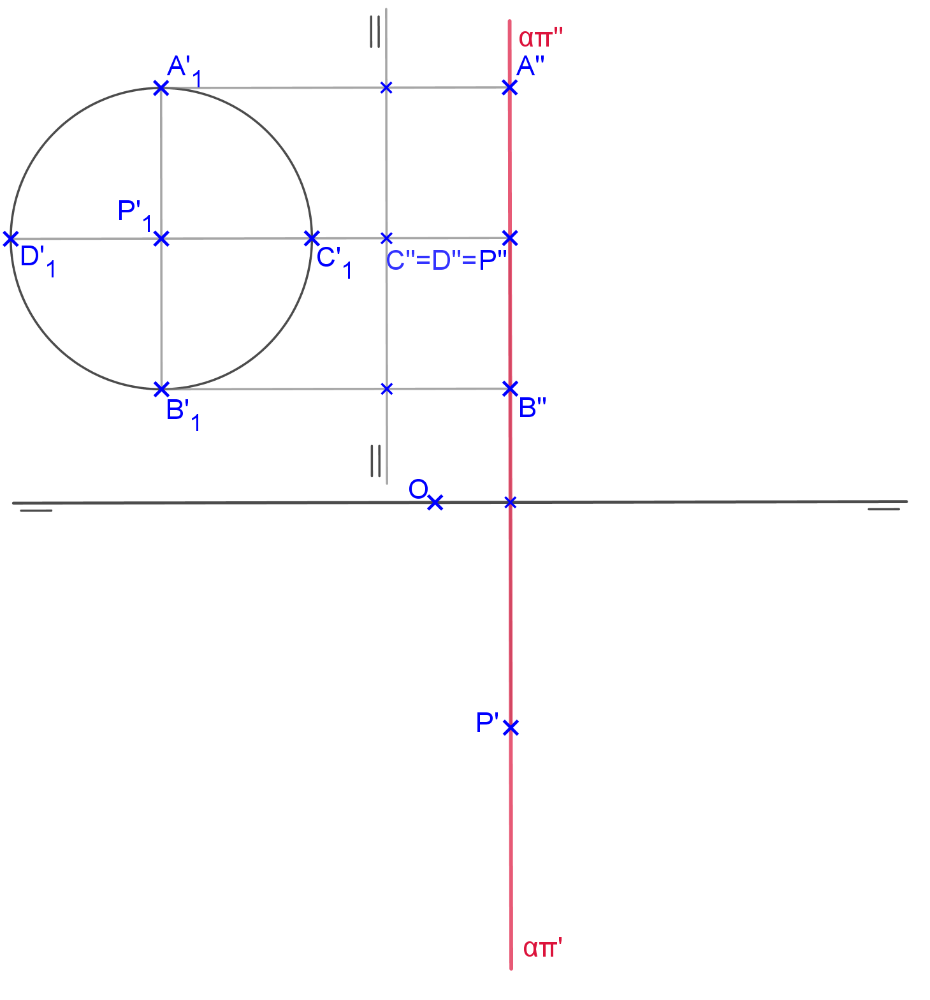
           <figcaption>Construa a base do cone com centro em <b>P'1</b> e determine as projeções dos pontos limite: <b>A</b>, <b>B</b>, <b>C</b> e <b>D</b>.</figcaption>
       </li>
	   <li>
           <input type="radio" id="047" name="sl">
           <label for="047"></label>
           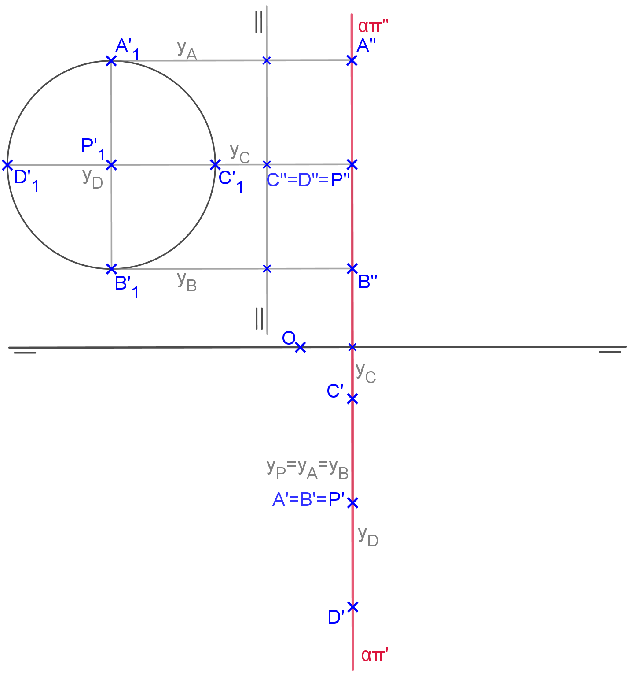
           <figcaption>Usando as coordenadas <b>y</b> de cada ponto limite, determine as primeiras projeções destes pontos.</figcaption>
       </li>
       <li>
           <input type="radio" id="048" name="sl">
           <label for="048"></label>
           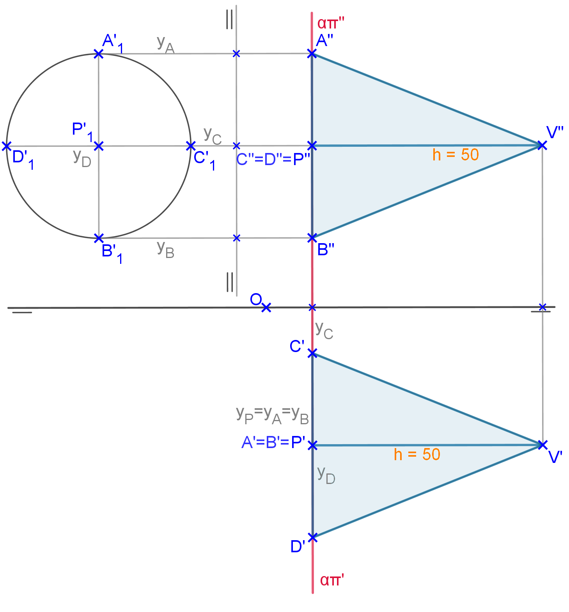
           <figcaption>Construa as projeções do cone marcando a altura a partir de <b>P</b> nas duas projeções com segmentos perpendiculares aos traços do plano.</figcaption>
       </li>
       <li>
           <input type="radio" id="049" name="sl">
           <label for="049"></label>
           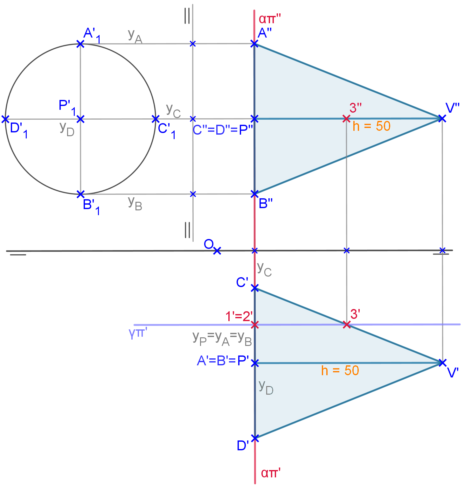
           <figcaption>Construa o plano de seção <b>&gamma;&pi;'</b> e determine as interseções na base e na geratriz <b>V'C'</b>.</figcaption>
       </li>
	   <li>
           <input type="radio" id="050" name="sl">
           <label for="050"></label>
           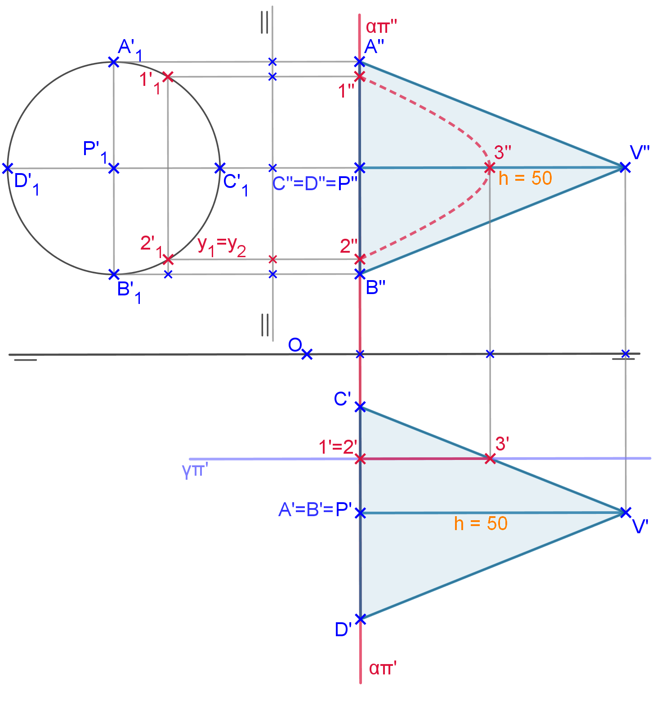
           <figcaption>Para encontrar as segundas projeções dos pontos de seção, vamos encontrar as projeções na base em VG: basta marcar a coordenada <b>y</b> do plano de seção e construir as linhas de chamada destes pontos de seção.</figcaption>
       </li>
    </ul>
    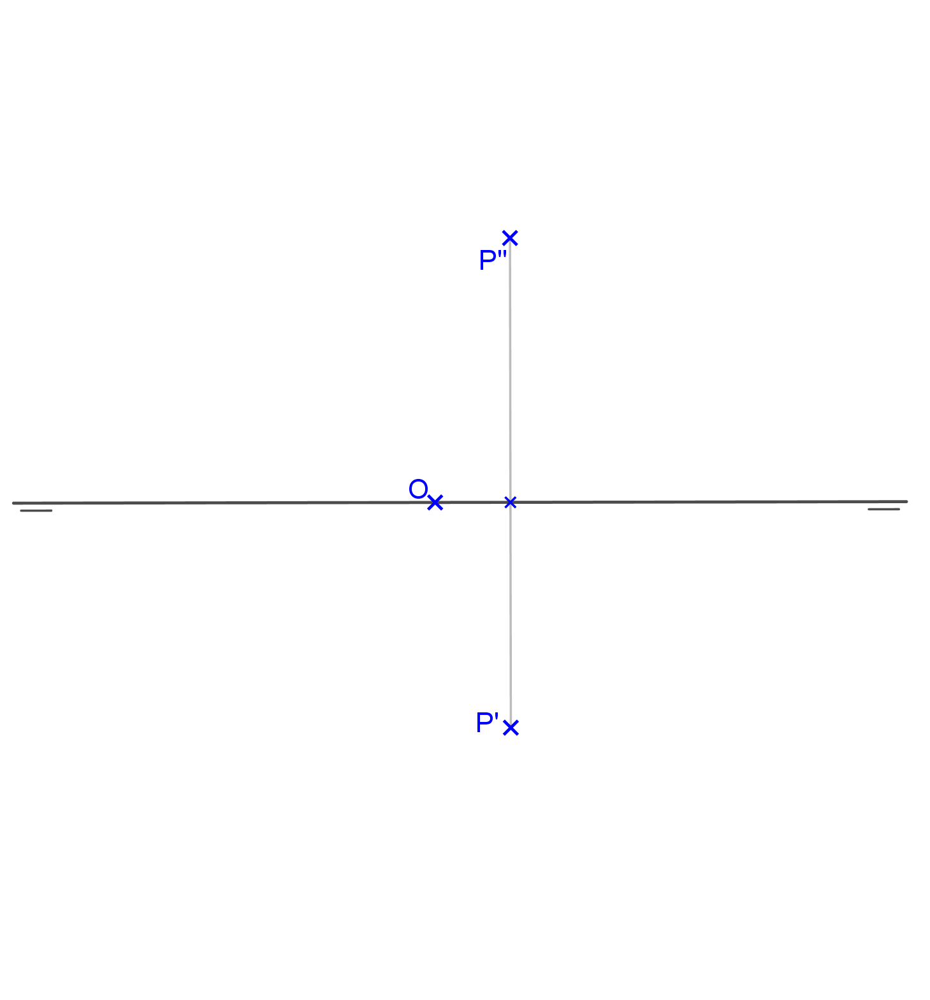
  

  

Atividade 4.2

  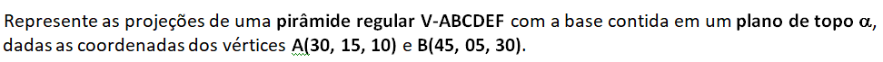
  

&#x1f4cf; &#x1f4d0; Resolução

  
Podemos construir a pirâmide usando mudança de plano horizontal ou rebatimento.

  <ul class="slider">
      <li>
           <input type="radio" id="042" name="sl">
           <label for="042"></label>
           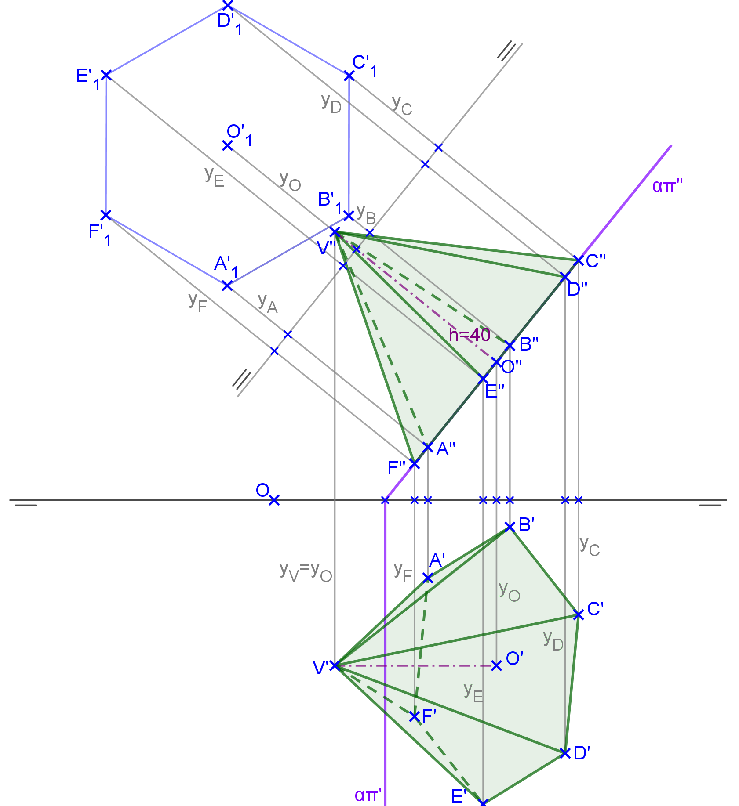
           <figcaption>Com a mudança de plano horizontal, construímos a VG da base a partir de uma linha de terra paralela ao traço <b>&alpha;&pi;''</b>. A altura da pirâmide começa no centro da base no traço <b>&alpha;&pi;''</b>.</figcaption>
       </li>
       <li>
           <input type="radio" id="041" name="sl">
           <label for="041"></label>
           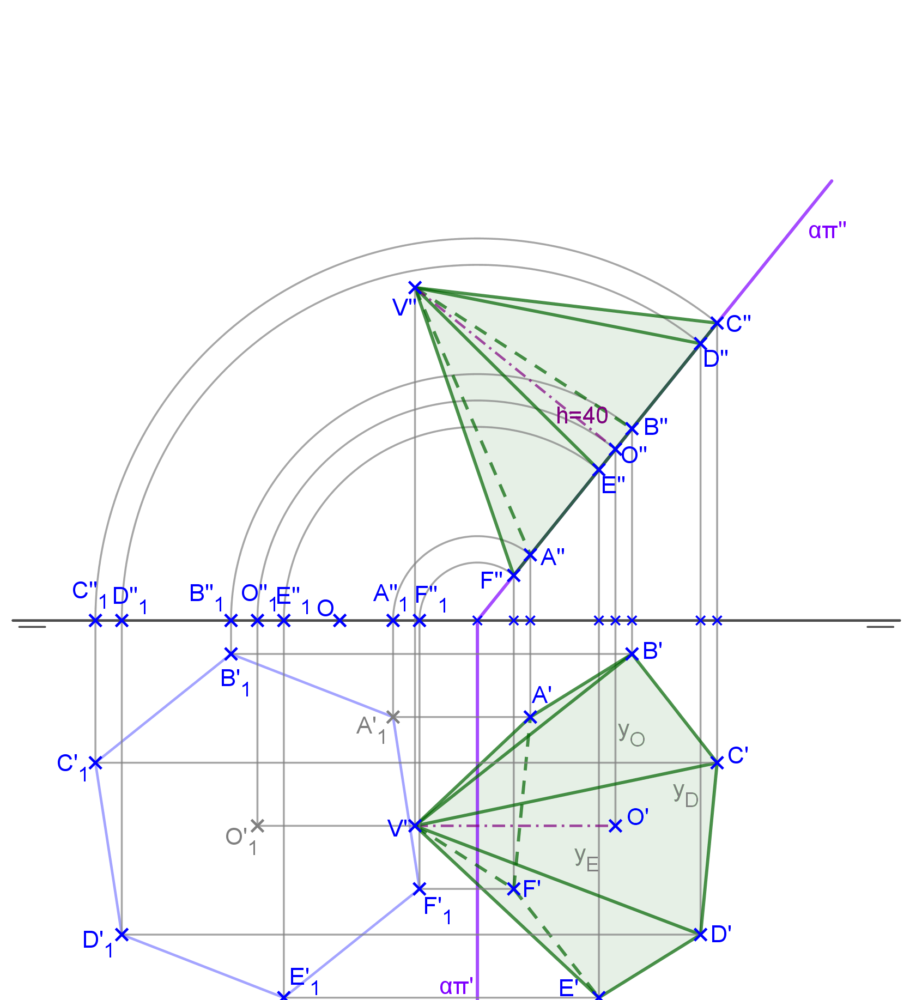
           <figcaption>Podemos construir a base usando o rebatimento do plano em torno do traço <b>&alpha;&pi;'</b>.</figcaption>
       </li>
    </ul>
    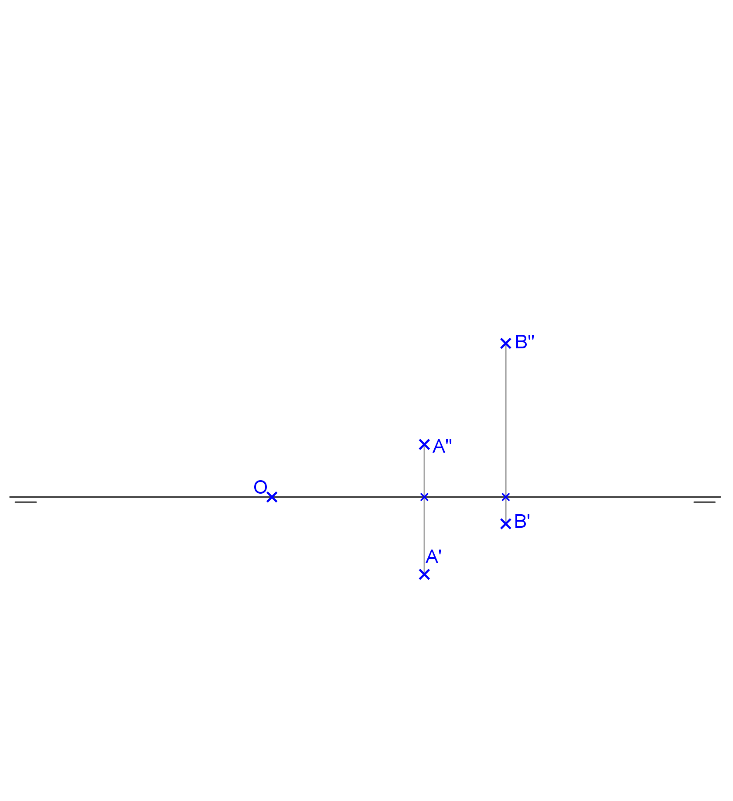
  

   

