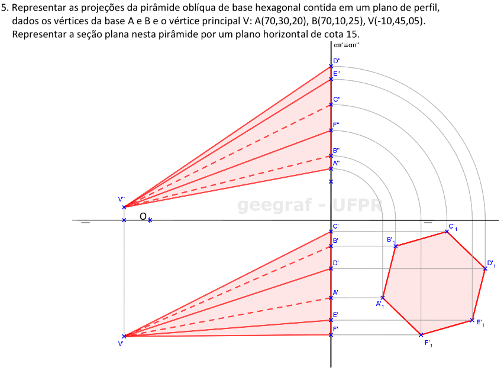
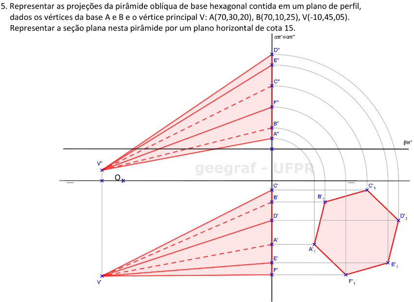
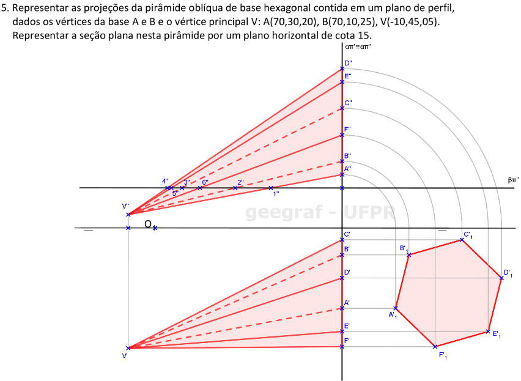
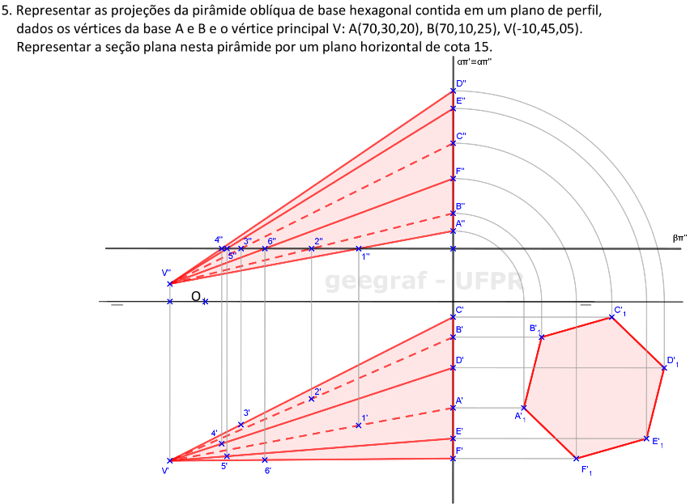
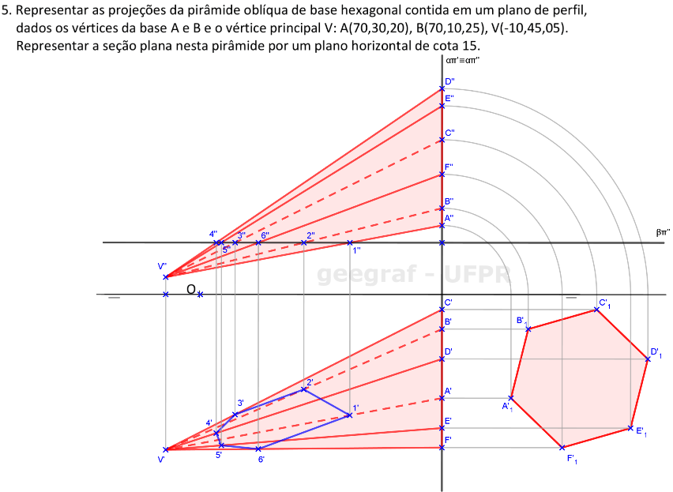
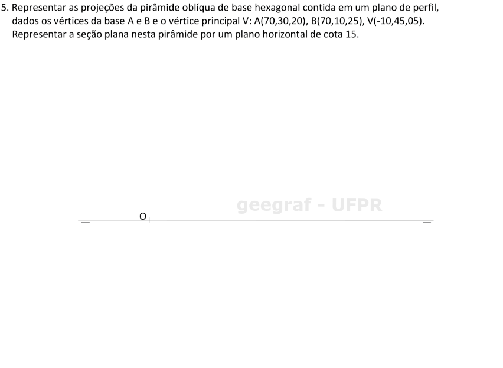

<link rel="stylesheet" href="../../scripts/style.css">

<h2 id="inicio">Respostas do Módulo 4</h2> 
  

Atividade 4.1: exercício 5 da pág. 57

  
  

&#x1f4cf; &#x1f4d0; Resolução

  

  <ul class="slider">
      <li>
           <input type="radio" id="s029" name="sl">
           <label for="s029"></label>
           
        <figcaption>Encontrar as projeções da pirâmide. Neste exemplo foi usado o rebatimento do plano no sentido horário para encontrar a VG da aresta AB e construir a base em VG. </figcaption>
       </li>
	  <li>
           <input type="radio" id="s030" name="sl">
           <label for="s030"></label>
           
        <figcaption>Encontrar o traço vertical do plano &beta; que é paralelo à LT.</figcaption>
       </li>
       <li>
           <input type="radio" id="s031" name="sl">
           <label for="s031"></label>
           
         <figcaption>Encontrar os pontos de interseção das arestas da pirâmide com o traço vertical do plano &beta;: 1''2''3''4''5''6''.</figcaption>
       </li>
       <li>
           <input type="radio" id="s032" name="sl">
           <label for="s032"></label>
           
         <figcaption>Encontrar as primeiras projeções destes pontos.</figcaption>
       </li>
	   <li>
           <input type="radio" id="s033" name="sl">
           <label for="s033"></label>
           
         <figcaption>A primeira projeção do polígono 123456 está em VG.</figcaption>
       </li>
    </ul>
	
  

		
  

Atividade 4.2: exercício 9 da pág. 64

  
  

&#x1f4cf; &#x1f4d0; Solução

		<figcaption>Solução</figcaption>
	

