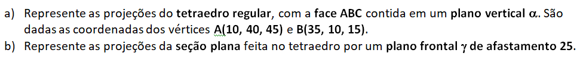
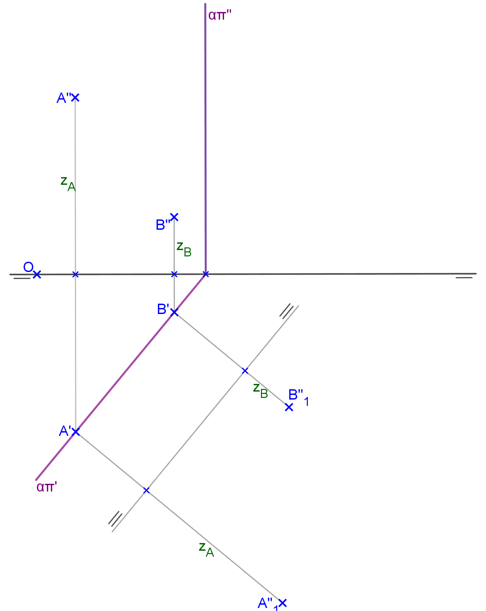
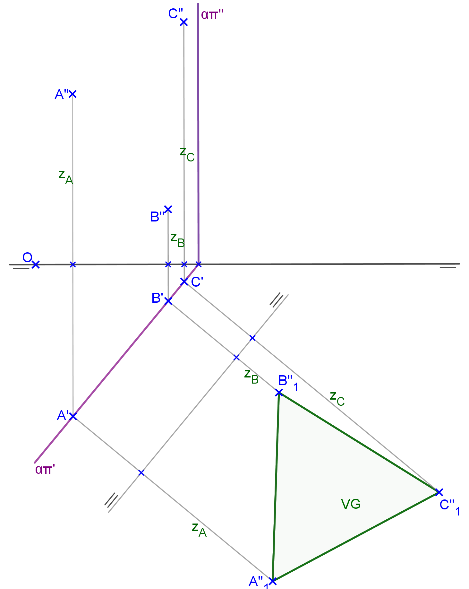
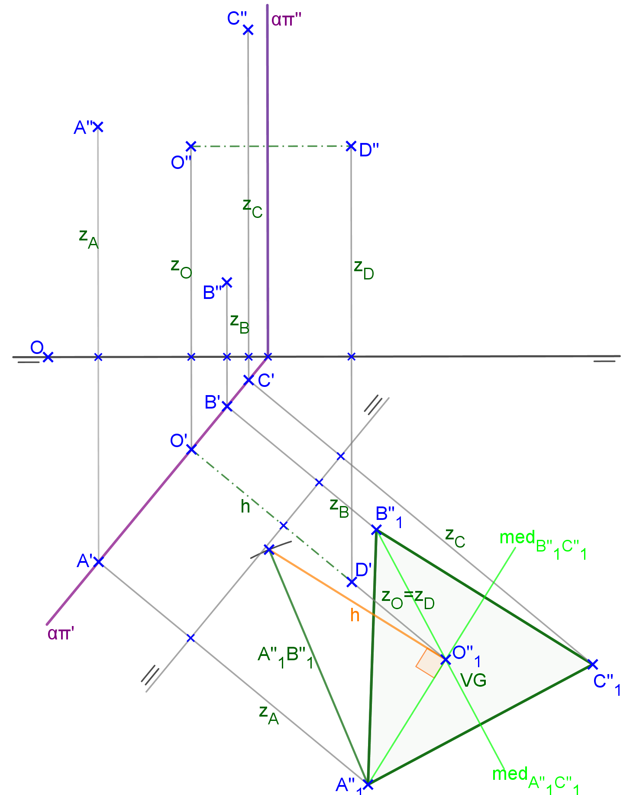
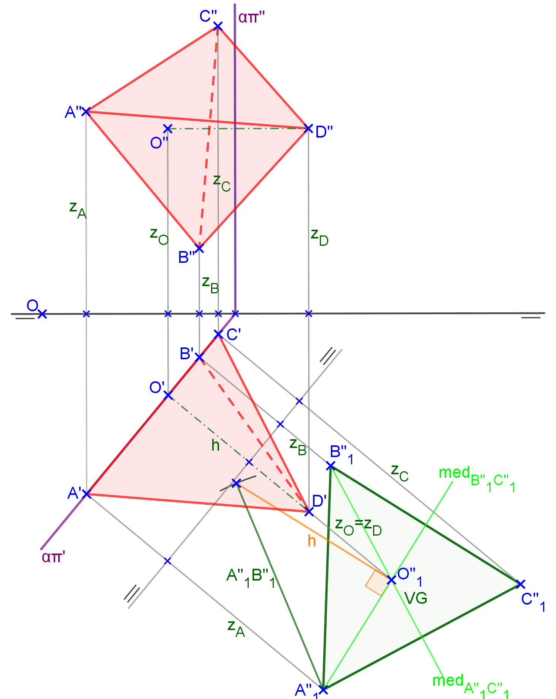
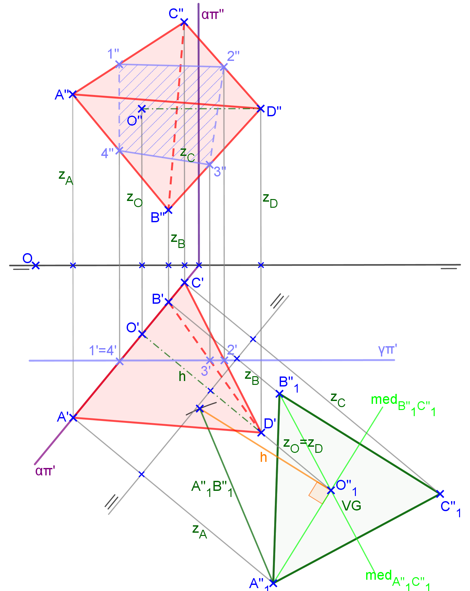
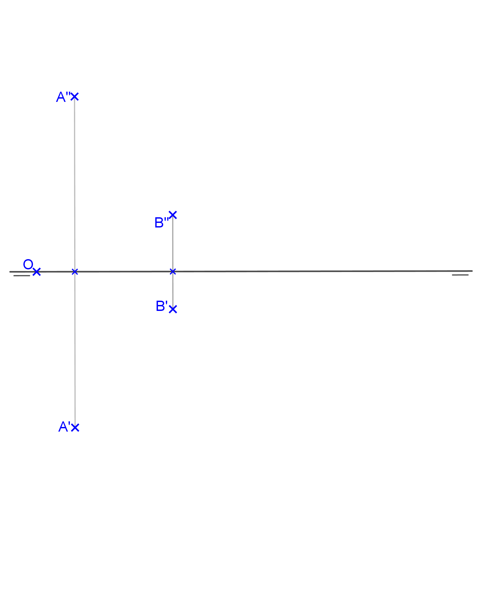
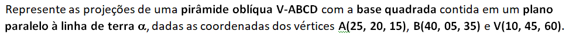
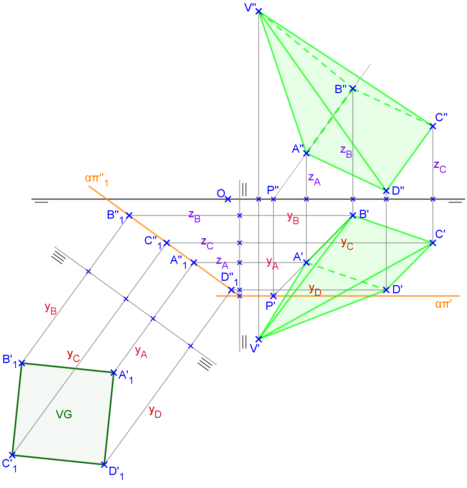

<link rel="stylesheet" href="../../scripts/styleA.css">

<h2 id="inicio">Respostas das Atividades do Módulo 5</h2> 
  

Atividade 5.1

  
  

&#x1f4cf; &#x1f4d0; Resolução

  
O plano vertical <b>&alpha;</b> passa pelos pontos <b>A</b> e <b>B</b>. Podemos construir a face <b>ABC</b> usando rebatimento ou mudança de plano vertical. Neste exemplo, a construção foi feita com a mudança de plano vertical.

  <ul class="slider">
      <li>
           <input type="radio" id="045" name="sl">
           <label for="045"></label>
           
           <figcaption>O traço <b>&alpha;&pi;'</b> contém as primeiras projeções dos vértices e <b>&alpha;&pi;''</b> é perpendicular à linha de terra. Vamos utilizar a mudança de plano vertical, mantendo-se as primeiras projeções. Construa a linha de terra 2 paralela a <b>&alpha;&pi;'</b> e determine as projeções <b>A''1</b> e <b>B''1</b> marcando as coordenadas <b>zA</b> e <b>zB</b>.</figcaption>
       </li>
       <li>
           <input type="radio" id="046" name="sl">
           <label for="046"></label>
           
           <figcaption>Construa a face <b>A''1B''1C''1</b> e encontre a projeção <b>C'</b> no traço <b>&alpha;&pi;'</b> e <b>C''</b> usando a cota <b>zC</b>.</figcaption>
       </li>
	   <li>
           <input type="radio" id="047" name="sl">
           <label for="047"></label>
           
           <figcaption>Construa o triângulo retângulo com cateto <b>A''1O''1</b> e hipotenusa igual à aresta do tetraedro. O outro cateto será a altura <b>h</b>. Marque a altura a partir da projeção <b>O'</b> e as cotas de <b>D</b> e <b>O</b>.</figcaption>
       </li>
       <li>
           <input type="radio" id="048" name="sl">
           <label for="048"></label>
           
           <figcaption>Construa as projeções do tetraedro e use os critérios de visibilidade das arestas.</figcaption>
       </li>
       <li>
           <input type="radio" id="049" name="sl">
           <label for="049"></label>
           
           <figcaption>Construa o plano de seção <b>&gamma;&pi;'</b> e determine as interseções nas arestas do tetraedro.</figcaption>
       </li>
    </ul>
    
  

  

Atividade 5.2

  
  

&#x1f4cf; &#x1f4d0; Solução

  
Podemos construir a pirâmide usando dupla mudança de planos. Primeiro vamos encontrar a projeção do traço <b>&alpha;&pi;'</b> prolongando o segmento <b>A''B''</b> até encontrar <b>P''</b> na linha de terra.

  
       <figcaption>Depois de fazer a dupla mudança de planos, construímos o quadrado em VG. Encontrando as projeções principais em <b>&pi;'</b> e <b>&pi;''</b>, basta utilizar os critérios de visibilidade para as arestas da pirâmide.</figcaption>
  

   

