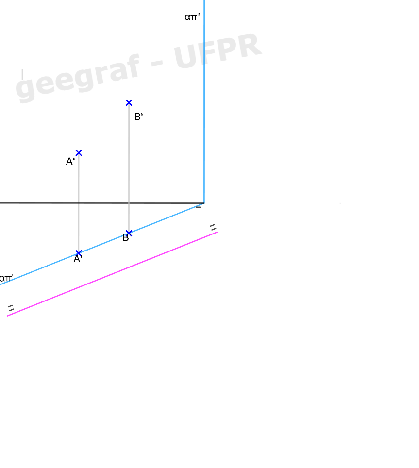
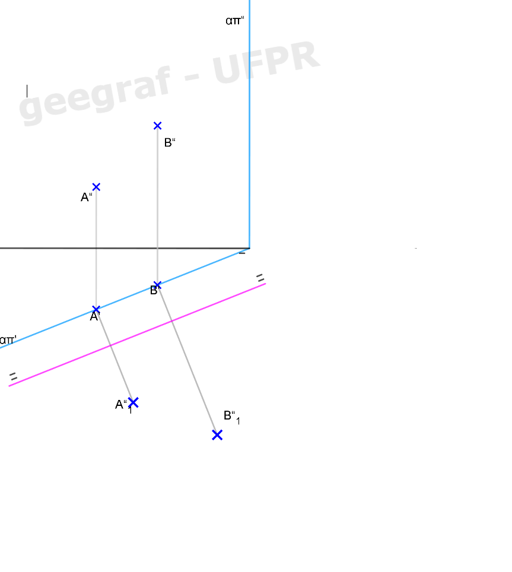
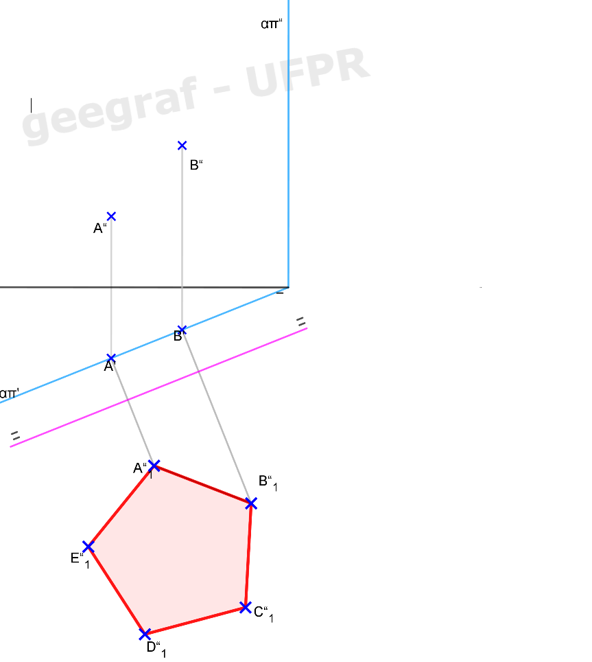
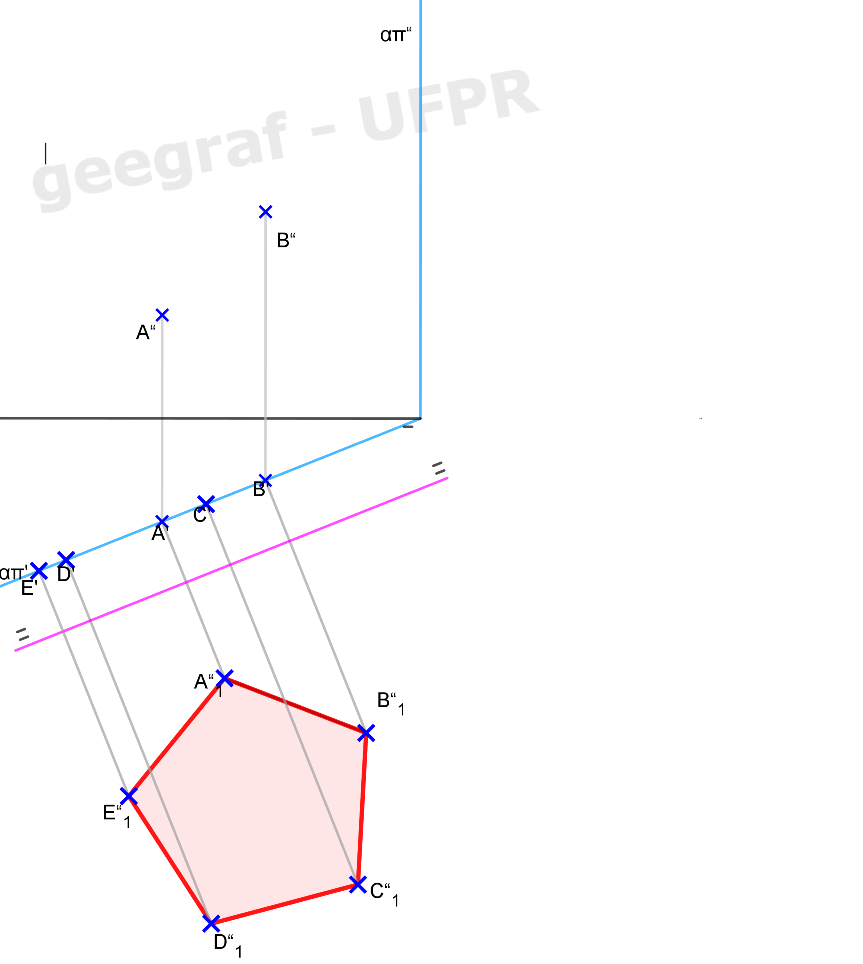
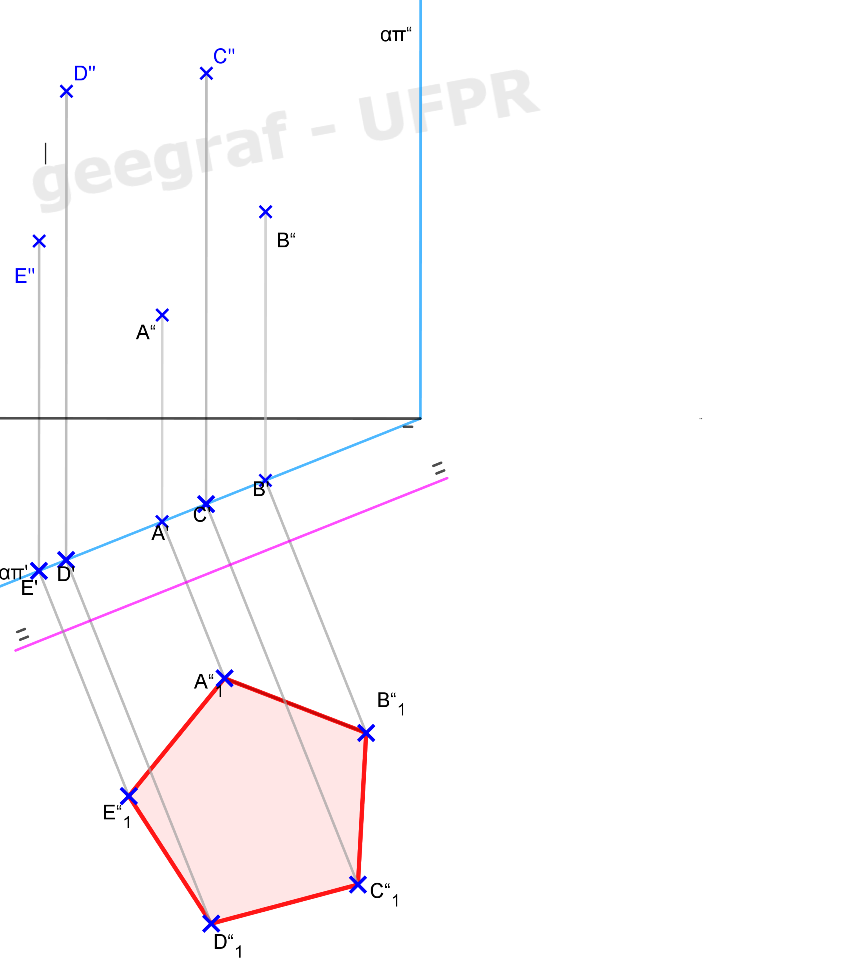
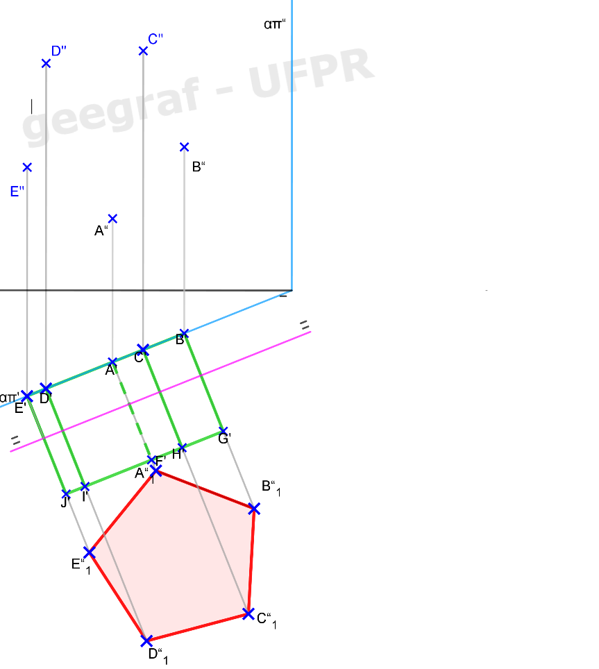
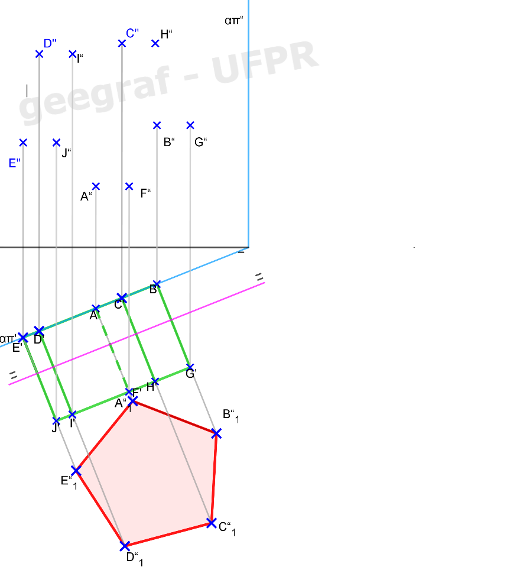
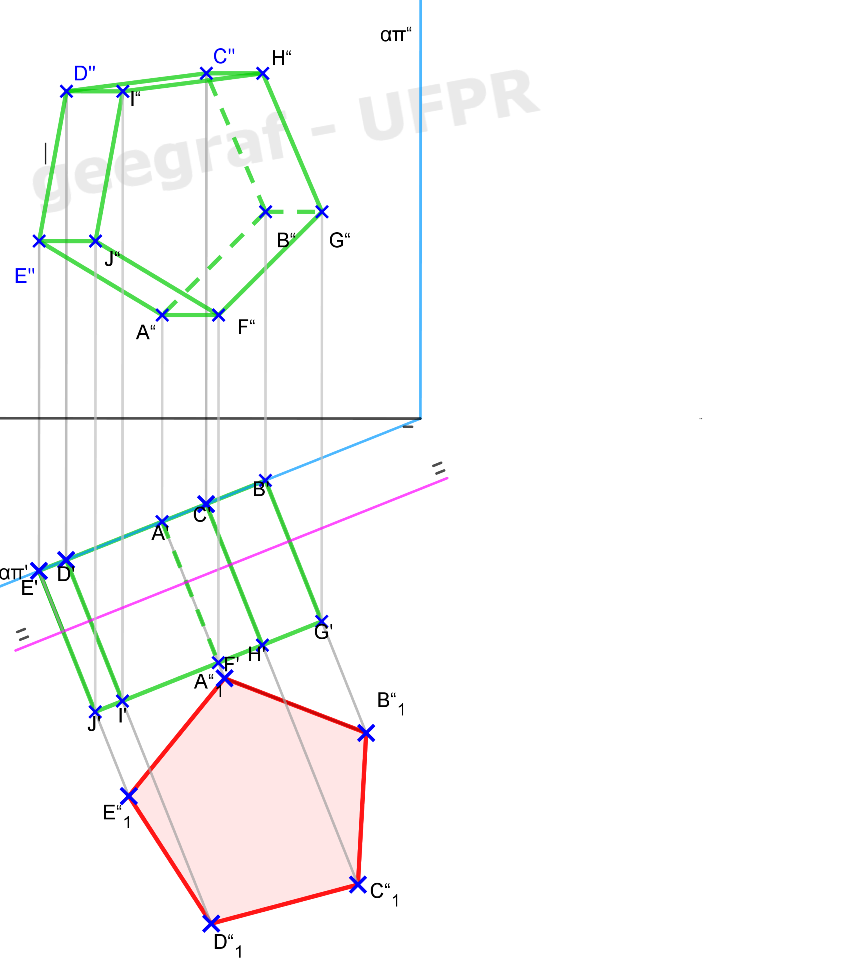
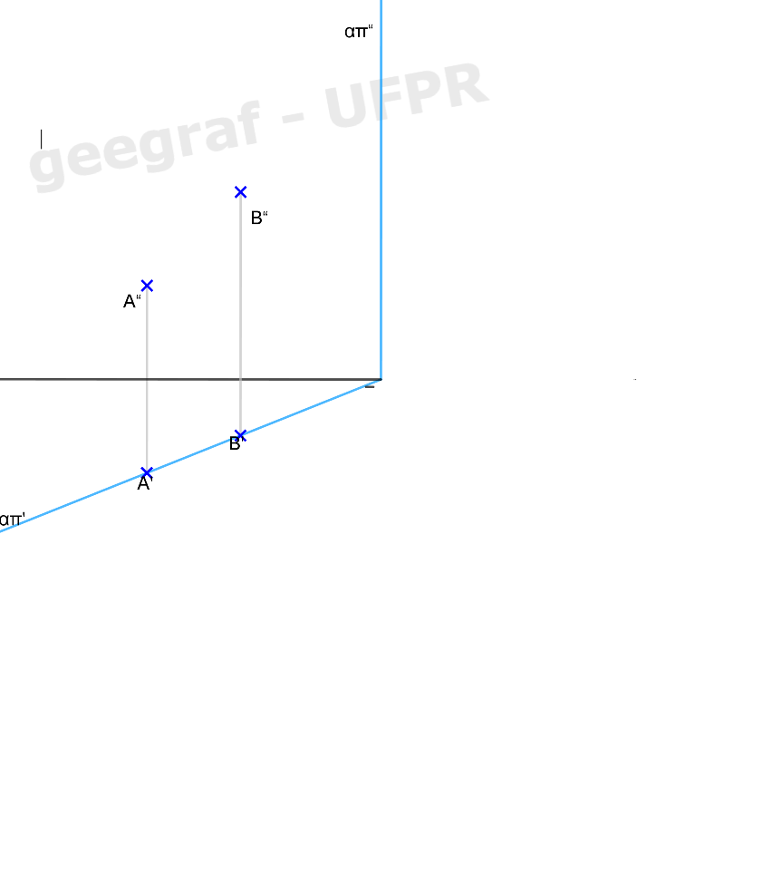
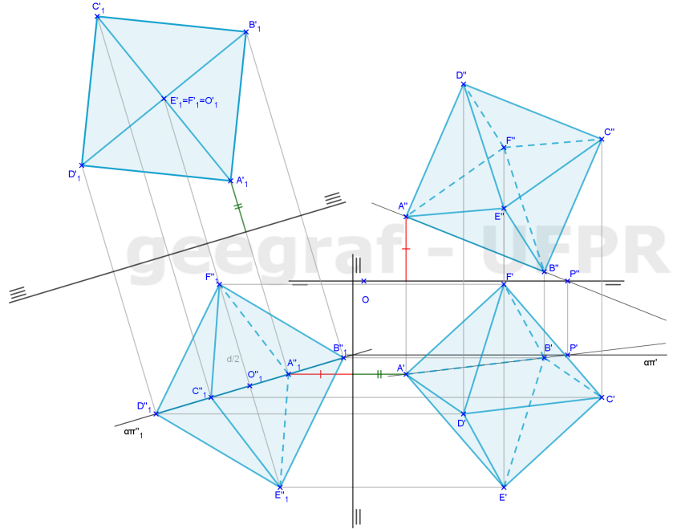

<link rel="stylesheet" href="../../scripts/style.css">

<h2 id="inicio">Respostas do Módulo 5</h2> 
  

Atividade 5.1: Exercício 4 da pág. 71

  
  

&#x1f4cf; &#x1f4d0; Resolução

  
Dados os pontos A e B, o plano vertical já fica definido pelos seus traços horizontal (&alpha;&pi;') e vertical (&alpha;&pi;") 

  <ul class="slider">
	  <li>
           <input type="radio" id="l055" name="sl">
           <label for="l055"></label>
           
        <figcaption>Efetuar a MPV para o plano vertical sobre o plano ", colocando a 2a LT paralela à &alpha;&pi;'</figcaption>
       </li>
       <li>
           <input type="radio" id="l056" name="sl">
           <label for="l056"></label>
           
         <figcaption>Fazer a MPV para os pontos A e B, encontrando A"1 e B"1</figcaption>
       </li>
	   <li>
           <input type="radio" id="l057" name="sl">
           <label for="l057"></label>
           
         <figcaption>o pentágono (observe que tem duas posições possíveis para o pentágono)</figcaption>
       </li>
	   <li>
           <input type="radio" id="l058" name="sl">
           <label for="l058"></label>
           
         <figcaption>Fazer o alçamento dos pontos, encontrando suas primeiras projeções sobre &alpha;&pi;'</figcaption>
       </li>
	   <li>
           <input type="radio" id="l059" name="sl">
           <label for="l059"></label>
           
         <figcaption>Fazer o alçamento em relação à 1a LT, obtendo as 2as projeções dos pontos</figcaption>
       </li>
	   <li>
           <input type="radio" id="l060" name="sl">
           <label for="l060"></label>
           
         <figcaption>Marcar a altura do sólido que é igual ao lado da base e representar a outra face do sólido e representar a visibilidade da 1a projeção</figcaption>
       </li>
	   <li>
           <input type="radio" id="l061" name="sl">
           <label for="l061"></label>
           
         <figcaption>Fazer o alçamento da face FGHIJ em relação à 1a LT</figcaption>
       </li>
	   <li>
           <input type="radio" id="l062" name="sl">
           <label for="l062"></label>
           
         <figcaption>Desenhar a visibilidade do sólido</figcaption>
       </li>
	</ul>
	
  

  	
  

Atividade 5.2: Exercício 6 da pág. 85

  
  

&#x1f4cf; &#x1f4d0; Solução

	
Esse exercício também é parecido com os anteriores.

	
	<figcaption>Note que agora será representado um octaedro regular e, portanto, a altura deverá ser marcada a partir do centro da seção equatorial do mesmo.</figcaption>
  

