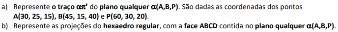
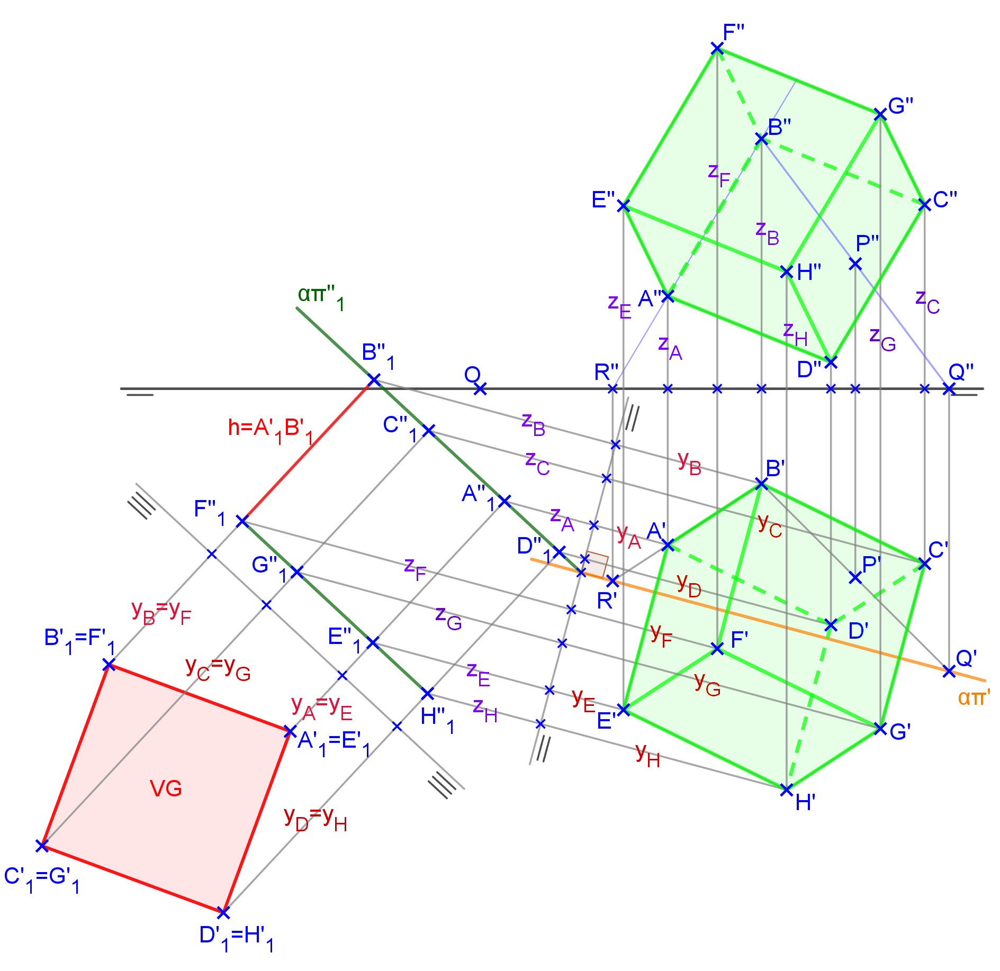

<link rel="stylesheet" href="../../scripts/styleA.css">

<h2 id="inicio">Respostas das Atividades do Módulo 6</h2> 
  

Atividade 6.1

  
  

&#x1f4cf; &#x1f4d0; Solução

  
Para encontrar o traço <b>&alpha;&pi;'</b>, determinamos os pontos <b>Q</b> e <b>R</b> com cotas nulas. Depois, basta fazer a dupla mudança de planos, transformando o plano qualquer em um plano de topo e depois em um plano horizontal.

  
       <figcaption>Depois de fazer a dupla mudança de planos, construímos o quadrado em VG. Encontrando as projeções principais em <b>&pi;'</b> e <b>&pi;''</b>, basta utilizar os critérios de visibilidade para as arestas do hexaedro.</figcaption>
  

   

