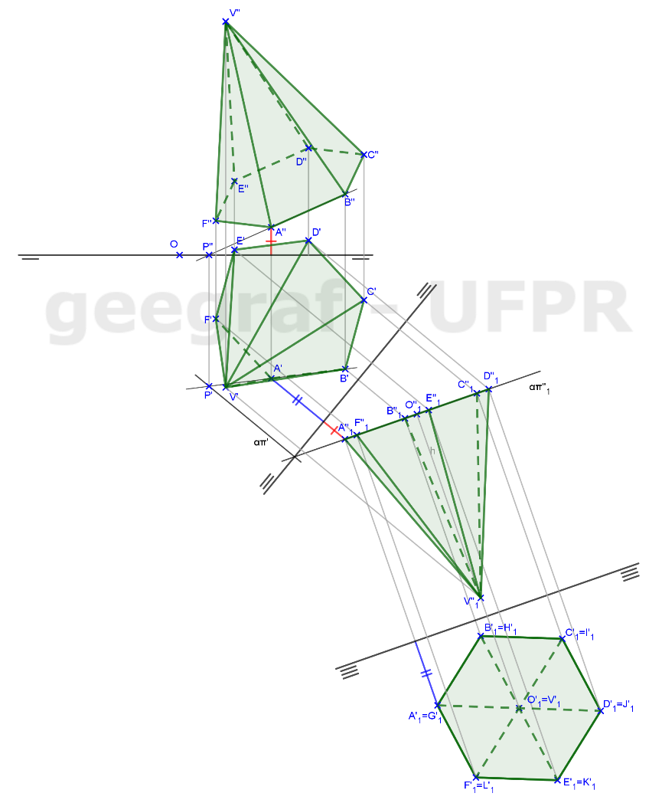

<link rel="stylesheet" href="../../scripts/style.css">

<h2 id="inicio">Respostas do Módulo 6</h2> 
	
  

Atividade 6.1: exercício 4 da pág. 92

  
  

&#x1f4cf; &#x1f4d0; Solução

	
Esse exercício também é parecido com os anteriores.

	
	<figcaption>Agora será representada uma pirâmide regular hexagonal com a base contida no plano qualquer.</figcaption>
  

