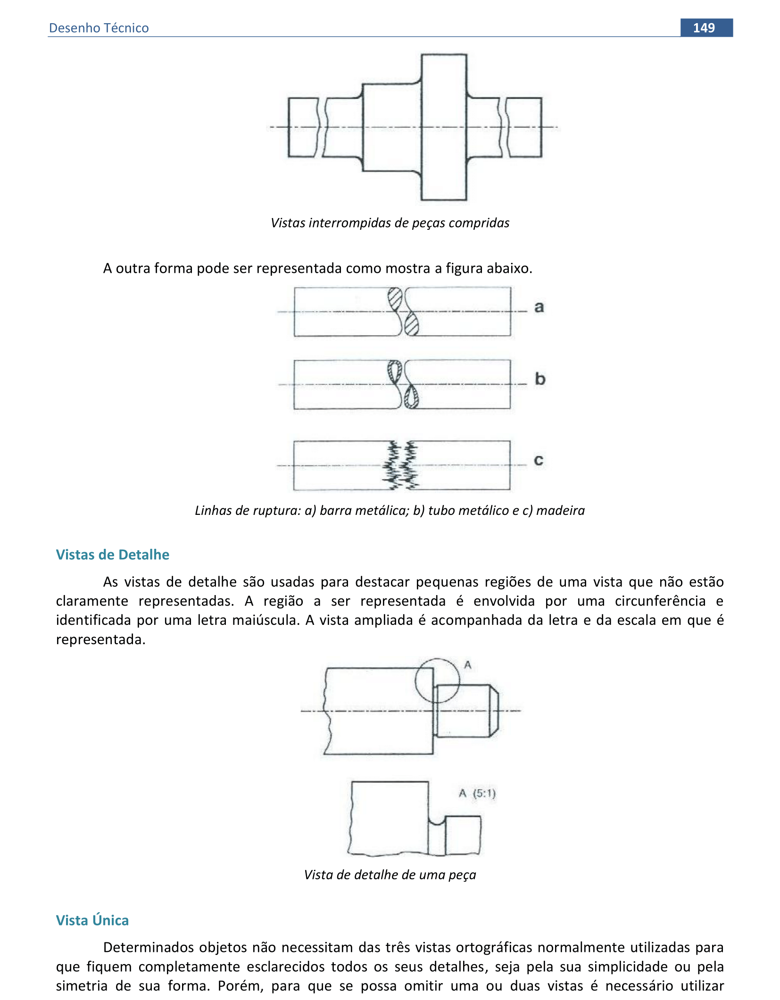
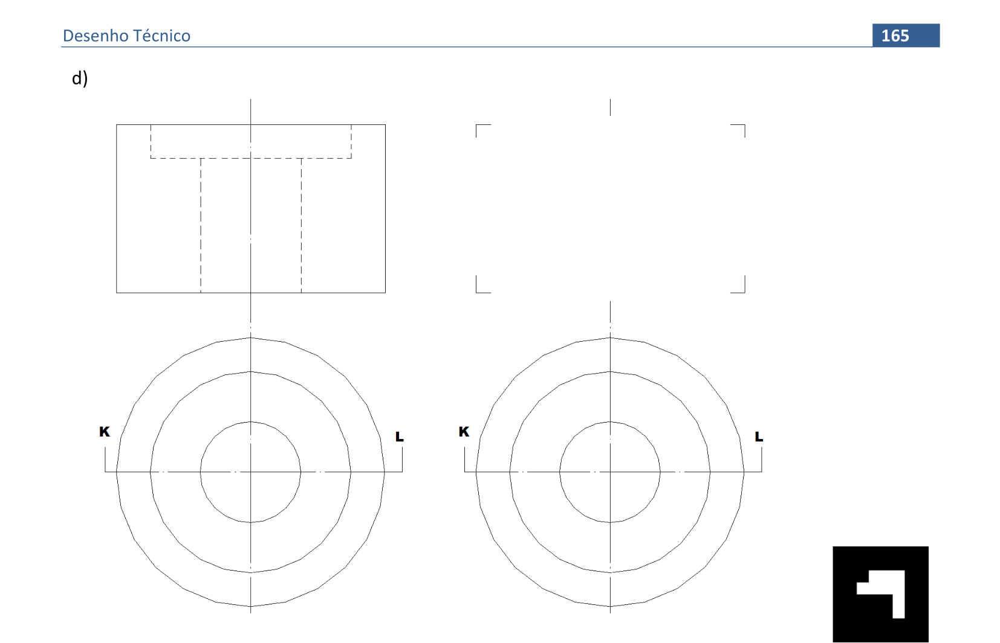

<link rel="stylesheet" href="../../scripts/style.css">

<h2 id="inicio">Respostas do Módulo 7</h2> 
	
  

Exercício proposto 7.1: 7b da pág. 136

  
  

  

&#x1f4cf; &#x1f4d0; Resolução

  
Vamos desenhar as <b>Vistas do objeto</b> que está representado em <b>Perspectiva Isométrica</b>. A representação será no <b>primeiro diedro</b>.

  <ul class="slider">
	   <li>
           <input type="radio" id="dt400" name="sl">
           <label for="dt400"></label>
           
         <figcaption><b>Identificamos as Vistas</b> Frontal (VF), Superior (VS) e Lateral Esquerda (VLE) na Perspectiva.</figcaption>
       </li>
	   <li>
           <input type="radio" id="dt401" name="sl">
           <label for="dt401"></label>
           
         <figcaption>Após <b>analisarmos a forma</b> do objeto e <b>delimitar o mesmo</b> obtemos as maiores dimensões do objeto: 4,2cm de largura, 2,2cm de altura e 3,2cm de profundidade. Desenhamos um <b>esboço</b> para as Vistas e marcamos essas dimensões maiores para termos uma ideia do espaço que será ocupado para o desenho.</figcaption>
       </li>
	   <li>
           <input type="radio" id="dt402" name="sl">
           <label for="dt402"></label>
           
         <figcaption>Desenhamos três retângulos conforme o esboço, lembrando que devemos utilizar a escala 2:1 para representar as medidas e que devemos deixar um mesmo espaçamento entre os retângulos. </figcaption>
       </li>
	   <li>
           <input type="radio" id="dt403" name="sl">
           <label for="dt403"></label>
           
         <figcaption>Marcamos nas Vistas as <b>medidas menores</b>.</figcaption>
       </li>
	   <li>
           <input type="radio" id="dt404" name="sl">
           <label for="dt404"></label>
           
         <figcaption><b>Detalhamos as Vistas</b> do objeto. </figcaption>
       </li>
    </ul>
	
  

  

Exercício proposto 7.2: 9 da pág. 149

  
  

&#x1f4cf; &#x1f4d0; Resolução

  
Vamos construir a <b>Perspectiva Isométrica Simplificada</b> do Objeto.

  <ul class="slider">
       <li>
           <input type="radio" id="dt741" name="sl">
           <label for="dt741"></label>
           
         <figcaption>Construímos o sólido seguindo os mesmos passos dos exercícios anteriores.</figcaption>
       </li>
	   <li>
           <input type="radio" id="dt742" name="sl">
           <label for="dt742"></label>
           
         <figcaption>Representamos a circunferência que está contida num plano horizontal (aparece em VG na vista superior). </figcaption>
       </li>
	   <li>
           <input type="radio" id="dt743" name="sl">
           <label for="dt743"></label>
           
         <figcaption>Pronto! A perspectiva está representada.</figcaption>
       </li>
    </ul>
	
  

  

  

Exercício proposto 7.3: 1d da pág. 165

  

&#x1f4cf; &#x1f4d0; Solução

  
Vamos representar o corte indicado no objeto.

    
    <figcaption>O corte é obtido por meio da interseção com um Plano Frontal definido pelos pontos A e B. Somente a seção resultante que é hachurada.</figcaption>
  

  

